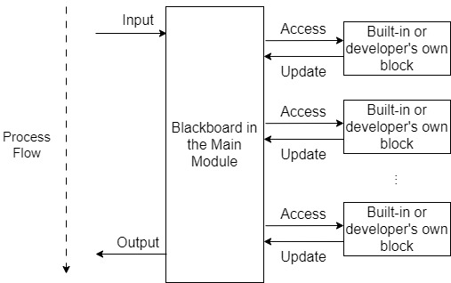

# DialBB: A Framework for Building Dialogue Systems

ver.0.8.0

[日本語版](README-ja.md)

## Introduction

DialBB is a framework for building dialogue systems developed by [C4A Research Institute, Inc.](https://www.c4a.jp/en/) DialBB has been develped as an information technology educational material. DialBB has *extensible* architecture  and is written in *readable codes*. DialBB enables the development of dialogue systems by combining modules called *building blocks*. Developers can easily build simple systems using built-in blocks and can build advanced systems using their own developed blocks. 

The main module of DialBB application receives a user utterance input in JSON format via method calls or via the Web API returns a system utterance in JSON format. The main module works by calling blocks, in sequence. Each block takes JSON format (data in Python dictionary) and returns the data in JSON format. The class and input/output of each block are specified in the configuration file for each application.




## Documents

Refer to the [document](https://c4a-ri.github.io/dialbb/document-en/build/html/) for detailed specification and the way of application development. Documentation for other than the latest version can be found in the [Links](https://c4a-ri.github.io/dialbb/) section.

## License

This software is released for non-commercial use. For details of the license, please see [License](LICENSE-en).

## Getting Started

### Execution Environment

We have confirmed that the following procedure works on Python 3.8.10 on Ubuntu 20.04.  We haven't heard that application dosn't work with Python 3.9 or later and on Windows10/11 and MacOS (including Apple Silicon), though we haven't completely confirmed. However, Snips NLU mentioned later does not support Python 3.9+, it may require additional procedure to install Snips NLU or it might not possible to install it.

The following instructions assume that you are working with bash on Ubuntu. If you are using other shells or the Windows command prompt, please read the following instructions accordingly.

### Installing DialBB

Clone the source code from github.

```sh
$ git clone https://github.com/c4a-ri/dialbb.git
```

In this case, a directory named `dialbb` is created.

If you want to install in a directory with a specific name, do the following.

```sh
$ git clone https://github.com/c4a-ri/dialbb.git <directry name>
```

The resulting directory is referred to below as the <DialBB directory>.


### Installing Python libraries

- Go to <DialBB directory>.

- Next, build a virtual environment if necessary. The following is an example of venv.

  ```sh
  $ python -m venv venv  # Create a virtual environment named venv
  $ venv/bin/activate   # Enter the virtual environment
  ```

- Next, do the following to install the minimu set of libraries.

  ```sh
  $ pip install -r requirements.txt 
  ```


### Running the Parroting Application

It is an application that just parrots back and forth. No built-in block classes are used.

#### Startup

```sh
$ python run_server.py sample_apps/parrot/config.yml
```


#### Operation Check on Terminal


Execute the following on another terminal. If you do not have curl installed, test it from a browser as described later.


- First access

  ```sh
  $ curl -X POST -H "Content-Type: application/json" \
    -d '{"user_id":"user1"}' http://localhost:8080/init
  ```
   The following response will be returned.

  ```json
  {"aux_data":null, 
   "session_id":"dialbb_session1", 
   "system_utterance":"I'm a parrot. You can say anything.", 
   "user_id":"user1"}
  ```

- Second access or later

  ```sh
  $ curl -X POST -H "Content-Type: application/json" \
    -d '{"user_utterance": "Hello", "user_id":"user1", "session_id":"dialbb_session1"}' \
    http://localhost:8080/dialogue
  ```

   The following response will be returned.

  ```json
  {"aux_data":null,
   "final":false,
   "session_id":"dialbb_session1",
   "system_utterance":"You said \"Hello\"",
   "user_id":"user1"}
  ```

#### Operation Check Using a Browser

If the hostname or IP address of the server from which the application is launched is `<hostname>`, access the following URL from a browser, and a dialogue screen will appear.

```
http://<hostname>:8080 
```

If the server is running on Windows 10, the dialog screen may not appear in your browser. In this case, a simple dialog screen will appear when you connect to the following URL.

```
http://<hostname>:8080/test
```

### Snips-STN Applications

This is a sample application using the following built-in blocks. The English version is available in `sample_apps/network_en/` and Japanese version is available in `sample_apps/network_ja/`.

- English Application

  - Simple Canonicalizer Block
  - Whitespace Tokenizer Block
  - Snips Understander Block (language understanding based on [Snips NLU](https://snips-nlu.readthedocs.io/en/latest/))
  - STN Manager Block (state transition network-based dialogue manager)
- Japanese Application

  - Japanese Canonicalizer Block
  - Sudachi Tokenizer  Block (Japanese tokenizer using [Sudachi](https://github.com/WorksApplications/SudachiPy))
  - Snips Understander  Block
  - STN Manager  Block

#### Installing Required Python Libraries

  If you do not use this application, you may skip the following steps.

  Do the following:

  ```sh
  # Run one of the following
  $ pip install -r sample_apps/network_en/requirements.txt
  $ pip install -r sample_apps/network_en/requirements.txt

  # To create and use an English application
  $ python -m snips_nlu download en

  # To create and use a Japanese language application
  $ python -m snips_nlu download ja
  ```

Note:

 - You may be asked to install additional software, such as [Rust](https://www.rust-lang.org/tools/install) (Especially on Windows), when an error occurs during the installation process. In that case, follow the instructions to install the software. 

  - Basically, Snips can't work with Python3.9+, as it can work with an older version of scikit-learn, which can't work on Python 3.9 and above. If you are using Python3.9 and above and an error may occur during the instal, then the following is worth trying.
  
    ```sh
	pip install Cython==0.29.36 
    pip install --upgrade pip setuptools wheel
	```
    
	If the install does not go well, feel free to email us.
	


  - On Windows, you might encounter an error like:

    ```
    ModuleNotFoundError: No module named 'setuptools_rust'
    ```

    In this case, first try:

    ```sh
    $ pip install --upgrade pip
    ```

    If that doesn’t resolve the issue, try the following steps:

    - Download `snips_nlu_parsers-0.4.3-cp38-cp38m-win_amd64.whl` from https://pypi.org/project/snips-nlu-parsers/#files and rename it to `snips_nlu_parsers-0.4.3-cp38-cp38-win_amd64.whl`. Install it using:

      ```sh
      $ pip install snips_nlu_parsers-0.4.3-cp38-cp38-win_amd64.whl
      ```

    - Download `snips_nlu_utils-0.9.1-cp37-cp37m-win_amd64.whl` from https://pypi.org/project/snips-nlu-utils/#files and rename it to `snips_nlu_utils-0.9.1-cp38-cp38-win_amd64.whl`. Install it using:

      ```sh
      $ pip install snips_nlu_utils-0.9.1-cp38-cp38-win_amd64.whl
      ```

    - Then, run the following again:

      ```sh
      $ pip install -r sample_apps/network_ja/requirements.txt 
      $ pip install -r sample_apps/network_en/requirements.txt 
      ```


- On Windows, when you run:

  ```sh
  $ python -m snips_nlu download en 
  $ python -m snips_nlu download ja 
  ```

  you may encounter an error `Creating a shortcut link for 'ja' didn't work`. In this case, please run Windows in developer mode.


  - When running with Anaconda on Windows, Anaconda Prompt may need to be started in administrator mode.

  - If you are using pyenv, you may get the following error.

    ```
    ModuleNotFoundError: No module named '_bz2' 
    ```

    See [this page](https://stackoverflow.com/questions/60775172/pyenvs-python-is-missing-bzip2-module) and others for how to deal with this problem.

If the installation does not work, please contact us.


#### Installing Graphviz

Install Graphviz by referring to the [Graphviz website](https://graphviz.org/). However, Graphviz is **not necessary** to run the application.


#### Startup

The following command starts the application.


  - English application

   ```sh
   $ python run_server.py sample_apps/network_en/config.yml 
   ```

    When invoking in the application directory, do the following

   ```sh
   $ export DIALBB_HOME=<DialBB home diretory>
   $ export PYTHONPATH=$DIALBB_HOME:$PYTHONPATH
   $ cd sample_apps/network_en  # moving to the application diretory
   $ python $DIALBB_HOME/run_server.py config.yml 
   ```

  - Japanese application

   ```sh
   $ python run_server.py sample_apps/network_ja/config.yml 
   ```

    When invoking in the application directory, do the following

   ```sh
   $ export DIALBB_HOME=<DialBB home diretory>
   $ export PYTHONPATH=$DIALBB_HOME:$PYTHONPATH
   $ cd sample_apps/network_ja  # moving to the application diretory
   $ python $DIALBB_HOME/run_server.py config.yml 
   ```


#### Operation Check

Operation check can be down with a browser. (See "Running the Parroting Application" above.)

#### Operation Check Using Test Sets

The following commands can be used to test the sequential processing and interaction of user speech.

- English

  ```sh
  $ python dialbb/util/test.py sample_apps/network_en/config.yml \
    sample_apps/network_en/test_inputs.txt --output \
    sample_apps/network_en/_test_outputs.txt
  ```

​	The dialog exchange is written to `sample_apps/network_en/_test_outputs.txt`.

  - Japanese

    ```sh
    $ python dialbb/util/test.py sample_apps/network_ja/config.yml \
      sample_apps/network_ja/test_inputs.txt --output \
      sample_apps/network_ja/_test_outputs.txt
    ```

​       The dialog exchange is written to `sample_apps/network_ja/_test_outputs.txt`.


### Experimental Applications

Experimental applications are available at `sample_apps/lab_app_ja/` (Japanese) and `sample_apps/lab_app_en/` (English) . This application is used to test various functions of the built-in blocks. It uses the following built-in blocks.


- English Application

  - Simple Canonicalizer Block
  - ChatGPT Understander Block
  - Spacy NER Block (NER using [spaCy](https://spacy.io/))

  - STN Manager Block

- Japanese Application

  - Japanese Canonicalizer Block
  - ChatGPT Understander Block
  - Spacy NER Block (NER using [spaCy](https://spacy.io/)/[GiNZA](https://megagonlabs.github.io/ginza/))

  - STN Manager Block

#### Installing Python libraries

  Do the following:

  ```sh
  $ pip install -r sample_apps/lab_app_en/requirements.txt # for English app
  $ pip install -r sample_apps/lab_app_ja/requirements.txt # for Japanese app
  ```

#### Setting environment variables

This application uses OpenAI's ChatGPT. So, set the OpenAI API key in the environment variable `OPENAI_API_KEY`. The following is a bash example.

```sh
$ export OPENAI_API_KEY=<OpenAI's API key>.
```

#### Startup

  ```sh
  $ python run_server.py sample_apps/lab_app_en/config_en.yml # English app
  $ python run_server.py sample_apps/lab_app_en/config_ja.yml # Japanese app
  ```

#### Test Method

The following commands allow you to test features not used in the Snips+STN ApplicatiSNIon.

  ```sh
  $ cd sample_apps/lab_app_en # in the case of English app
  $ cd sample_apps/lab_app_ja # in the case of Japanese app
  $ export DIALBB_HOME=<DialBB home directory>.
  $ export PYTHONPATH=$DIALBB_HOME:$PYTHONPATH
  $ python $DIALBB_HOME/dialbb/util/send_test_requests.py config.yml test_requests.json
  ```

### ChatGPT Dialogue Application

This application uses only  OpenAI's ChatGPT to engage in dialogues. 

Only the following builtin block is used.

- ChatGPT Dialogue Block


#### Installing Python libraries

  Do the following

  ```sh
  $ pip install -r sample_apps/chatgpt/requirements.txt
  ```

#### Setting environment variables

Set the environment variable OPENAI_API_KEY to the OpenAI API key. The following is a bash example.

```sh
$ export OPENAI_API_KEY=<OpenAI's API key>.
```

#### Startup

  English version:

  ```sh
  $ python run_server.py sample_apps/chatgpt/config_en.yml
  ```

  Japanese version:

  ```sh
  $ python run_server.py sample_apps/chatgpt/config_en.yml
  ```

## Requests, Questions, and Bug Reports

Please feel free to send your requests, questions, and bug reports about DialBB to the following email address. Even if it is a trivial or vague question, feel free to send it.

- Report bugs, point out missing documentation, etc.: [GitHub Issues](https://github.com/c4a-ri/dialbb/issues)

- Long-term development policy, etc.: [GitHub Discussions](https://github.com/c4a-ri/dialbb/discussions)

- Anything: email at `dialbb at c4a.jp`


## Copyright

(c) C4A Research Institute, Inc.
