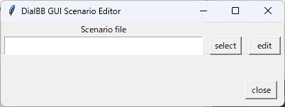
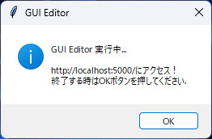
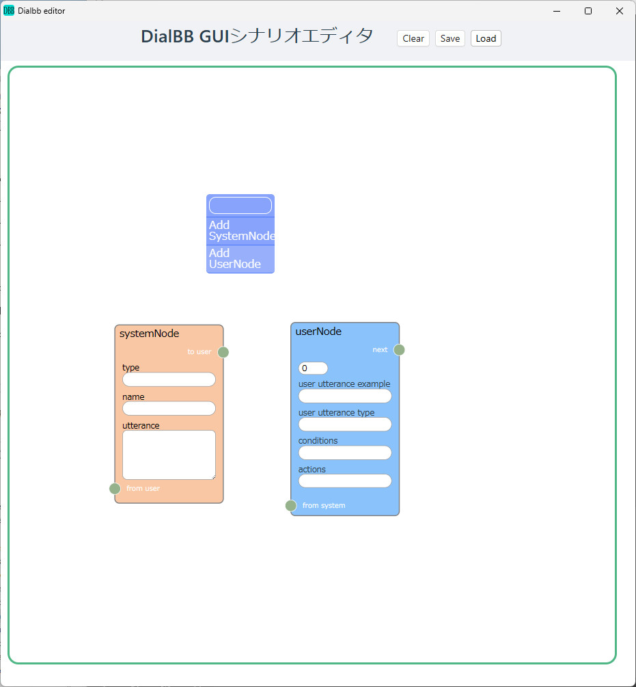
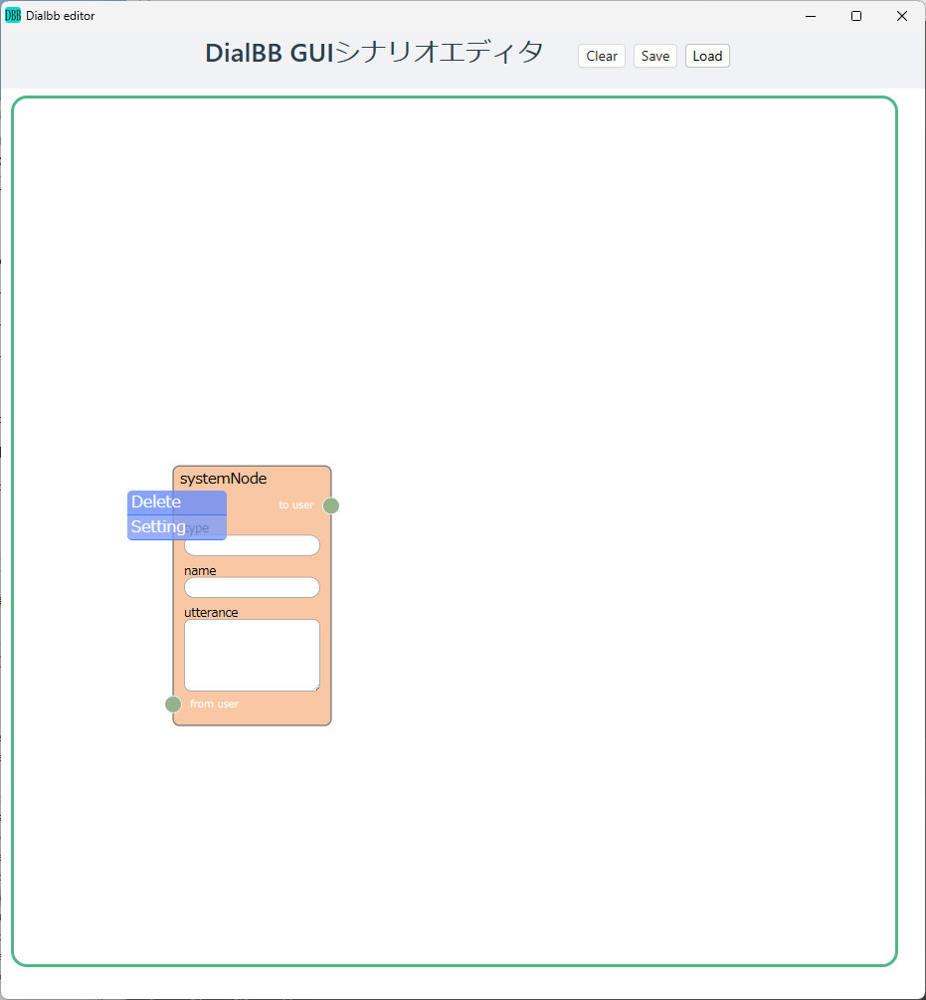
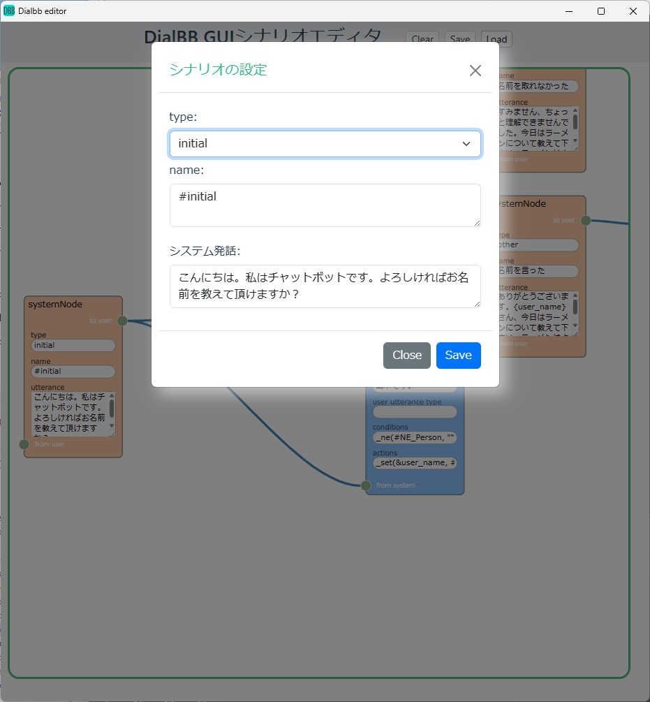
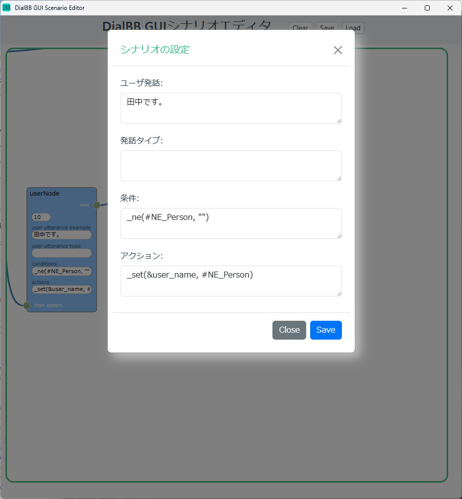
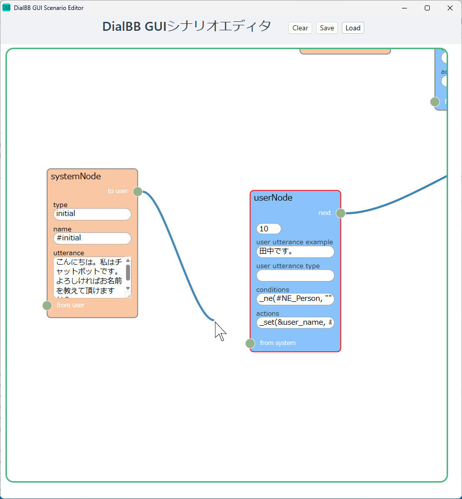
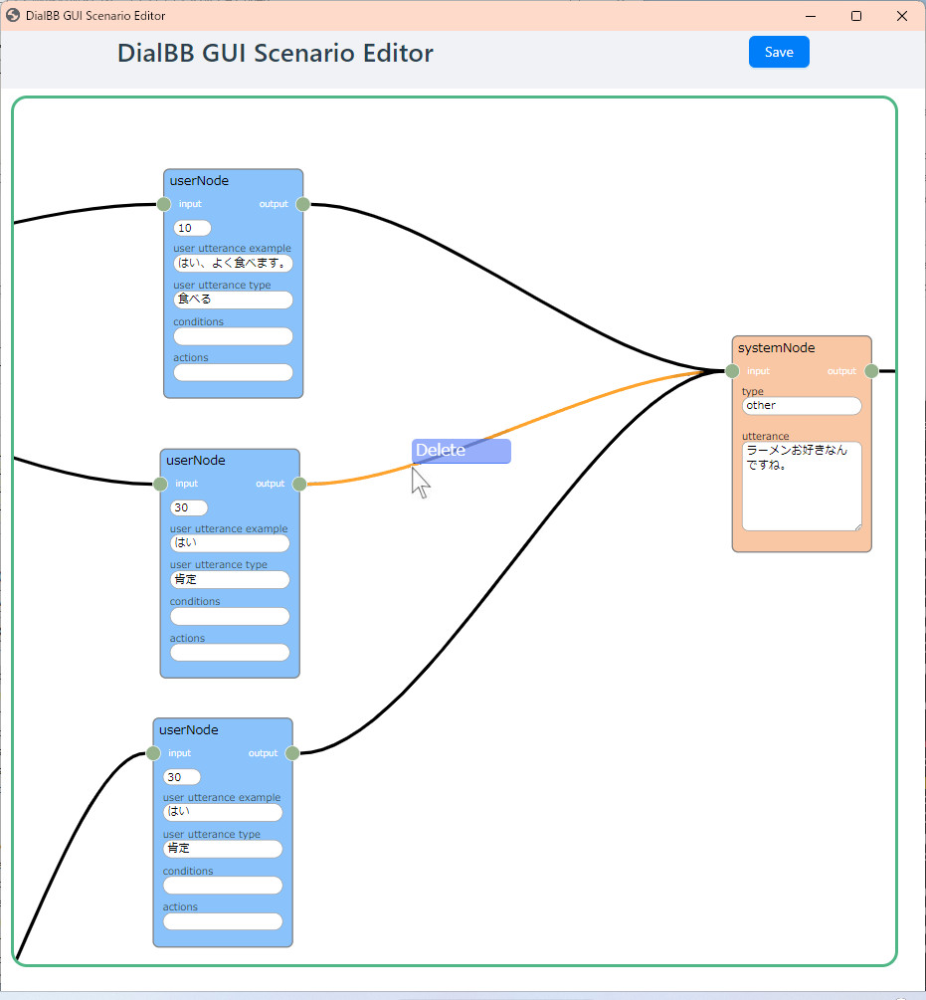

# DialBB GUI シナリオ エディタ

### 開発環境の構築
* vite + vue 3 + typescript 環境でビルドを行っています．  
  python, node.js も必要です.  

* （参考）開発環境  
  python 3.10.5  (3.8.10でも動作確認済み)  
  vite 5.0.8  
  vue 3.3.11  
  node.js 21.6.1  

* セットアップ  
  gui_editor/フォルダで
```
npm install
```

* 動作確認  
```
npm run dev
```

  ブラウザよりアクセス  
  http://localhost:5173/ 

* 本番用ビルド  
```
npm run build
```
  dist/フォルダにリリース物が生成されます  
  

### シナリオ エディタの起動方法  
#### ・メイン画面の起動
```
python dialbb\builtin_blocks\stn_management\gui_editor\main.py
```

#### ・エディタの起動
[select]ボタンでシナリオExcelファイルを指定して、[edit]ボタンでエディターサーバを起動します.  


#### ・エディタの終了
実行中ダイアログの[OK]ボタンでエディターサーバは停止します.  



### シナリオ エディタの使い方  

#### ・概要

シナリオを[systemノード]と[userノード]として扱います、それぞれのノードを[コネクタ]で接続することでsystem：userを関連付けます。


#### ・ノードの追加
背景で右クリック > [systemノード]か[userノード]を選択すると新規追加されます 




#### ・ノードの削除
ノードの上で右クリック > [Delete] を選択すると削除されます  



#### ・ノード項目の入力
ノードの上で右クリック > [Setting] を選択すると入力ダイアログが表示されます  

　

#### ・コネクタの接続・削除
ノードのoutputソケットを左クリック > 他ノードのinputソケットへドラッグして接続します  
削除はinputソケットを摘まんで離すか、コネクター上で右クリック > [Delete] を選択します。

　


#### ・ファイルに保存(Excel)
上部の[Save]ボタンをクリックします、ノードデータをシナリオExcelに書き込みます。（保存しないでエディタサーバを停止した場合はデータが失われます）

-------  

