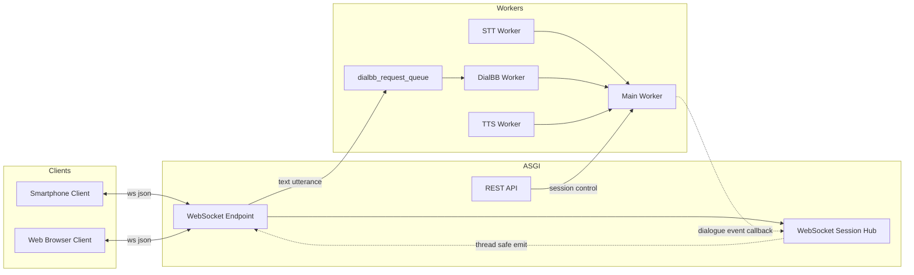
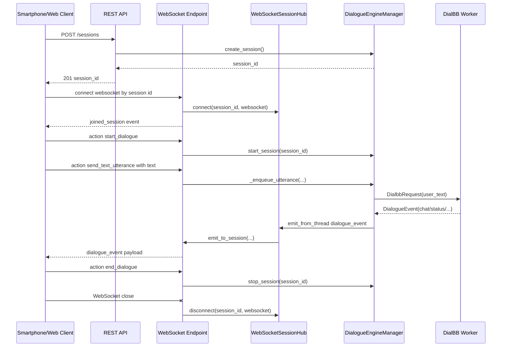

# mm_client Phase 1/2 実装ガイド

## 概要

Phase 1 でコアエンジンを分離し、Phase 2 で Flask-SocketIO サーバを構築しました。

- **dialbb.multimodal.core**: 会話状態管理（UI非依存）
- **dialbb.multimodal.engine**: セッション・ワーカー管理（マルチセッション対応）
- **dialbb.multimodal.server**: REST API + WebSocket（FastAPI ネイティブ）
- **start_mm_client.py**: Tkinter GUI（新エンジン活用、後方互換性維持）

---

## 1. インストール

### 依存パッケージ（新規追加）
```bash
pip install flask-socketio python-socketio python-engineio
```

または pyproject.toml で定義されている場合：
```bash
poetry install
```

### エントリポイント
```bash
# Tkinter GUI（既存互換）
dialbb-mm-client [config/mm_client_config.yml]

# サーバモード（新規）
dialbb-mm-client-server --host 0.0.0.0 --port 5000 --config config/mm_client_config.yml
```

---

## 2. REST API

### ヘルスチェック
```
GET /health
```
**レスポンス:**
```json
{
  "status": "ok",
  "service": "mm-client-server"
}
```

### セッション作成
```
POST /sessions
```
**レスポンス (201):**
```json
{
  "session_id": "xxxxxxxx-xxxx-xxxx-xxxx-xxxxxxxxxxxx"
}
```

### セッション開始（対話開始）
```
POST /sessions/<session_id>/start
```
**レスポンス:**
```json
{
  "status": "started"
}
```

### テキスト発話送信（REST）
```
POST /sessions/<session_id>/utterance
Content-Type: application/json

{
  "text": "こんにちは"
}
```
**レスポンス:**
```json
{
  "status": "sent"
}
```

### セッション停止（対話終了）
```
POST /sessions/<session_id>/stop
```

### セッション削除
```
DELETE /sessions/<session_id>
```

### セッション一覧
```
GET /sessions
```
**レスポンス:**
```json
{
  "sessions": ["session_id_1", "session_id_2"]
}
```

---

## 3. WebSocket API

### 接続

FastAPI ネイティブ WebSocket を使用します。

```javascript
const sessionId = 'xxxxxxxx-xxxx-xxxx-xxxx-xxxxxxxxxxxx';
const socket = new WebSocket(`ws://localhost:5000/dialogue/ws/${sessionId}`);

socket.onopen = () => {
  console.log('Connected');
};

socket.onmessage = (event) => {
  const message = JSON.parse(event.data);
  console.log('Message:', message.event, message.payload);
};

socket.onerror = (error) => {
  console.error('Error:', error.message);
};
```

### クライアント → サーバ（送信）

クライアントは `{ action, ...payload }` 形式で送信します。

#### `start_dialogue`
対話開始
```javascript
socket.send(JSON.stringify({
  action: 'start_dialogue'
}));
```

#### `end_dialogue`
対話終了
```javascript
socket.send(JSON.stringify({
  action: 'end_dialogue'
}));
```

#### `send_text_utterance`
テキスト発話（WebSocket 経由）
```javascript
socket.send(JSON.stringify({
  action: 'send_text_utterance',
  text: 'こんにちは'
}));
```

#### `send_audio_chunk`
音声チャンク送信（Phase 3 で実装予定）
```javascript
socket.send(JSON.stringify({
  action: 'send_audio_chunk',
  audio_data: '<base64 encoded PCM16>'
}));
```

### サーバ → クライアント（受信）

サーバは `{ event, payload, ... }` 形式で送信します。

#### `dialogue_event`
会話状態・チャット内容の更新通知
```javascript
socket.onmessage = (event) => {
  const message = JSON.parse(event.data);
  
  if (message.event === 'dialogue_event') {
    const { event_type, data, timestamp } = message.payload;
    
    if (event_type === 'status') {
      console.log('Status:', data.message);
    }
    
    if (event_type === 'chat') {
      console.log(`${data.role}: ${data.text}`);
    }
    
    if (event_type === 'final') {
      console.log('Dialogue finished');
    }
    
    if (event_type === 'error') {
      console.error(`Error: ${data.message}`);
    }
  }
};
```

#### `joined_session`
セッション参加確認（接続時に自動送信）
```javascript
socket.onmessage = (event) => {
  const message = JSON.parse(event.data);
  if (message.event === 'joined_session') {
    console.log('Joined session:', message.payload.session_id);
  }
};
```

#### `error`
エラー通知
```javascript
socket.onmessage = (event) => {
  const message = JSON.parse(event.data);
  if (message.event === 'error') {
    console.error('Error:', message.payload.message);
  }
};
```

**event_type 一覧:**
- `status`: ステータス更新（message フィールド）
- `chat`: チャットメッセージ（role, text フィールド）
- `final`: 対話終了
- `error`: エラー（source, message フィールド）

### クライアント実装例

本リポジトリには、WebSocket を使用したクライアント実装例が用意されています。

**Python クライアント:**
```bash
python client_example.py <session_id>
python client_example.py 550e8400-e29b-41d4-a716-446655440000 ws://192.168.1.100:5000
```
→ `client_example.py`（非同期対話ループ）

**JavaScript/HTML クライアント:**
ブラウザで `client_example.html` を開くと、ウェブベースのチャットインターフェースでテストできます。

---

## 4. スレッド・接続構成（スマホ / WebSocket 対応）

FastAPI サーバでは、クライアント（スマホブラウザ／Webブラウザ）と WebSocket 接続を維持しつつ、内部の対話エンジンはワーカースレッドで動作する。



補足:
- WebSocket の送受信は FastAPI のイベントループで実行。
- 対話処理（STT/DialBB/TTS）は `DialogueEngineManager` 配下のワーカースレッドで実行。
- スレッド側イベントは `WebSocketSessionHub.emit_from_thread()` が `asyncio.run_coroutine_threadsafe()` でイベントループに橋渡しする。

## 5. シーケンス図（スマホクライアント / WebSocket）



### 送受信メッセージの観点

- クライアント -> サーバ: `{"action": "start_dialogue" | "end_dialogue" | "send_text_utterance" | "send_audio_chunk", ...}`
- サーバ -> クライアント: `{"event": "joined_session" | "dialogue_event" | "error", "payload": {...}}`
- `dialogue_event.payload.event_type`: `status` / `chat` / `final` / `error`

---

## 6. Python 内部 API

### コアエンジンの直接利用
```python
from dialbb.multimodal.core import CoreDialogueEngine, DialogueEvent
from dialbb.multimodal.engine import DialogueEngineManager, SessionConfig

# 設定
config = SessionConfig(
    dialbb_config='path/to/dialbb/config.yml',
    stt_key_file='path/to/stt/key.json',
    loop_period=0.1,
    max_user_wait_time=30.0,
    mic_gain=1.0,
)

# エンジンマネージャを作成
def on_event(session_id: str, event: DialogueEvent) -> None:
    print(f"[{session_id}] {event.event_type}: {event.data}")

manager = DialogueEngineManager(config, event_callback=on_event)

# セッション管理
session_id = manager.create_session()
manager.start_session(session_id)
manager.stop_session(session_id)
manager.delete_session(session_id)
```

### カスタムコマンド送信
```python
# テキスト発話を直接送信
from dialbb.multimodal.main.messages import DialbbRequest

session = manager.get_session(session_id)
if session:
    session.dialbb_request_queue.put(
        DialbbRequest(
            session_id=session.engine.session_id,
            user_text='ユーザの発話',
            aux_data={},
        )
    )
```

---

## 7. 設定ファイル（mm_client_config.yml）

既存のフォーマット継続：

```yaml
main:
  loop_period: 0.1
  max_user_wait_time: 30.0

stt:
  key_file: path/to/google-credentials.json
  mic_gain: 1.0

dialbb:
  config_file: path/to/dialbb/config.yml
```

---

## 8. 推奨される利用方法

### Tkinter GUI（従来通り）
```bash
dialbb-mm-client config/mm_client_config.yml
```
✅ 既存ユーザは影響なし  
✅ GUI は新エンジンで動作

### Web UI（スマホ対応）
1. サーバ起動:
```bash
dialbb-mm-client-server --config config/mm_client_config.yml
```

2. Web UI（Vue.js など）から接続:
```javascript
// セッション作成 → start_dialogue → send_text_utterance
```

### バックエンド統合
```python
from dialbb.multimodal import DialogueEngineManager, SessionConfig

# 既存システムに組み込み
engine_manager = DialogueEngineManager(config)
session_id = engine_manager.create_session()
```

---

## 9. Phase 3 へのロードマップ

### 音声ストリーム対応（WebSocket 経由）
- `send_audio_chunk` イベントの実装
- STT クライアントを WebSocket 経由で動作
- TTS 音声をクライアントへ送信

### モバイル UI の完成
- React Native / Flutter でのネイティブ化検討

### パフォーマンス最適化
- マルチセッション負荷試験
- オートスケーリング対応

---

## トラブルシューティング

### セッションが見つからない
```python
# セッションが作成されているか確認
sessions = manager.list_sessions()
print(sessions)  # アクティブなセッション一覧
```

### WebSocket 接続エラー
- CORS を確認: サーバ起動時に `cors_allowed_origins="*"` を設定済み
- ファイアウォールを確認: ポート 5000 が開いているか

### STT エラー
```bash
# Google Cloud 認証キーを確認
echo $GOOGLE_APPLICATION_CREDENTIALS
cat path/to/key.json
```

---

## まとめ

Phase 1/2 で以下が実現できます：

✅ **UI 非依存の会話エンジン** (core.py)  
✅ **マルチセッション対応** (engine.py)  
✅ **REST + WebSocket API** (server.py)  
✅ **既存 Tkinter GUI との互換性維持**  
✅ **スマホ対応の基盤完成**

次のステップ（Phase 3）は音声ストリーミング統合です。
