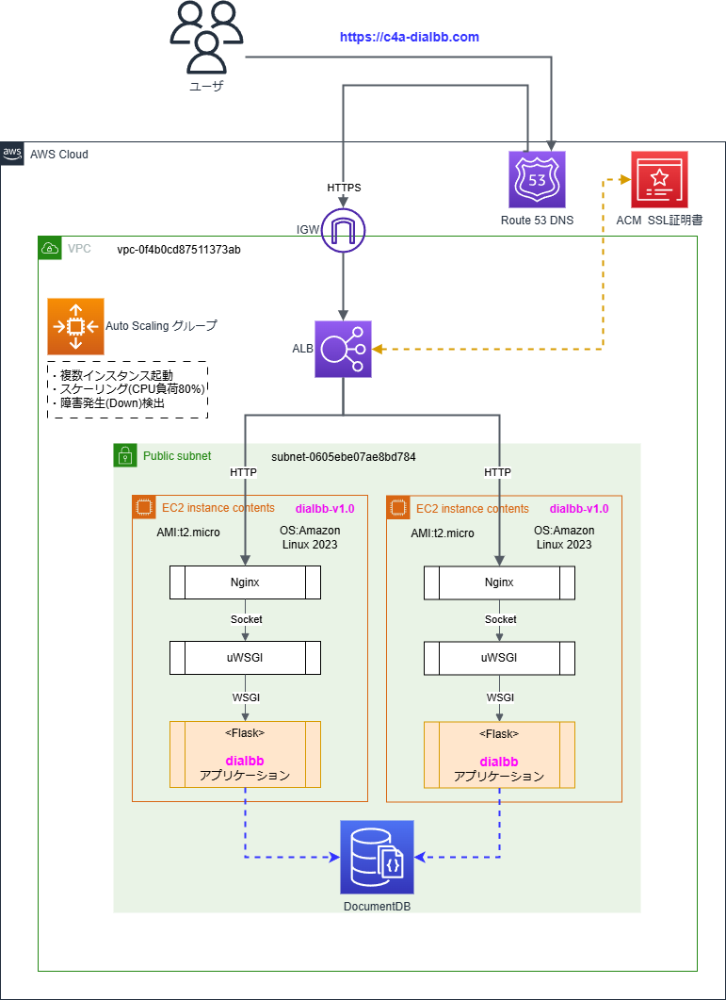

# DialBBアプリケーションをAWSで公開する手順（ドラフト）

## 概要

* AWSでDialbbアプリケーションを動作させるためには、ベースとなる [dialbb](https://github.com/c4a-ri/dialbb/tree/dev-v1.0)ブランチ:dev-v1.0と本リポジトリのファイルをEC2に配置して環境構築する.  

  * ファイル/ディレクトリの説明

    |リリースファイル|内容|
    |----|---|
    |uwsgi.ini|uWSGIのconfigファイル|
    |wsgi_if.py|wWSGIとFlask(run_server.py)の中継プログラム|
    |sample_apps/simple_ja|AWS DocumentDBを使用するアプリケーションconfig|

* 今回作成するAWSの構成

    

## EC2インスタンス作成

### はじめに
* DocumentDBが使えるリージョンを選択する. 東京リージョンなど
* 既存のSSHキーペアが無い場合は[キーペアの作成]する.

1. [EC2] > [インスタンスを起動] > 以下の条件でインスタンスを追加する  

    ```text
    ・インスタンス名：dialbb-v1.0
    ・タグを付与：Environment=「外部DB使用」
    ・OS：Amazon Linux 2023
    ・インスタンスタイプ：t3.micro
    ・キーペア：dialbb-dev-test  ※dialbb-dev-testと同じもの
    ・ネットワーク設定：[編集]↓
        ・VPC：vpc-0f4b0cd87511373ab（デフォルト） ※dialbb-dev-testと同じもの
        ・サブネット：デフォルト
        ・パブリックIP自動割り当て：「有効化」（デフォルト）
        ・セキュリティグループ：既存のセキュリティグループ：sg-059df1dc992934fdf（デフォルト）
    ・ストレージ：8GB（デフォルト）
    ※セキュリティグループではSSH(22)とHTTP(80)が解放
    ```

1. Elastic IPを割り当てる

    ```text
    [Elastic IP] > 54.252.75.4をチェック > [アクション]で[IPアドレスを関連付ける]を選択
     > [インスタンス]に"dialbb v1.0" > [関連付ける]
    ```

1. インスタンスの起動

    ```text
    [EC2] > [インスタンス] >
    "dialbb-v1.0"をチェック >
    [インスタンスの状態] > [インスタンスを開始]
    ```

## インスタンスにdialbb v1.0をセットアップ

### 1. wheelを転送

* ローカル環境からdialbb v1.0のwheelをAWSのインスタンスに転送（ssh公開キーが必要）

    ```sh
    scp -p -i ~/.ssh/dialbb-dev-test.pem dialbb-x.x.x-py3-none-any.whl ec2-user@54.252.75.4:~/.
    ```
    または、インスタンス上でGitHubから直接get
    ```sh
    wget https://github.com/c4a-ri/dialbb/raw/refs/heads/main/dist/dialbb-1.0.3-py3-none-any.whl
    ```

### 2. インスタンス環境のセットアップ

* インスタンスに入る

    ```sh
    ssh -i ~/.ssh/dialbb-dev-test.pem ec2-user@54.252.75.4
    ```

* ec2-userをサーバー管理者にする

    ```sh
    sudo groupadd -g 992 nginx
    sudo usermod -aG nginx ec2-user
    id ec2-user
    # これが設定されていればOK：4(adm), 992(nginx)
    ```

* 必要なパッケージのインストール

    ```sh
    yum update
    yum -y install bzip2 bzip2-devel gcc git libffi-devel make patch xz-devel \
    openssl openssl-devel readline readline-devel zlib-devel tree sqlite sqlite-devel
    ```

* Pythonのセットアップ

    ```sh
    git clone http://github.com/yyuu/pyenv.git ~/.pyenv
    echo 'export PYENV_ROOT="$HOME/.pyenv"' >> ~/.bash_profile
    echo 'export PATH="$PYENV_ROOT/bin:$PATH"' >> ~/.bash_profile
    echo 'eval "$(pyenv init -)"' >> ~/.bash_profile
    . ~/.bash_profile
    pyenv install 3.10.5
    pyenv global 3.10.5
    ```

### 3. dialbbインストール

* 本リポジトリのwsgi_if.pyとsample_appsフォルダを転送

    ```sh
    sudo mkdir /var/www/
    /var/www/dialbb/wsgi_if.py
    /var/www/dialbb/sample_apps
    ```

* wheelからpipでインストール

    ```sh
    pip install ~/dialbb-x.x.x-py3-none-any.whl
    ```

## Nginx + uWSGI + Flask(dialbb)の環境設定

### 1. NginxとuWSGIをインストール

* パッケージインストール

    ```sh
    sudo dnf -y install nginx
    pip install uwsgi
    ```

### 2. uWSGI関連のセットアップ

* 本リポジトリのuwsgi.iniを転送

    ```sh
    /var/www/dialbb/uwsgi.ini
    ```

    `主な設定内容`

    ```sh
    current_release = /var/www/dialbb  # プロジェクトのroot
    wsgi-file=%(current_release)/wsgi_if.py  # wsgiで動作させるファイルのパス
    socket = /var/www/dialbb/uwsgi.sock  # NginxとWSGIの通信ソケット（一時ファイル）
    processes = 1  # WSGIで生成するプロセス数
    logto = /var/log/wsgi/uwsgi.log  # ログファイル
    ```

* uWSGIのログディレクトリの作成

    ```sh
    mkdir -p /var/log/wsgi
    sudo chown $USER:nginx -R /var/log/wsgi  # ログの所有者変更
    sudo chmod 775 /var/log/wsgi  # Groupに書き込み権限付与
    ```

* uWSGIのサービス設定ファイル作成

    ```sh
    sudo vim /etc/systemd/system/uwsgi.service
    ```

    `uwsgi.service`

    ```sh:uwsgi.service
    [Unit]
    Description=uWSGI instance to serve DialBB
    After=network.target
    
    [Service]
    User=ec2-user
    Group=nginx
    WorkingDirectory=/var/www/dialbb
    ExecStart=/home/ec2-user/.pyenv/shims/uwsgi --ini uwsgi.ini
    Restart=always
    KillSignal=SIGQUIT
    Type=notify
    NotifyAccess=all
    
    [Install]
    WantedBy=multi-user.target
    ```

### 3. Nginx関連のセットアップ

* ログファイルを書き込み可能にする

    ```sh
    $ sudo chown nginx:nginx /var/log/nginx
    $ sudo chmod 750 /var/log/nginx
    ```

* uwsgi.confファイルの設定

    ```sh
    sudo vim /etc/nginx/conf.d/uwsgi.conf
    ```

    `uwsgi.conf`

    ```sh:uwsgi.conf
    server {
        # 80番ポートを開放する
        listen       80;

        # "/"から始まるURIに{}内の設定を適用する
        location / {
            # uwsgiのパラメータを読み込む
            include uwsgi_params;
            # uwsgiとの通信に用いるソケットファイルを指定する
            uwsgi_pass unix:///var/www/dialbb/uwsgi.sock;
        }
    }
    ```

* Nginx設定ファイルでuwsgi.confを読み込む設定になっていること

    ```sh
    less /etc/nginx/nginx.conf
    ```

    `uwsgi.conf`

    ```sh
    # ここの記述があること、コメント化されていたら外す
    include /etc/nginx/conf.d/*.conf
    ```

### 4. サービスの起動設定

* サービスを起動

    ```sh
    sudo systemctl start nginx
    sudo systemctl start uwsgi.service
    ```

* デーモン自動起動の設定

    ```sh
    sudo systemctl enable nginx
    sudo systemctl enable uwsgi.service
    ```

### 5. 動作確認

* ここまでの設定で以下のような接続状況を構築した  
  **`app(dialbb) <-> uWSGI <-> socket <-> Nginx <-> Client`**

* 一時的にDB機能を無効にしてdialbbの動作確認を行う  

    `sample_apps/simple_ja/config.yml`

    ```sh
    # 以下をコメント化
    context_db:
        host: mongodb:....
          :
    ```

* インスタンスの再起動

    ```text
    [EC2] > [インスタンス] > "dialbb-v1.0"をチェック >
    [インスタンスの状態] > [インスタンスを停止]
    
    状態が"停止済み"になったら、
    [インスタンスの状態] > [インスタンスを開始]
    ```

* ブラウザからアクセス
    `http://54.252.75.4/`

    チャットが開始すればOK

* sample_apps/simple_ja/config.ymlの変更を元に戻す

* 正しく動作しない場合はログファイルを確認して原因を究明する

    ```sh
    /var/log/nginx/access.log     # Nginxのアクセスログ
    /var/log/nginx/error.log      # Nginxのエラーログ
    /var/log/wsgi/uwsgi.log       # uWSGIの通信ログとdialbbのログ出力
    ```

## AWS 各サービスの設定手順

### 1. SSL証明書の作成

* 証明書を作成

    ```text
    [Certificate Manager] を選択
    [証明書のリクエスト] をクリック > [パブリック証明書]  > [次へ]
    
    ドメイン追加 > 入力：【c4a-dialbb.com】
      > 検証方法の選択 ： [DNS]
      > キーアルゴリズム ： [RSA 2048]
      > タグの作成 ： "name" : "dialbb-v1.0"
    > [リクエスト]
    
    リクエストが完了すると【証明書ID】が付与される、
    ステータスはまだ：保留中の検証
    ダッシュボードが表示されるので該当[証明書ID]をクリック
    ⇒「DNS(Route 53)にレコード(CNAME)を登録」へと続く
    ```

### 2. ロードバランサ・ALBの作成

* LB用のセキュリティグループの作成

    ```text
  [EC2] > [セキュリティグループ作成]
  名前 > LoadBarancerSecurityGroup
  インバンドルール > [HTTP]：[80]：[0.0.0.0/0]
                     [HTTPS]：[443]：[0.0.0.0/0] を設定
  アウトバンドルール > 上と同じ
  ```

* ターゲットグループの作成

    ```text
    ターゲットタイプ > [インスタンス]
    ターゲットグループ名 > "dialbb-v1"
    プロトコル > [HTTP][80ポート]を選択
     ※ELBからの通信はHTTP通信で受けことになるので80番ポートを開けます
    
    VPC > [vpc-0f4b0cd87511373ab]
    プロトコルバージョン >  [HTTP1] 
    
    ヘルスチェックはdefault設定    ※以前は無しにできた
    > [次へ]
    [ターゲットを登録] > dialbb-v1.0 ※インスタンスは起動状態であること
        > [保留中として以下を含める]を押下
        下段に選択したEC2インスタンスが表示される
        > [ターゲットグループの作成]ボタンを押下
    ```

* ALBの作成

    ```text
    [EC2] > 
    [ロードバランサー] > [ロードバランサーの作成] 
    > [Application Load Balancer] を選択 > [作成]
    
    ロードバランサ名を入力：dialbb > 
      > スキームは[インターネット向け]
      > アドレスタイプは[IPv4] になっていること
    
    ネットワークマッピングで、
      VPC > [vpc-0f4b0cd87511373ab] に指定
      サブネット > 一応分配機能なので2つチェック
           ※dialbbインスタンスが使用しているものを含めること
    アベイラビリティーゾーン > ap-southeast-2b
    サブネット > subnet-0c487aab24b56f6b0
      ※推奨）2つ以上のアベイラビリティーゾーンを有効にするとアプリケーションの耐障害性を高められる。
     > ap-southeast-2c (apse2-az2) も選択
    セキュリティグループ > "LoadBarancerSecurityGroup"
    
    リスナーとルーティング
        ※リスナーの追加は、ALBまでの通信をHTTPSで受けるため、
      > [HTTPS][443ポート]を選択
      > ターゲットグループは先ほど作成した > "dialbb-v1"
    
    [デフォルトアクション] > (転送先) > "dialbb-v1" 
                         ※上で作成したターゲットグループ
    
    セキュアリスナーの設定で、[HTTPS:443リスナー]
    セキュリティポリシー > default(推奨) を指定
    SSL証明書 > [ACMから] > [作成した証明書]:"c4a-dialbb.com"または識別子ID
      >  [次の手順]
    
    ロードバランサタグ > Name : "dialbb-v1.0" を設定
    
    内容確認して  > [ロードバランサの作成]
    ```

### 3. DNSの設定

* DNS(Route 53)にレコード(CNAME)を登録

    ```text
    [Route53] > 
    [ホストゾーン] > "c4a-dialbb.com"を選択 > [詳細]
    Aレコードを選択 > [レコードを編集]
    [トラヒックのルーティング先]
        [エンドポイントを選択] > [Application Load Balancer...]
        [リージョンを選択] > [シドニー]
        [ロードバランサ] > プルダウンメニューより
      "dualstack.dialbb-205316954.ap-southeast-2.elb.amazonaws.com"
        ※先頭に"dualstack."が付いた、ALB名の[DNS name]を選択する
    
    "正常に更新されました"のメッセージと共に [ステータスを表示]ボタンが現れるのでクリック
    "INSYNC" となればDNSの伝達が完了
    ```

* 正常動作確認 (CLI)

    ```text
    WSL/コマンドプロンプトで、
    # snlookup c4a-dialbb.com
        名前:  c4a-dialbb.com
        Address: 54.252.75.4
    ⇒Elastic IPが表示されればOK
     
  〇HTTPSでアクセス確認
    https://c4a-dialbb.com/
    
    ⇒「このページに到達できません」ERROR:DNS_PROBE_FINISHED_NXDOMAIN  にならなければOK
  ```

### 4. HTTP(port:80)リダイレクトの設定

* httpをhttpsへリダイレクトする設定

    ```text
    [EC2] > ロードバランサー > 作成したロードバランサーを選択
    
    [リスナー] > [リスナーの追加]
        リスナーの設定 > [プロトコル] > HTTP  [ポート]:80
        デフォルトのアクション > [URLにリダイレクト] を選択する
            リダイレクトのアクション > URI部分
            > [プロトコル] > HTTP  [ポート]:80
    > [追加]
    
    デフォルトのアクションにおいて、
    [Itemized URL] > [HTTPS] > port:[443」
    > [保存]
    ```

* HTTPでアクセス確認

    ```text
    http://c4a-dialbb.com/
      ⇒httpsにリダイレクトされる
    ```

### 5. Autoスケーリングの設定

* AMI（イメージ）の作成

    ```text
    [EC2] > [インスタンス] で対象インスタンスを選択
    [アクション] > [イメージとテンプレート] > [イメージの作成]
    [イメージ名] > "dialbb-v1.0"
    [イメージの説明] > "dialbb-v1.0 with documentDB"
    インスタンスボリュームはdefault  ※サイズ:8、終了時に削除の設定
    [リソースのタグ] > Name : "dialbb-v1.0"
    > [イメージを作成]
    ```

* 起動テンプレートの作成

    ```text
    [EC2] > [起動テンプレート] > 右上の[起動テンプレートの作成]
    [起動テンプレート名] > dialbb-v1
    [Auto Scaling ガイダンス]  > チェックボックスを選択
    タグ > Name : "dialbb-v1.0"
    アプリケーション及びOSイメージ
    [自分のAMI] > [自己所有] > Amazonマシンイメージ > "dialbb-v1.0"
        ※起動する EC2インスタンスの設定（AMI、インスタンスタイプ、セキュリティグループなど）を指定
    
    [キーペア] > dialbb-dev-test を選択  ※これにより起動インスタンスにsshアクセスできる

    サブネット > ※defaultを選択
    セキュリティグループ >  ※現状インスタンスと同じものを選択
    > [起動テンプレートを作成]
    ```

* Auto Scaling グループの作成

    ```text
    [EC2] > [Auto Scaling グループ] > [Auto Scaling グループを作成する]
    [Auto Scaling グループ名] > "dialbb-v1-Scaling"
    [起動テンプレート] > "dialbb-v1" を選択
    [バージョン] > 1
    > [次へ]
    
    インスタンスタイプの要件：
    [インスタンス属性を指定する]  ※default（正直意味が良く分からない）
    vCPU 最小:0 最大:2
    メモリ(GiB) 最小:0 最大:8
    
    [ネットワーク]
        VPC > [vpc-0f4b0cd87511373ab]
        アベイラビリティーゾーン > ap-southeast-2b
        サブネット > subnet-0c487aab24b56f6b0
        ※ALBと同じものを選ぶ
    > [次へ]
    
    ロードバランシング > [既存のロードバランサーにアタッチする]を選択
    ターゲットグループ > "dialbb-v1"   ※ALBのときに作成したもの
    ゾーンシフトを有効にする > そのままOFF  ※障害がある間、インスタンスは        他の正常なアベイラビリティーゾーンに起動します
    Elastic Load Balancing のヘルスチェックをオンにする > 推奨なのでチェック
    最初のヘルスチェックのディレイ：300秒
    > [次へ]
    
    [グループサイズとスケーリング]
        希望するキャパシティ(グループサイズを指定してください) > 2  ※希望のインスタンス数
        スケーリング > [最小の希望する容量]=0 [最大の希望する容量]=2
        自動スケーリング > [ターゲット追跡スケーリングポリシー]を選択
        メイトリックスタイプ > [平均CPU使用率]
        ターゲット値 > 80
    モニタリング > [CloudWatch 内でグループメトリクスの収集を有効にする]をチェック
    タグ > Name : "dialbb-v1-Scaling"
    > [Auto Scaling グループを作成]
    ```

### 6. AWS DocumentDBの設定

* セキュリティグループの作成

    ```text
    [EC2] > [セキュリティグループ] > [セキュリティグループの作成]
    Name：dialbbDocDB
    説明：DocumentDB accessed from dialbb instance
    VPC：vpc-0f4b0cd87511373ab（デフォルト）
    インバンドルール
        タイプ：カスタムTCP
        ポート範囲：27017  ※Amazon DocumentDB のデフォルトポート
        リソースタイプ：カスタム
        ソース：sg-059df1dc992934fdf  ※EC2インスタンスのセキュリティグループ
    アウトルール>はそのまま
    > [作成]
    ```

* TLSを無効化するためのパラメータグループを追加

    ```text
    [Amazon DocumentDB] >  [パラメータグループ] > [新規作成] > 名前：【dialbb-docdb5】
    次にdialbb-docdb5をクリックして詳細表示
      [クラスターパラメータ]の[tls]をチェック > [編集] > [disabled]に変更
       > [保存]
    ```

* DocumentDB クラスターの作成

    ```text
    [Amazon DocumentDB] >  [クラスター] > [作成]
    ストレージ構成：[Amazon DocumentDB 標準]をチェック
        ※低～中程度の I/O使用量の多くのアプリケーションに適したコスト効率の高い価格設定
    [インスタンス数] ：[1]を選択  ※コストを最小限に抑えることができる
    [接続性] > [EC2コンピューティングリソースに接続する]を選択
    [EC2インスタンス] > [dialbb v1]を選択
    [認証] セクションで、[自己管理]を選択 > 
        ユーザー名=【dialbbAdmin】とパスワード=【fH2_Y3h4】を入力
    [詳細設定を表示] をオンにしてメニュー展開
    [ネットワーク設定] セクションの
     [VPC セキュリティグループ] > 上記の[dialbbDocDB] を選択
    [パラメータグループ] ：[dialbb-docdb5]を選択
    [保管時の暗号化] > [暗号化の無効化]
    ※その他はデフォルトのまま
    > [クラスターの作成]
    ```

## AWS dialbbサービスの動作確認

* dialbbアプリのDBホストを作成したDocumentDBに変更

    ```text
    [Amazon DocumentDB] > [クラスター] > プライマリインスタンスを選択
    [設定]タブにあるインスタンスエンドポイントをチェック
    
    /var/www/dialbb/sample_apps/simple_ja/config.yml context_db:
      host: ※上記インスタンスエンドポイントに置き換え
    例： docdb-2025-07-31-12-16-56.c70qyue4kv2i.ap-northeast-1.docdb.amazonaws.com
    ```

* インスタンスを起動

    ```text
    [EC2] > [インスタンス] > "dialbb-v1.0"を選択
    [アクション] > [インスタンスを開始]
    ```

* ブラウザからアクセス

    ```text
    https://c4a-dialbb.com/
    
    ⇒dialbbのチャットが正常に起動すること
    ```
