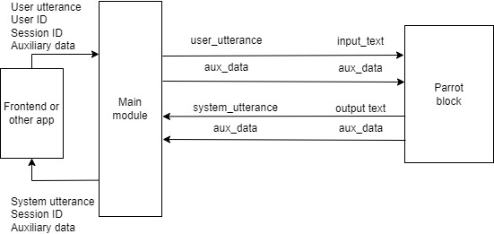
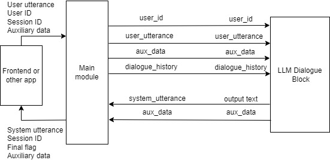
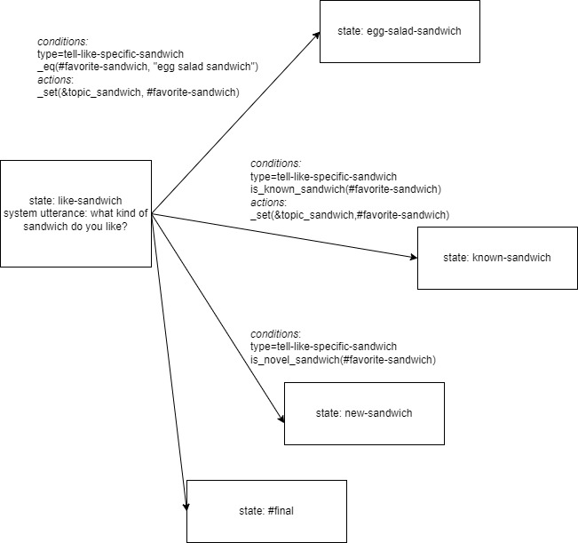
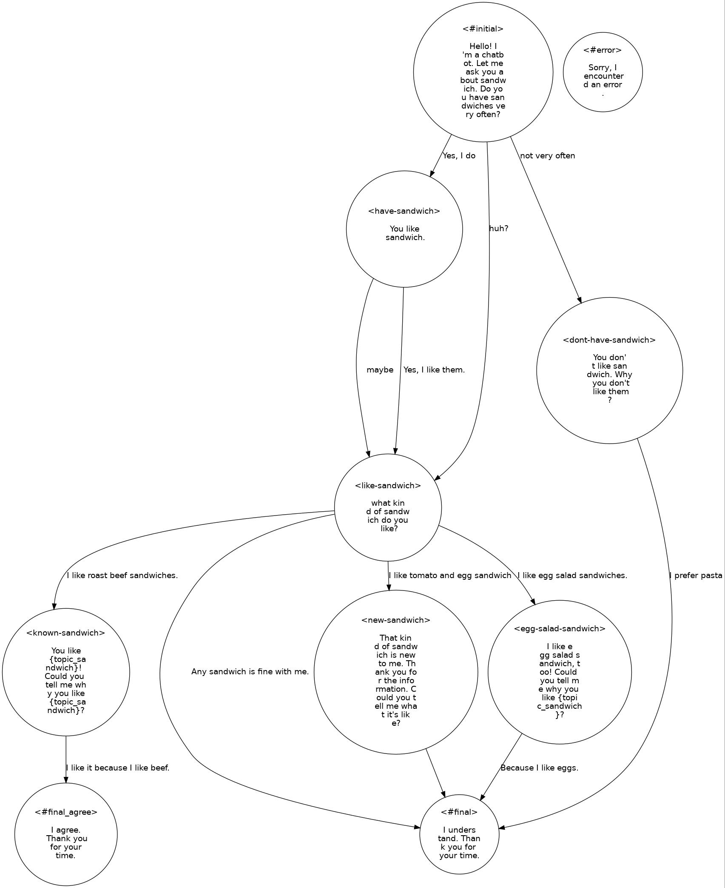

# Tutorial

## Introduction

DialBB comes with several sample applications. In this chapter, we use the English sample applications to explain the structure of a DialBB application and how to build an application with DialBB.

For instructions on how to run these applications, see [README](https://github.com/c4a-ri/dialbb/blob/main/README.md).

## Parrot Sample Application

### Description

This application simply repeats what the user says. It does not use any built-in block classes.

It is located in `sample_apps/parrot`.

`sample_apps/parrot/config.yml` is the configuration file that defines this application, and its contents are as follows.

```yaml
blocks:
  - name: parrot
    block_class: parrot.Parrot
    input:
      input_text: user_utterance
      input_aux_data: aux_data
    output:
      output_text: system_utterance
      output_aux_data: aux_data
      final: final
```

`blocks` is a list of configurations for the blocks used in this application. We call these block configurations. This application uses only one block.

`name` specifies the name of the block. It is used in logs.

`block_class` specifies the class name of the block. An instance of this class is created, and it exchanges information with the main module. The class name is written as a relative path from the configuration file or as a relative path from the `dialbb` directory.

A block class must be a subclass of `dialbb.abstract_block.AbstractBlock`.

`input` defines how information is received from the main module. For example,

```yaml
input_text: user_utterance
```

means that `blackboard['user_utterance']` in the main module can be referenced as the `input_text` element in the dictionary argument of the block class's `process` method.

`output` defines how information is sent to the main module. For example,

```yaml
output_text: system_utterance
```

means that `blackboard['system_utterance']` in the main module is overwritten or added using the `output_text` element of the dictionary returned by the block class's `process` method.

This can be illustrated as follows.



For the symbols above the arrows connecting the main module and the block, the symbol on the left is the key in the main module's blackboard, and the symbol on the right is the key in the block's input or output.

You can also look at `sample_apps/parrot/parrot.py` to understand the concept of a block class in DialBB more concretely.

### Debug Mode

As shown below, setting the environment variable `DIALBB_DEBUG` to `yes` enables debug logging.

```sh
export DIALBB_DEBUG=yes; dialbb-server sample_apps/parrot/config.yml
```

This causes detailed logs to be output to the console, which should help you understand the behavior more deeply.

## LLM Dialogue Application

### Description

This application uses {ref}`llm_dialogue` to conduct dialogue with a single prompt template and a large language model (LLM).

It is located in `sample_apps/llm_dialogue_en`.

The contents of `sample_apps/llm_dialogue_en/config.yml` are as follows.

```yaml
# Configuration file for an LLM-based English application

blocks:
  - name: llm_dialogue
    block_class: dialbb.builtin_blocks.llm_dialogue.llm_dialogue.LLMDialogue
    input:
      dialogue_history: dialogue_history
      aux_data: aux_data
    output:
      system_utterance: system_utterance
      aux_data: aux_data
      final: final
    user_name: User
    system_name: System
    first_system_utterance: "Hello! Let's talk about food. What kind of cuisine do you like?"
    prompt_template: prompt_template.txt
    model: gpt-4o-mini
    temperature: 0.7
```

The exchange of information with the main module is illustrated as follows.



In addition to `input` and `output`, several other parameters are set in the block configuration.

`prompt_template` specifies the template for the prompt used to generate system utterances.

The contents of `sample_apps/llm_dialogue_en/prompt_template.txt` are as follows.

```text
# Task Description

- You are a dialogue system and are chatting with the user on food. Please generate next system utterance in less than 30 words.

# Your persona

- Emma
- female
- likes chocolates and wines
- working for an IT company
- very friendly and extrovert

# Situation

- You first met the user.
- The user and you are in the same age group
- The user and you talk friendly

# The flow of dialogue

- Introduce each other
- Tell the user that you like Italian food
- Ask the user if se/he likes Italian food
- If the user likes Italian, ask the user which kind of Italian food she/he likes
- If the user doesn't like Italian, ask her/him why.

# Notes

- Do not begin your responses with your name or "User".
- Do not use quotation marks.
[[[
{notes}
]]]
```

The dialogue history up to that point is appended to this prompt template and sent to the LLM to generate the system utterance.

The following part is normally not used and is removed. A detailed explanation is omitted.

```text
[[[
{notes}
]]]
```

(app_development_with_chatgpt_app)=

### Building an Application by Reusing the LLM Dialogue Application

To build a new application by reusing this application, do the following.

- Copy the entire `sample_apps/llm_dialogue_en` directory. It may be copied to a directory completely unrelated to the DialBB directory.

- Edit `config.yml` and `prompt_template.txt`. You may also rename these files.

- Start it with the following command.

  ```sh
  dialbb-server <configuration file>
  ```

## DST-STN Application

### Description

This application uses the following built-in blocks and includes a variety of functions.

- {ref}`dst_with_llm`
- {ref}`stn_manager`

It is located in `sample_apps/dst_stn_en`.

The contents of `sample_apps/dst_stn_en/config.yml` are as follows.

```yaml
# Configuration for the English experimental application

language: en

system_name: "sandwich bot"

blocks:
  - name: dst
    block_class: dialbb.builtin_blocks.dst_with_llm.dst_with_llm.DST
    input:
      dialogue_history: dialogue_history
      aux_data: aux_data
    output:
      aux_data: aux_data
    knowledge_file: dst_knowledge_en.xlsx
    gpt_model: gpt-4o-mini
    flags_to_use:
      - 'Y'
      - 'T'
  - name: manager
    block_class: dialbb.builtin_blocks.stn_management.stn_manager.Manager
    knowledge_file: dst_stn_en_senario.xlsx
    function_definitions: scenario_functions
    scenario_graph: yes
    input:
      dialogue_history: dialogue_history
      dst_result: dst_result
      aux_data: aux_data
    output:
      output_text: system_utterance
      final: final
      aux_data: aux_data
    repeat_when_no_available_transitions: yes
    input_confidence_threshold: 0.5
    confirmation_request:
      function_to_generate_utterance: generate_confirmation_request
      acknowledgement_utterance_type: "yes"
      denial_utterance_type: "no"
    #utterance_to_ask_repetition: "could you say that again?"
    ignore_out_of_context_barge_in: yes
    reaction_to_silence:
      action: repeat
    flags_to_use:
      - 'Y'
      - 'T'
    llm:
      model: gpt-4o-mini
      temperature: 0.7
      situation:
        - You are a dialogue system and chatting with the user.
        - You met the user for the first time.
        - You and the user are similar in age.
        - You and the user talk in a friendly manner.
      persona:
        - Your name is Yui
        - 28 years old
        - Female
        - You like sweets
        - You don't drink alcohol
        - A web designer working for an IT company
        - Single
        - You talk very friendly
        - Diplomatic and cheerful
      cautions:
        - Do not generate long sentences
        - Do not put period at the end of sentences
```

### Files That Make Up the Application

The files that make up this application are located in the `sample_apps/dst_stn_en` directory. That directory contains the following files and directories.

- `config.yml`

  The configuration file that defines the application.

- `dst_knowledge_en.xlsx`

  The file that describes the knowledge used by the DST with LLM block.

- `dst_stn_en_senario.xlsx`

  The file that describes the knowledge used by the STN Manager block.

- `scenario_functions.py`

  The program used by the STN Manager block.

- `test_requests.json`

  A file containing example requests for testing, including speech-input-related metadata such as confidence scores, barge-in, long silence, rewind, and stop-dialogue flags.

- `simulation`

  A directory containing files for simulation-based testing.

### DST with LLM Block

#### Slot Extraction Results

The DST with LLM block extracts slots from the dialogue so far. The slot extraction result consists of a set of slot name and slot value pairs.

For example,

```text
System: What kind of sandwich do you like?
User: I like roast beef sandwiches.
```

produces the following slot extraction result.

```json
{
  "favorite-sandwich": "roast beef sandwich"
}
```

Here, `favorite-sandwich` is the slot name, and its value is `roast beef sandwich`.

#### Slot Extraction Knowledge

The knowledge used by the DST with LLM block is written in `dst_knowledge_en.xlsx`. A brief explanation is given below.

Slot extraction knowledge consists of the following two sheets.

| Sheet name | Content |
| ---------- | ------- |
| dialogues | Examples of pairs of dialogues and slot extraction results |
| slots | Relationships between slots and entities, and a list of synonyms |

Part of the `dialogues` sheet is shown below.

| flag | dialogue | slots |
| ---- | -------- | ----- |
| Y | System: What kind of sandwich do you like?<br />User: I like roast beef sandwiches. | favorite-sandwich=roast beef sandwich |
| Y | System: What kind of sandwich do you like?<br />User: Egg salad sandwiches are my favorite. | favorite-sandwich=egg salad sandwich |

The first row means that the slot extraction result from the dialogue in the `dialogue` column is as follows.

```json
{
  "favorite-sandwich": "roast beef sandwich"
}
```

The `flag` column is used to specify in the configuration whether that row should be used.

Next, part of the `slots` sheet is shown below.

| flag | slot name | entity | synonyms |
| ---- | --------- | ------ | -------- |
| Y | favorite-sandwich | roast beef sandwich | roast beef, roast beef sandwiches |
| Y | favorite-sandwich | egg salad sandwich | egg salad sandwiches, Egg Salad |
| Y | favorite-sandwich | chicken salad sandwich | chicken salad sandwiches |

The `slot name` column is the slot name, `entity` is the slot value, and `synonyms` is a list of synonyms.

For example, the first row means that if a value such as `roast beef` or `roast beef sandwiches` is obtained as the slot value for `favorite-sandwich`, it is replaced with `roast beef sandwich` in the slot extraction result.

When the application starts, examples are created from this knowledge and embedded into the LLM prompt. At runtime, the dialogue history is added to the prompt and slot extraction is performed.

### STN Manager Functions

#### Overview

The STN Manager block performs dialogue management and language generation using a State Transition Network (STN). An STN is also called a scenario. The scenario is written in the `scenario` sheet of the `dst_stn_en_senario.xlsx` file. For details on how to write this sheet, see {numref}`scenario`.

#### Scenario Description

Part of the scenario description is shown below.

| flag | state | system utterance | user utterance example | conditions | actions | next state |
| ---- | ----- | ---------------- | ---------------------- | ---------- | ------- | ---------- |
| Y | like-sandwich | What kind of sandwich do you like? | I like egg salad sandwiches. | #favorite-sandwich=="egg salad sandwich" | _set(&topic_sandwich, #favorite-sandwich) | egg-salad-sandwich |
| Y | like-sandwich |  | I like roast beef sandwiches. | is_known_sandwich(#favorite-sandwich) | _set(&topic_sandwich, #favorite-sandwich) | known-sandwich |
| Y | like-sandwich |  | I like tuna sandwiches. | is_novel_sandwich(#favorite-sandwich) | _set(&topic_sandwich, #favorite-sandwich) | novel-sandwich |
| Y | like-sandwich |  | Any sandwich is fine with me. |  |  | #final |

Each row represents one transition.

The `flag` column, as with slot extraction knowledge, is used to specify in the configuration whether that row should be used.

The `state` column is the name of the source state, and the `next state` column is the name of the destination state.

The `system utterance` column is the system utterance output in that state. The system utterance is associated with the value in the `state` column on the left, independently of the transition in that row.

The `user utterance example` column gives an example utterance expected for that transition. It is not actually used.

The `conditions` column represents the conditions for the transition. A transition's conditions are satisfied when the `conditions` column is empty, or when all conditions in the `conditions` column are satisfied.

These conditions are checked in order from the transition written at the top.

A row whose `conditions` column is empty is called a default transition. In principle, each state needs one default transition, and it must be the bottommost row among the rows whose source is that state.

#### Conditions

The conditions in the `conditions` column are a list of function calls. If there are multiple function calls, they are connected with `;`.

Functions used in the `conditions` column are called condition functions. They return either `True` or `False`. If all function calls return `True`, the condition is satisfied.

Functions whose names start with `_` are built-in functions. Other functions are created by the developer and, in this application, are defined in `scenario_functions.py`.

`_eq` is a built-in function that returns `True` if the values of its two arguments are the same string.

Arguments that start with `#`, such as `#favorite-sandwich`, are special arguments. Prefixing a slot name from the slot extraction result with `#` creates an argument representing the slot value. `#favorite-sandwich` is the value of the `favorite-sandwich` slot.

Arguments enclosed in `""`, such as `"egg salad sandwich"`, take the enclosed string as their value.

`_eq(#favorite-sandwich, "egg salad sandwich")` returns `True` when the value of the `favorite-sandwich` slot is `egg salad sandwich`.

`is_known_sandwich(#favorite-sandwich)` is defined in `scenario_functions.py` so that it returns `True` if the system knows the value of the `favorite-sandwich` slot, and `False` otherwise.

Inside condition functions, you can access data called context information. Context information is dictionary data. Keys can be added in condition functions and in the action functions described below. There are also special keys whose values are set in advance. For details, see {numref}`context_information`.

#### Actions

The `actions` column contains the processing to execute when the transition in that row occurs. This is a list of function calls. If there are multiple function calls, they are connected with `;`.

Functions used in the `actions` column are called action functions, and they do not return a value.

As with condition functions, functions whose names start with `_` are built-in functions. Other functions are created by the developer and, in this application, are defined in `scenario_functions.py`.

`_set` performs assignment of the value of the second argument to the first argument. In `_set(&topic_sandwich, #favorite-sandwich)`, the first argument `&topic_sandwich` means the `topic_sandwich` key in context information, so this function call sets the value of the `#favorite-sandwich` slot into `topic_sandwich` in context information. Values in context information can be retrieved in conditions and actions using `*<key name>`.

The application defines functions such as `is_known_sandwich`, `is_novel_sandwich`, `generate_confirmation_request`, `decide_greeting`, and `get_system_name` in `scenario_functions.py`.

#### Summary of Transition Description

To summarize, in the first row, when the state is `like-sandwich`, the system says `What kind of sandwich do you like?`. If the value of the `favorite-sandwich` slot in the next user's slot extraction result is `egg salad sandwich`, the condition is satisfied, the transition occurs, the value of the `favorite-sandwich` slot is set as the value of `topic_sandwich` in context information, and the state moves to `egg-salad-sandwich`. If the condition is not satisfied, the condition in the second row is checked.

This can be illustrated as follows.



#### Special State Names

There are some special state names.

`#prep` is the state before dialogue begins. After the session starts, condition checking and actions are executed in this state.

`#initial` is the state that generates the first user utterance.

States whose names start with `#final` are final states. They return `True` in `final` in the block output, so the dialogue ends.

`#error` is the state to which the system transitions when an internal error occurs. This also returns `True` in `final` in the block output.

#### Syntax Sugar

Syntax sugar is provided to simplify descriptions of built-in function calls in the scenario. For example, `confirmation_request="Could you say that again?"` is equivalent to `_set(&confirmation_request, "Could you say that again?")`.

`#favorite-sandwich=="egg salad sandwich"` is equivalent to `_eq(#favorite-sandwich, "egg salad sandwich")`.

#### Utterance Generation and Condition Evaluation Using LLMs

The sample application configures the `llm` section of the STN Manager block so that large language models can be used for utterance generation and condition evaluation inside the scenario.

```yaml
llm:
  model: gpt-4o-mini
  temperature: 0.7
  situation:
    - You are a dialogue system and chatting with the user.
    - You met the user for the first time.
    - You and the user are similar in age.
    - You and the user talk in a friendly manner.
  persona:
    - Your name is Yui
    - 28 years old
    - Female
    - You like sweets
    - You don't drink alcohol
    - A web designer working for an IT company
    - Single
    - You talk very friendly
    - Diplomatic and cheerful
  cautions:
    - Do not generate long sentences
    - Do not put period at the end of sentences
```

#### Function Calls and Special Variable References in System Utterances

Inside system utterances, you can embed variables from context information, special variables, and function calls.

For example,

```text
I am {get_system_name()}. May I ask your name?
```

causes `get_system_name(context)`, defined in `scenario_functions.py`, to be called, and its return value replaces `{get_system_name()}`. `get_system_name` is defined so that it returns the value of `system_name` in the configuration file.

#### Reaction Utterance Generation

The STN Manager can prepend a short reaction utterance to the next system utterance by storing it in context information. This is useful for producing more natural responses and for showing that the system is reacting to the user's previous utterance.

#### Sub-dialogues

The STN Manager supports sub-dialogues. Reusable interactions such as confirmation sequences can be described once and called from multiple states, which reduces the amount of scenario description.

#### Skip Transitions

If `$skip` appears in the `system utterance` column, no system utterance is returned, and condition checking is performed immediately to take the next transition. This is useful, for example, when you want to change the next destination further based on the result of an action.

#### Repeat Function

The block configuration specifies `repeat_when_no_available_transitions`. When this is specified, if there is no transition whose conditions are satisfied, the system returns to the original state and repeats the same utterance.

#### Functions for Handling Speech Input

The STN Manager has functions for handling speech input, which can be used by configuring the block configuration. In this application, they are configured as follows.

```yaml
input_confidence_threshold: 0.5
confirmation_request:
  function_to_generate_utterance: generate_confirmation_request
  acknowledgement_utterance_type: "yes"
  denial_utterance_type: "no"
ignore_out_of_context_barge_in: yes
reaction_to_silence:
  action: repeat
```

`test_requests.json` contains examples of requests that exercise these behaviors.

#### Scenario Graph

If Graphviz is installed, when the application starts it outputs a graph file named `_scenario_graph.jpg` using the system utterances in the `system utterance` column and the user utterance examples in the `user utterance example` column. The following is the scenario graph for this application.



### Building an Application by Reusing the DST-STN Application

As with the other sample applications, you can build a new application by copying the entire `sample_apps/dst_stn_en` directory and editing it.

The main files that you are likely to modify are as follows.

- `dst_knowledge_en.xlsx`

  Edit this file to adjust the knowledge used by the DST with LLM block.

- `dst_stn_en_senario.xlsx`

  Edit this file to update the scenario.

- `scenario_functions.py`

  Define or update custom functions used by the scenario in this file. See {numref}`custom_functions`.

- `config.yml`

  Modify this file when you want to change block configuration parameters, models, prompt-related settings, or runtime behavior.