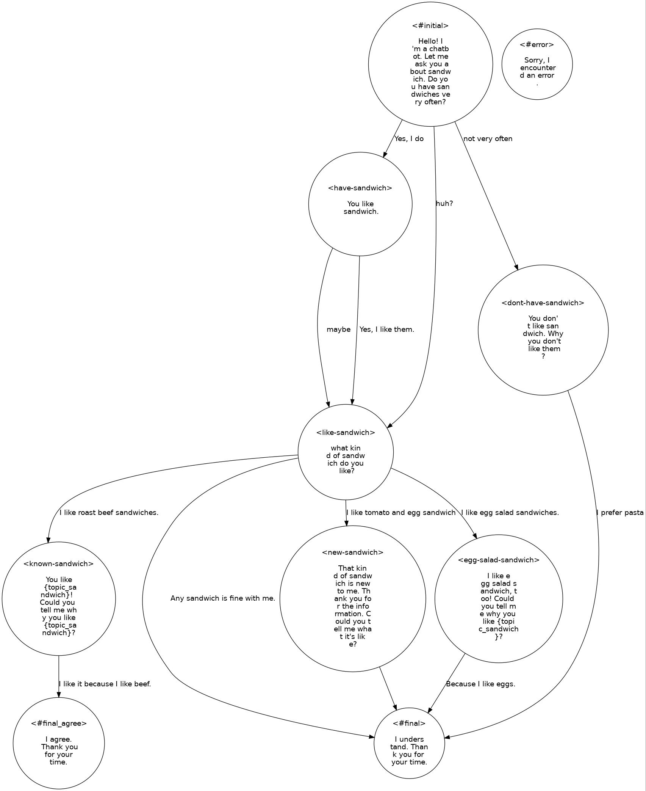

# Tutorial

## Introduction

DialBB comes with several sample applications. In this chapter, we will use the English applications among them to explain the structure of a DialBB application and the method for building an application using DialBB.

For instructions on how to run these applications, please refer to [README](https://github.com/c4a-ri/dialbb).

## Parrot Sample Application

### Description

This is a simple application that just parrots back what the user says. It does not use any built-in block classes.

It can be found in `sample_apps/parrot`.

The configuration file that defines this application is located at `sample_apps/parrot/config.yml`, and its contents are as follows:

```yaml
blocks:
  - name: parrot
    block_class: parrot.Parrot
    input:
      input_text: user_utterance  
      input_aux_data: aux_data
    output:
      output_text: system_utterance
      output_aux_data: aux_data
      final: final
```

`blocks` element is a list of configurations for the blocks used in this application, referred to as *block configurations*. This application uses only one block.

`name` specifies the name of the block. This name is used in logs.

`block_class` specifies the class name of the block. An instance of this class is created to exchange information with the main module. The class name should be written as a relative path from the configuration file or from the `dialbb` directory.

The block class must be a subclass of `dialbb.abstract_block.AbstractBlock`.

`input` defines how information is received from the main module. For example:

```yaml
input_text: user_utteranee
```
This means that the `blackboard['user_utterance']` in the main module can be referenced as the `input_text` element in the argument (dictionary type) of the `process` method of the block class.

`output` specifies the transmission of information to the main module. For example,

```yaml
output_text: system_utterance
```

means that `blackboard['output_text']` in the main module is overwritten or appended with the `output_text` element in the output (dictionary type) of the `process` method of the block class.

When illustrated, it looks like the following:


The symbols above the arrows connecting the main module and the block represent the keys on each side: the left side shows the key in the `blackboard` of the main module, while the right side shows the key for input or output in the block.

Additionally, by looking at `sample_apps/parrot/parrot.py`, you should be able to better understand the concept of block classes in DialBB.

### Debug Mode

By setting the environment variable `DIALBB_DEBUG` to `yes` as shown below, the log level will switch to debug mode.

```sh
export DIALBB_DEBUG=yes; python run_server.py sample_apps/parrot/config.yml
```

This will output detailed logs to the console, which should help deepen your understanding by observing the system’s behavior in more detail.

## ChatGPT Dialogue Application

### Description

Using {ref}`chatgpt_dialogue`, we will conduct a dialogue with OpenAI's ChatGPT.

It can be found in `sample_apps/chatgpt/`.

The contents of `sample_apps/chatgpt/config_en.yml` are as follows.

```yaml
blocks:
  - name: chatgpt
    block_class: dialbb.builtin_blocks.chatgpt.chatgpt.ChatGPT
    input:
      user_id: user_id
      user_utterance: user_utterance
      aux_data: aux_data
    output:
      system_utterance: system_utterance
      aux_data: aux_data
      final: final
    first_system_utterance: "Hello! Let's talk about food. What kind of cuisine do you like?"
    prompt_template: prompt_template_en.txt
    gpt_model: gpt-4o-mini
```

The exchange of information with the main module is illustrated as follows.


In addition to `input` and `output`, several other parameters are configured as block configuration parameters.

The `prompt_template` specifies the template for the system prompt.

The contents of the prompt template `sample_apps/chatgpt/prompt_template_en.txt` are as follows.

```markdown
# Task Description

- You are a dialogue system and are chatting with the user on food. Please generate next system utterance in less than 30 words.

# Your persona

- Emma
- female
- likes chocolates and wines
- working for an IT company
- very friendly and extrovert

#  Situation

- You first met the user.
- The user and you are in the same age group
- The user and you talk friendly

# The flow of dialogue

- Introduce each other
- Tell the user that you like Italian food
- Ask the user if se/he likes Italian food
- If the user likes Italian, ask the user which kind of Italian food she/he likes
- If the user doesn't like Italian, ask her/him why.

# Notes

- Do not begin your responses with your name or "User".
- Do not use quotation marks.

[[[
{notes}
]]]
```
The conversation history up to that point is attached to this prompt template and sent to ChatGPT, which then generates the system response.

The following sectionis usually not used and is deleted. A detailed explanation is omitted.
```
[[[
{notes}
]]]
```


(app_development_with_chatgpt_app)=
### Creating an Application Using the ChatGPT Application

To create a new application by reusing this application, follow these steps:

- Copy the entire `sample_apps/chatgpt` directory. It doesn't need to be placed within the DialBB directory; any directory will work.

- Edit `config.yml` and `prompt_template_en.txt`. You can also rename these files if desired.

- Start the application with the following command:

  ```sh
  export PYTHONPATH=<DialBB directory>; python run_server.py <configuration file>

## Simple Application

Here is a sample application using the embedded blocks.  
(As of v0.9, it has been replaced with an application that does not use Snips NLU.)

- {ref}`simple_canonicalizer`
- {ref}`lr_crf_understander`
- {ref}`stn_manager`

It can be found in `sample_apps/simple_ja/`.

### System Architecture

This application has the following system architecture.


This application uses the following three built-in blocks. Details on these built-in blocks are explained in {numref}`builtin_blocks`.

- Simple Canonicalizer: Normalizes user input sentences (converting uppercase to lowercase, etc.).

- LR-CRF Understander Performs language understanding. It uses Logistic Regression and Conditional Random Fields (CRF) to determine user utterance types (also known as intents) and extract slots.

- STN Manager: Manages dialogue and generates language. Dialogue management is performed using a State Transition Network (STN), which outputs system responses.

### Files Comprising the Application

The files that make up this application are located in the `sample_apps/simple_ja` directory (folder).

The `sample_apps/simple_ja` directory includes the following files:

- `config.yml`

  This is the configuration file that defines the application. It specifies which blocks to use and which files each block should load. The format of this file is explained in detail in {numref}`configuration`.

- `config_gs_template.yml`

  This is a template configuration file for using Google Spreadsheet instead of Excel for the knowledge needed by the LR-CRF Understander block and the STN Manager block. You can use it by copying the file and adding information needed to access Google Spreadsheet.

- `simple-nlu-knowledge-ja.xlsx`

  This file contains the knowledge (language understanding knowledge) used by the LR-CRF Understander block.

- `simple-scenario-ja.xlsx`

  This file contains the knowledge (scenario) used by the STN Manager block.

- `scenario_functions.py`

  This is a program used by the STN Manager block.

- `test_inputs.txt`

  This is the test scenario used for system testing.

### LR-CRF Understander Block

#### Language Understanding Result

The LR-CRF Understander block analyzes the input utterance and outputs the language understanding result.  
The language understanding result consists of a type and a set of slots.

For example, the language understanding result for "I like roast beef sandwiches" would be as follows.

```json
{
  "type": "tell-like-specific-sandwich", 
  "slots": {
     "favorite-sandwich": "roast beef sandwich"
  }
}
```
The phrase is categorized under the type `"tell-like-specific-sandwich"`, and the slot `"favorite-sandwich"` has the value `"roast beef sandwich"`. There may be utterances that contain multiple slots as well.

#### NLU Knowledge

The language understanding knowledge used by the LR-CRF Understander block is written in the `simple-nlu-knowledge-en.xlsx` file. For details on the description method of this language understanding knowledge, refer to {numref}`nlu_knowledge`. Below is a brief explanation.

The language understanding knowledge consists of the following two sheets:

| Sheet Name | Content                                                   |
|------------|------------------------------------------------------------|
| utterances | Examples of utterances for each type and the slots that should be extracted from those utterances |
| slots      | Relationship between slots and entities                   |

Here is an excerpt from the *utterances* sheet.

| flag | type                        | utterance                                | slots                                       |
| ---- | --------------------------- | ---------------------------------------- | ------------------------------------------- |
| Y    | yes                         | yes                                      |                                             |
| Y    | yes                         | yeah                                     |                                             |
| Y    | tell-like-specific-sandwich | I like roast beef sandwiches             | favorite-sandwich=roast  beef sandwiches    |
| Y    | tell-like-specific-sandwich | chicken salad sandwiches are my favorite | favorite-sandwich=chicken salad  sandwiches |

The first row indicates that the type of "yes" is "yes", and it has no slots. The language understanding result for "yes" would be as follows:

```JSON
{  
   "type": "yes"   
}
```

The language understanding result for "chicken salad sandwiches are my favorite" would be as follows:

```JSON
{
  "type": "tell-like-specific-sandwich", 
  "slots": {
     "favorite-sandwich": "chicken salad sadwiches"
  }
}
```

The `flag` column is used to specify in the configuration whether or not to use that row.

Next, here is a portion of the contents from the `slots` sheet.

| flag | slot name         | entity              | synonyms                          |
| ---- | ----------------- | ------------------- | --------------------------------- |
| Y    | favorite-sandwich | roast beef sandwich | roast beef, roast beef sandwiches |
| Y    | favorite-sandwich | egg salad sandwich  | egg salad sandwiches, Egg Salad   |


The `slot name` column indicates the slot name, `entity` specifies the slot value, and `synonyms` lists synonyms for that value. 

For example, the first row indicates that if values like `roast beef` or `roast beef sandwiches` are obtained as slot values for the slot `favorite-sandwich` , they will be replaced with `roast beef sandwich`  in the language understanding result.


#### Construction and Use of Language Understanding Models

When the application is launched, models based on logistic regression and conditional random fields (CRFs) are created using the aforementioned knowledge and are utilized during runtime.

### STN Manager Block

#### Overview

The STN Manager block performs dialogue management and language generation using a State-Transition Network (STN). The State-Transition Network is also referred to as a "scenario." The scenario is documented on the `scenario` sheet within the `simple-scenario-ja.xlsx` file. For details on how to write this sheet, please refer to {numref}`scenario`.

#### Scenario Description

A portion of the scenario description is provided below.

| flag | state             | system  utterance                   | user utterance  example                                      | user utterance  type        | conditions                                      | actions                                    | next state         |
| ---- | ----------------- | ----------------------------------- | ------------------------------------------------------------ | --------------------------- | ----------------------------------------------- | ------------------------------------------ | ------------------ |
| Y    | like-sandwich | what kind of  sandwich do you like? | I like egg  salad sandwiches.                                | tell-like-specific-sandwich | \_eq(#favorite-sandwich,  "egg salad sandwich") | _set(&topic_sandwich,  #favorite-sandwich) | egg-salad-sandwich |
| Y    | like-sandwich     |                                     | I  like roast beef sandwiches.                               | tell-like-specific-sandwich | is_known_sandwich(#favorite-sandwich)           | _set(&topic_sandwich,#favorite-sandwich)   | known-sandwich     |
| Y    | like-sandwich     |                                     | I  like tomato and egg sandwich.                             | tell-like-specific-sandwich | is_novel_sandwich(#favorite-sandwich)           |                                            | new-sandwich       |
| Y    | like-sandwich     |                                     | Any  sandwich is fine with me. |                             |                                                 |                                            | #final             |

Each row represents a single transition.

The `flag` column, similar to the language understanding knowledge, specifies whether that row will be used based on the configuration.

The `state` column contains the name of the initial state, and the `next state` column contains the name of the destination state.

The `system utterance` column contains the system's response output in that state. This response is linked to the value in the `state` column on the left, regardless of the transition in that row.

The `user utterance example` column provides an example of the expected user response for that transition. This example is not actually used in practice.

The `user utterance type` and `conditions` columns specify the conditions for the transition. The conditions for a transition are satisfied under the following conditions:

- The `user utterance type` column is empty, or the value in the `user utterance type` column matches the user utterance type of the language understanding result, and
- The `conditions` column is empty, or all conditions listed in the `conditions` column are satisfied.

These conditions are checked sequentially, starting from the topmost transition.

A row with both an empty `user utterance type` and an empty `conditions` column is referred to as a default transition. Generally, each state requires one default transition, which should be positioned at the bottom among the rows originating from that state.

#### Conditions

The `conditions` column contains a list of function calls representing specific conditions. If multiple function calls are present, they are separated by `;`.

The functions in the `conditions` column, known as *condition functions*, each return either `True` or `False`. When all function calls return `True`, the condition is considered satisfied.

Functions beginning with `_` are built-in functions. Other functions, defined in `scenario_functions.py` for this application, are custom functions created by developers.

The `_eq` function is a built-in function that returns `True` if two arguments contain the same string.

Arguments beginning with `#`, like `#favorite_sandwich`, are special arguments. For example, `#` followed by the name of a slot   in the language understanding result denotes the value of the slot.  `#favorite_sandwich` is the value of the `#favorite_sandwich` slot.

The values of the arguments enclosed by `""` like `"tuna sandwich"` are the enclosed strings.

`_eq(#favorite_sandwich, "tuna sandwich")` returns `True` when the `favorite-sandwich` slot value is `tuna sandwich`.

The function `is_known_ramen(#favorite_sandwich)` is defined in `scenario_functions.py` so that it returns `True` when the system recognizes the value in the `favorite-sandwich` slot and returns `False` otherwise.

Condition functions can access data known as *context information* which is a dictionary-type data structure. Keys can be added to this structure within the condition or action functions. Some keys are pre-set with values, as detailed in the reference section `{numref}context_information`.

#### Actions

The `actions` column specifies the processes to be executed when a transition in that row occurs. It lists function calls; if there are multiple function calls, they are separated by `;`.

Functions used in the `actions` column are called action functions, and they do not return any values.

Similar to condition functions, functions that start with an underscore (`_`) are built-in functions. Other functions are custom functions created by the developer and are defined in `scenario_functions.py` for this application.

The `_set` function assigns the value of the second argument to the first argument. For instance, `_set(&topic_sandwich, #favorite-sandwich)` assigns the value of the `#favorite-sandwich` slot to the `topic_sandwich` key in the context information. Context information values can be accessed within conditions and actions by referencing `*<key name>`.

`is_known_sandwich(#favorite-sandwich)` is an example of a developer-defined function. This function, defined in `scenario_functions.py`, judges whether the value of the `favorite-sandwich` slot of the language understanding result is one of the sandwiches that the system knows using its known sandwich list.

#### Summary of Transition Description

To summarize, in the first row, when the state is `like-sandwich`, the system utters, "what kind of sandwich do you like?". If the type of the user's next utterance, as determined by language understanding, is `tell-like-specific-sandwich`, and the value of the `favorite-sandwich` slot is `egg salad sandwich` , then the conditions are met, and the transition occurs. The value of the `favorite-sandwich` slot, i.e., `egg salad sandwich`, is then set as the value for `topic_sandwich` in the context information, and the state changes to `egg-salad-sadwich`. If the conditions are not met, the conditions for the second row are checked.

A diagram would illustrate this as follows:


#### Special State Names

There are some special state names used in the system:

- `#prep`: This is the state before the dialogue begins. After the session starts, condition checks and actions are executed in this state.
- `#initial`: This state generates the first user prompt.
- States with names starting with `#final` are final states. They set the `final` value in the block's output to `True`, indicating the end of the dialogue.
- `#error`: This state is used when an internal error occurs. It also sets `final` to `True` in the block's output, signaling the end of the dialogue.

#### Scenario Graph

If Graphviz is installed, the application will output a graph (`_scenario_graph.jpg`) upon startup. This graph, or scenario graph, utilizes the system utterances from the `system utterance` column and the example user utterances from the `user utterance example` column to illustrate the dialogue flow. Below is the scenario graph for this application.



### Utilizing N-Best Language Understanding Results

In this application, the LR-CRF language understanding block is set to output a 5-Best list of understanding results. This is specified by the `num_candidates` element in the configuration file.

```yml
blocks:  # bclock list
  - ....
  - name: understander
    ....
    num_candidates: 3
  - ....
```

In the STN Manager block, when checking the conditions for a transition, it examines the top language understanding results in order. If it finds a result that satisfies the conditions, it uses that result to execute the corresponding action and transitions to the next state.


### Building an Application Using a Simple Application Structure

#### Overview

This section explains how to construct an application using a simple application structure, similar to the method in {numref}`app_development_with_chatgpt_app`.

- **Copy the Application Directory**  
   Copy the `sample_apps/simple_ja` directory as a whole. You can place it in any directory unrelated to the DialBB directory.

- **Edit Each File**  
   You may edit each of the files in the directory as needed. Renaming the files is also permitted.

- **Run the Application**  
   Start the application with the following command:

   ```sh
   export PYTHONPATH=<DialBB directory>;python run_server.py <configuration file>
   ```

#### Files to Modify

- `simple-nlu-knowledge-ja.xlsx`

  Edit this file to adjust the knowledge used in the LR-CRF language understanding block.

- `simple-scenario-ja.xlsx`

  Modify this file to update the scenario.

- `scenario_functions.py`

  Define the functions (conditional functions and action functions) that are added to the scenario in this file (see {numref}`custom_functions`).

  In each function definition, include an additional argument representing context information, typically defined as `context: Dict[str, Any]`. Context information encompasses both pre-registered data and data added during interaction by action functions. For further details, refer to {numref}`context_information`.

- `config.yml`

  Modifications to this file are generally unnecessary if only basic functionality is being used.

## Lab Application

### Overview

It is based on language understanding by ChatGPT and network-based dialogue management, incorporating various functionalities of embedded blocks. The following embedded blocks are used:

- {ref}`simple_canonicalizer`
- {ref}`chatgpt_understander`
- {ref}`chatgpt_ner`
- {ref}`stn_manager`

The main differences from simple applications are the use of the ChatGPT language understanding block and the ChatGPT named entity recognition block, as well as the advanced functionalities of the STN Manager block.


### Files Comprising the Application

The files that make up this application are located in the `sample_apps/simple_ja` directory. This directory includes the following files:

- `config.yml`

  This is a configuration file that defines the application.


- `lab_app_nlu_knowledge_en.xlsx`

  This file contains the knowledge used by the ChatGPT Language Understanding Block.

- `lab_app_scenario_en.xlsx`

  This file contains the knowledge used by the STN Manager Block.

- `scenario_functions.py`

  This is a program used within the STN Manager Block.

- `test_requests.json`

  This file contains test requests (refer to {numref}`test_requests`).

### ChatGPT Language Understanding Block

Language understanding is conducted using ChatGPT in JSON mode. For this purpose, knowledge formatted in the same way as that used by the LR-CRF language understanding block is utilized. This knowledge is applied through few-shot learning to perform language understanding on the input text. The input and output of the LR-CRF language understanding block are also the same.

The specific GPT model for this process is defined in the block configuration under `gpt_model`.

The default prompt template is used for prompting ChatGPT to conduct language understanding. For further details, please refer to {numref}`chatgpt_understander_params`.

### ChatGPT Named Entity Recognition (NER) Block

The ChatGPT Named Entity Recognition (NER) block performs named entity extraction using ChatGPT. The extracted results are returned in the `aux_data` field of the block's output. Below is an example:

```json
{"NE_person": "John", "NE_Location": "Los Angels"}
```

`Person` and `Location` are named entity classes defined in the named entity recognition knowledge, which will be explained below. These results can be accessed within the STN Manager block using special variables such as `#NE_person` and `#NE_Location`.

#### Named Entity Recognition Knowledge

The knowledge used by the ChatGPT NER block is written in the `simple-ner-knowledge-ja.xlsx` file. For details on the description method of NER knowledge, refer to {numref}`chatgpt_ner_knowledge`. A brief explanation is provided below.

Named entity extraction knowledge consists of the following two sheets:

| Sheet Name | Description                                                  |
| ---------- | ------------------------------------------------------------ |
| utterances | Example utterances and the named entities that should be extracted from them |
| classes    | Descriptions of named entity classes and examples of named entities for each class |

Below is a partial example of the `utterances` sheet:

| flag | utterance                    | entities                   |
|------|------------------------------|----------------------------|
| Y   | New York                    | location=New York             |
| Y    | Candy likes tuna sandwiches | person=Candy                  |
| Y    | Tom White lives in LA       | person=Tom White, location=LA |

- The `flag` column is used to configure whether the row should be used.
- The `utterance` column contains example utterances.
- The `entities` column lists the slots contained in the utterance in the format `<Entity Class>=<Entity>, ..., <Entity Class>=<Entity>`. Commas can be full-width or punctuation marks.

Below is an example of the `classes` sheet. Each named entity class is described in one row.

| flag | class   | explanation   | examples                               |
|------|--------|--------------|----------------------------------------|
| Y   | person   | person name   | Daniel, Mr. Green, Dr. Morgan,  Becky, Karen Chu  |
| Y    | location | location name | Dallas, New Jersey, Washington  DC, Japan, Europe |

- The `flag` column is the same as in the `utterances` sheet.
- The `class` column specifies the named entity class.
- The `explanation` column describes the named entity.
- The `examples` column provides examples of named entities in the class, separated by commas or punctuation marks.

### Functions of the STN Manager

In the experimental application, the following STN Manager functions, which are not used in the simple application, are utilized.

#### Function Calls and Special Variable References in System Utterances

In the simple application, only context information variables were embedded in system utterances. However, it is also possible to embed function calls and special variables.

For example:

```
I'm {get_system_name()}. If you don't mind, could you tell me your name?
```

In this case, the function `get_system_name(context)`, defined in `scenario_functions.py`, is called, and its return value (a string) replaces `{get_system_name()}`. This function is designed to return the value of `system_name` specified in the configuration file.

Another example:

```
Thank you {#NE_person}! Let me ask you about sandwich. Do you have sandwiches very often?
```

Here, `{#NE_person}` is replaced by the value of the special variable `#NE_person`. `#NE_person` corresponds to the value of `NE_person` in `aux_data`, meaning it holds the value of the "Person" entity extracted by the named entity recognition block.

#### Syntax Sugar

Syntax sugar is provided to simplify the notation for calling built-in functions within the scenario. For instance, `confirmation_request="Sorry to ask you again, but do you often eat sadwiches?"` is equivalent to writing `_set(&confirmation_request, "Sorry to ask you again, but do you often eat sadwiches?")`.

Similarly:

- `#favorite-sandwich=="egg salad sandwich"` is equivalent to `_eq(#favorite-sandwich, "egg salad sandwich")`
- `#NE_person!=""` is equivalent to `_ne(#NE_Preson, "")`

This shorthand makes the scenario scripting more concise and easier to read.

#### Reaction Utterance Generation

In the `actions` section of the scenario, there is `_reaction="Great!"`. `_reaction` is a special variable in the context information that appends its value to the beginning of the next system utterance. For example, if the scenario transitions to a state called `like-sandwich` after this, the system utterance `what kind of sandwich do you like?` will have `Great!` added at the start, resulting in `Great! what kind of sandwich do you like?`.

By including such reactions, the system can acknowledge the user’s previous input, enhancing the user experience by conveying that it is actively listening to what the user is saying.

#### Utterance Generation and Condition Evaluation Using ChatGPT

In a system utterance, the notation `$"Generate a sentence to say it's time to end the talk by continuing the conversation in 50 words"` is syntax sugar for the built-in function call `_generate_with_llm("Generate a sentence to say it's time to end the talk by continuing the conversation in 50 words")`, which uses ChatGPT to generate an utterance.

Similarly, in the `conditions` section, the notation `$"Please determine if the user said the reason"` is syntax sugar for the built-in function call `_check_with_llm("Please determine if the user said the reason")`. This uses ChatGPT to evaluate the conversation history and returns a Boolean value indicating whether the user provided a reason.

The specific ChatGPT model, temperature parameter, context setting, and persona for utterance generation are specified in the block configuration as follows:

```yaml
chatgpt:
  gpt_model: gpt-4o-mini
  temperature: 0.7
  situation:
    - You are a dialogue system and chatting with the user.
    - You met the user for the first time.
    - You and the user are similar in age.
    - You and the user talk in a friendly manner.
  persona:
    - Your name is Yui
    - 28 years old
    - Female
    - You like sweets
    - You don't drink alcohol
    - A web designer working for an IT company
    - Single
    - You talk very friendly
    - Diplomatic and cheerful
```

#### Sub-dialogue

The `next state` field contains `#gosub:confirmation-requested:confirmed-if-have-sandwich`, which indicates that after transitioning to the `confirmation_requested`state and conducting a dialogue, the conversation will return to the `confirmed-if-have-sandwich`state. A conversation starting from the `confirmation_requested` state is called a sub-dialogue. When the sub-dialogue transitions to the `#exit` state, it exits the sub-dialogue and goes to the ``confirmed-if-have-sandwich` state.

By setting up reusable dialogues as sub-dialogues for various situations that require user confirmation, you can reduce the amount of scenario writing required.

#### Skip Transition

When `$skip` is placed in the system utterance field, no system utterance is returned, and the system immediately moves to the next transition after evaluating conditions. This is useful when you want to determine the next transition based on the outcome of an action.

#### Repeat Function

The `repeat_when_no_available_transitions` option is specified in the block configuration. When this is enabled, if there are no transitions that satisfy the conditions, it returns to the original state and repeats the same utterance. In this case, it’s acceptable to have states without default transitions. In this application, the `like-sandwich` state lacks a default transition, so if an unrelated utterance is made in this state, the same system utterance will be repeated.

#### Handling Voice Input

The STN Manager includes functionality to handle voice input, which can be utilized by configuring it in the block configuration. In this application, it is set up as follows:

```yaml
    input_confidence_threshold: 0.5
    confirmation_request:
      function_to_generate_utterance: generate_confirmation_request
      acknowledgement_utterance_type: "yes"
      denial_utterance_type: "no"
    #utterance_to_ask_repetition: "could you say that again?"
    ignore_out_of_context_barge_in: yes
    reaction_to_silence:
      action: repeat
```
Please refer to {numref}`handling_speech_input` for the meanings.

The file `test_requests.json` contains examples of inputs that support speech input.

