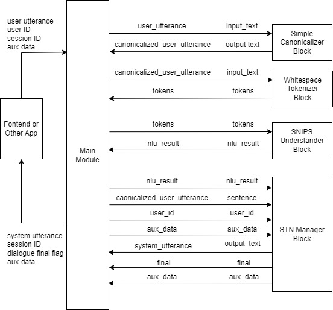

# Sample Applications

## Sample Applications Included in DialBB

### Parroting application

This is an application that just parrots back and forth. No built-in block classes are used.

It is located in `sample_apps/parrot`.

### Snips+STN Applications

Applications using the following blocks.

- English Application

  - {ref}`simple_canonicalizer`
  - {ref}`whitespace_tokenizer`
  - {ref}`snips_understander`
  - {ref}`stn_manager`

- Japanese Application

  - Japanese Canonicalizer
  - Sudachi Tokenizer
  - {ref}`snips_understander`
  - {ref}`stn_manager`

The English version is located in `sample_apps/network_en/` and the Japanese version is located in `sample_apps/network_ja/`.

### Experimental Application

This application is based on language understanding based on ChatGPT and dialogue management based on state transistion networks, and includes examples of various functions of the built-in blocks. It uses the following built-in blocks. (from v0.7, ChatGPT language undderstanding instead of Snips language understanding)

- English Application

  - Simple Canonicalizer
  - {ref}`chatgpt_understander`
  - {ref}`spacy_ner`
  - {ref}`stn_manager`

- Japanese Application

  - Japanese Canonicalizer
  - {ref}`chatgpt_understander`
  - {ref}`spacy_ner`
  - {ref}`stn_manager`

It is located in `sample_apps/lab_app_ja/` (Japanese)  and `sample_apps/lab_app_en/` (English).

### ChatGPT Dialogue Application

It uses the following built-in blocks to engage in dialogue using OpenAI's ChatGPT.

- {ref}`chatgpt_dialogue`

It is located in `sample_apps/chatgpt/`.

## Exaplanation of Snips+STN Appplication

This section describes the structure of a DialBB application through the English Snips+STN Application.

### System Architecture

Below is the system architecture of the application.




This application uses the following built-in blocks. The details of these built-in blocks are described in "{ref}`builtin-blocks`".


- Simple Canonicalizer: Normalizes user input text (uppercase -> lowercase, etc.)

- Whitespace Tokenizer: Splits normalized user input into tokens based on whitespaces.

- Snips Understander: Performs language understanding, using [Snips_NLU](https://snips-nlu.readthedocs.io/en/latest/) to determine user utterance types (also called intents) and extract slots.

- STN Manager: Performs dialogue management and language generation. It uses a state transition network and outputs system utterances.


The symbols on the arrows connecting the main module and the blocks are the keys on the blackboard of the main module on the left side and the keys on the input/output of the blocks on the right side.


### Files Comprising the Application

The files comprising this application are located in the directory `sample_apps/network_en`. By
modifying these files, you can see how the application will change. By making significant changes to the
files, you can create a completely different dialogue system.

`sample_apps/network_en` includes the following files.

- `config.yml`


  This is a configuration file that defines the application. It specifies information such as what blocks to use and the files to be loaded by each block. The format of this file is described in detail in the "{ref}`configuration`" section.

- `sample-knowledge-en.xlsx`

  This describes the knowledge used in the Snips Understander and STN Manager blocks.

- `scenario_functions.py`

  This defines functions used in the STN Manager block.

- `dictionary_functions.py`

  This contains examples of defining dictionary for Snips Understander with functions, not Excel.


- `test_inputs.txt`

  Test scenarios used in system testing.

### Snips Understander Block

#### Language understanding results

The Snips Understander block analyzes input utterance and outputs language understanding results. Each result consists of a type and a set of slots. For example, the language understanding result of "I like chicken salad sandwich" is as follows.

```json
{
  "type": "tell-like-specific-sandwich", 
  "slots": {
    "favarite_sandwich": "chcken salad sandwich"
  }
}
```

The type is `"tell-like-specific-sandwich"` and the value of the `"favarite_sandwich"` slot is `"chicken salad sandwich"`. It is possible to have multiple slots.


#### Language understanding knowledge

The knowledge for language understanding used by the Snips Understander block is written in `sample-knowledge-ja.xlsx`.

The language understanding knowledge consisits of the following four sheets.

| Sheet name | Contents                                   |
| ---------- | -------------------------------------- |
| utterances | Examples of utterance for each type                       |
| slots      | Relationship between slots and entities           |
| entities   | Entity information               |
| dictionary | Dictionary entries and sysnonyms for each entry |

For more information on these, see "{ref}`nlu_knowledge`."

#### Training data for Snips

When the application is launched, the above knowledge is converted into training data for Snips and a model is created. 

The training data for Snips is `_training_data.json` in the application directory. You can check if the conversion is successful by looking at this file.

### STN Manager Block 

The dialogue management knowledge (scenario) is the `scenario` sheet in the `sample-knowledge-en.xlsx` file. 

For details on how to write this sheet, please refer to "{ref}`scenario`".

If GraphViz is installed, the application outputs an image file (`_`) of the state transition network generated from
the scenario file when the application is launched. The following is the state transition network of the
application.


Among the functions used in the conditions of transisions and actions that are executed after transitions, those which are not built-in are defined in `scenario_functions.py`.


