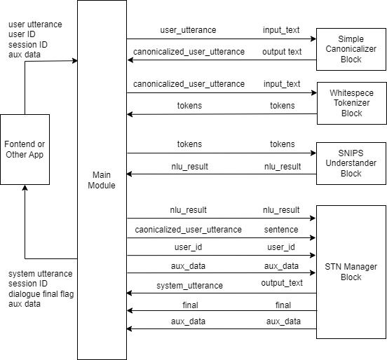
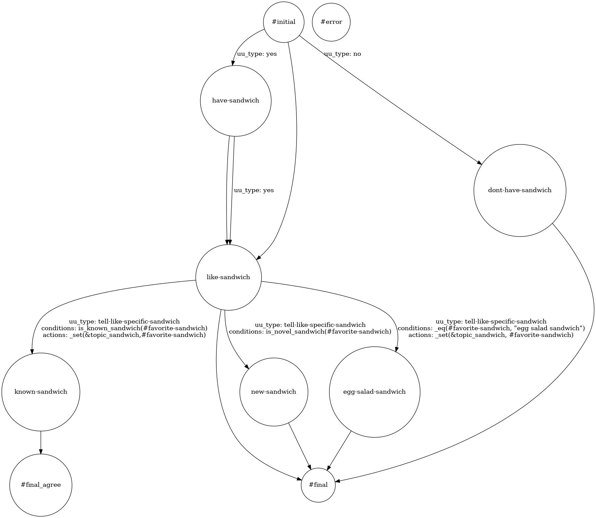

# English Sample Application 

This section describes the structure of a DialBB application through a English sample application.

## システム構成

Below is the system architecture of the application.





This application uses the following built-in blocks. Built-in blocks are blocks that are pre-installed in DialBB. The details of these built-in blocks are described in "{ref}`builtin-blocks`".


- Simple Canonicalizer: Normalizes user input text (uppercase -> lowercase, etc.)

- Whitespace Tokenizer: Splits normalized user input into tokens based on whitespaces.

- SNIPS Understander: Performs language understanding, using [SNIPS_NLU](https://snips-nlu.readthedocs.io/en/latest/) to determine user speech
types (also called intents) and extract slots.

- STN Manager: Peformes dialogue management and language generation. It uses a state transition network and outputs system utterances.


The symbols on the arrows connecting the main module and the blocks are the keys on the blackboard of the main module on the left side and the keys on the input/output of the blocks on the right side.


## Files comprising the application

The files comrising this application are located in the directory (folder) `sample_apps/network_en`. By
modifying these files, you can see how the application will change. By making significant changes to the
files, you can create a completely different dialogue system.

`sample_apps/network_ja` includes the following files.

- `config.yml`


  This is a configuration file that defines the application. It specifies information such as what blocks to use and the files to be loaded by each block. The format of this file is described in detail in the "{ref}`configuration`" section.

- `sample-knowledge-en.xlsx`

  This describes the knowledge used in the SNIPS Undderstander and STN Manager blocks.

- `scenario_functions.py`

  This defines functions used in the STN Manager block.

SNIPS Undderstander用の辞書をExcel記述ではなく，関数によって定義する場合の例が含まれています．

- `test_inputs.txt`

  Test scenarios used in system testing.

## SNIPS Understander Block

### Laguange understanding results

The SNIPS Understander block analyzes input utterance and outputs language understanding results. The result consists of a type and a set of slots. For example, the language understanding result of "I like chicken salad sandwich" is as follows.

```json
{"type": "tell-like-specific-sandwich", "slots": {"favarite_sandwich": "chcken salad sandwich"}}
```

The type is `"tell-like-specific-sandwich"` and the value of the `"favarite_sandwich"` slot is `"chicken salad sandwich"`. It is possible to have multiple slots.

`"特定のラーメンが好き"`がタイプで，`"favarite_ramen"`スロットの値が`"醤油ラーメン"`です．複数のスロットを持つような発話もあり得ます．

### Language understanding knowledge

THe knowldge for language understanding used by the SNIPS Understander block is written in `sample-knowledge-ja.xlsx`.

THe language understanging knowledge consisits of the following four sheets.

| Sheet namae   | Contents                                   |
| ---------- | -------------------------------------- |
| utterances | Examples of speech for each type                       |
| slots      | Relationship between slots and entities           |
| entities   | Entity information               |
| dictionary | Dictionary entries and sysnonimys for each entry |

For more information on these, see "{ref}`nlu_knowledge`.

### Traning data for SNIPS

When the application is launched, the above knowledge is converted into training data for SNIPS and a model is created. 
 
The training data for SNIPS is `_training_data.json` in the application directory. You can check if the conversion is successful by looking at this file.

## STN Manager Block 

The dialogue management knowledge (scenario) is the `scenario` sheet in the `sample-knowledge-en.xlsx` file. 

For details on how to write this sheet, please refer to "{ref}`scenario`".

If Graphviz is installed, the application outputs an image file of the state transition network generated from
the scenario file when the application is launched. The following is the state transition network of the
application.




Among the functions used in the conditions of transisions and actions that are executed after transitions, those which are not built-in are defined in `scenario_functions.py`.


