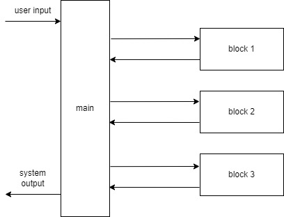

# DialBBの概要

{ref}`intro`に書いたように，DialBBは対話システムを作るためのフレームワークです．

フレームワークとは，それ単体でアプリケーションとして成立はしないが，データや追加のプログラムを与えることでアプリケーションを作成するものです．

以下にDialBBのアプリケーションの基本的なアーキテクチャを示します．

メインモジュールは，対話の各ターンで入力されたデータ（ユーザ発話を含みます）を各ブロックに順次処理させることにより，システム発話を作成して返します．この入力の内容は同じJSON形式のデータblackboard[^fn] に書き込まれます．各ブロックは，blackboardの要素のいくつかを受け取り，辞書形式のデータを返します．返されたデータはblackboardに追加されます．すでに同じキーを持つ要素がblackboardにある場合は上書きされます．

どのようなブロックを使うかは，コンフィギュレーションファイルで設定します．ブロックは，あらかじめDialBBが用意しているブロック（組み込みブロック）でもアプリケーション開発者が作成するブロックでも構いません．

メインモジュールが各ブロックにどのようなデータを渡し，どのようなデータを受け取るかもコンフィギュレーションファイルで指定します．

詳細は「{ref}`framework`」で説明します．

[^fn]: ver.0.2以前はpayloadと呼んでいました．
