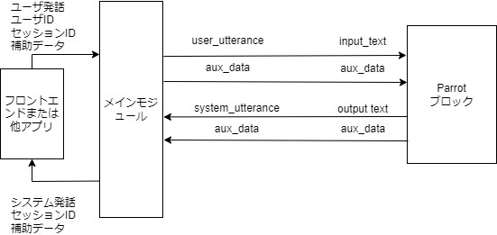
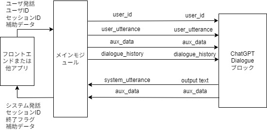

# チュートリアル

## はじめに

DialBBにはいくつかのサンプルアプリケーションが付属しています．本章ではこれらのうち，日本語アプリケーションを用いて，DialBBのアプリケーションの構成と，DialBBを用いてアプリケーションを構築する方法を説明します．

これらのアプリケーションの動作のさせ方は[README](https://github.com/c4a-ri/dialbb)を見てください．

## オウム返しサンプルアプリケーション

### 説明

ただオウム返しを行うアプリケーションです．組み込みブロッククラスは使っていません．

`sample_apps/parrot`にあります．

`sample_apps/parrot/config.yml`が，このアプリケーションを規定するコンフィギュレーションファイルで，その内容は以下のようになっています．

```yaml
blocks:
  - name: parrot
    block_class: parrot.Parrot
    input:
      input_text: user_utterance  
      input_aux_data: aux_data
    output:
      output_text: system_utterance
      output_aux_data: aux_data
      final: final
```

`blocks`は，本アプリケーションで用いるブロックのコンフィギュレーション（*ブロックコンフィギュレーション*と呼びます）のリストです．本アプリケーションでは，一つのブロックのみを用います．

`name`はブロックの名前を指定します．ログで用いられます．

`block_class`は，このブロックのクラス名を指定します．このクラスのインスタンスが作られて，メインモジュールと情報をやり取りします．クラス名は，コンフィギュレーションファイルからの相対パスまたは`dialbb`ディレクトリからの相対パスで記述します．

ブロッククラスは，`diabb.abstract_block.AbstractBlock`の子孫クラスでないといけません．

`input`はメインモジュールからの情報の受信を規定します．例えば，

```yaml
input_text: user_utteranee
```

は，メインモジュールの`blackboard['user_utterane']`をブロッククラスの中の`process`メソッドの入力（辞書型）の`input_text'`として参照できることを意味します．

`output`はメインモジュールへの情報の送信を規定します．例えば，

```yaml
output_text: system_utterance
```

は，メインモジュールの`blackboard['output_text']`をブロッククラスの`process`メソッドの出力（辞書型）`output_text`要素で上書きまたは追加することを意味しています．

これを図示すると以下のようになります．



メインモジュールとブロックを結ぶ矢印の上の記号は，左側がメインモジュールのblackboardにおけるキーで，右側がブロックの入出力におけるキーです．

さらに，`sample_apps/parrot/parrot.py`を見ることでDialBBにおけるブロッククラスの概念が理解できると思います．

### デバッグモード

以下のように，環境変数`DIALBB_DEBUG`に`yes`を設定することにより，ログレベルがデバッグモードになります．

```sh
export DIALBB_DEBUG=yes;python run_server.py sample_apps/parrot/config.yml
```

これにより，コンソールに詳しいログが出力されます．

## ChatGPT対話アプリケーション

### 説明

{ref}`chatgpt_dialogue`を用い，OpenAIのChatGPTを用いて対話を行います．

`sample_apps/chatgpt/`にあります．

`sample_apps/chatgpt/config_ja.yml`の内容は以下のようになっています．

```yaml
blocks:
  - name: chatgpt
    block_class: dialbb.builtin_blocks.chatgpt.chatgpt.ChatGPT
    input:
      user_id: user_id
      user_utterance: user_utterance
      aux_data: aux_data
    output:
      system_utterance: system_utterance
      aux_data: aux_data
      final: final
    user_name: ユーザ
    system_name: システム
    first_system_utterance: "こんにちは．私の名前は由衣です．少しお話させてください．スイーツって好きですか？"
    prompt_template: prompt_template_ja.txt
    gpt_model: gpt-3.5-turbo
```

メインモジュールとの情報の授受を図示すると以下のようになります．




ブロックコンフィギュレーションのパラメータとして，`input`，`output`以外にいくつか設定されています．

`prompt_template`は，システム発話のプロンプトのテンプレートを指定します．

プロンプトテンプレート`sample_apps/chatgpt/prompt_template_ja.txt`の中身は以下のようになっています．

```txt
# タスク説明

- あなたは対話システムで，ユーザと食べ物に関して雑談をしています．あなたの次の発話を50文字以内で生成してください．

# あなたのペルソナ

- 名前は由衣
- 28歳
- 女性
- スイーツ全般が好き
- お酒は飲まない
- IT会社のwebデザイナー
- 独身
- 非常にフレンドリーに話す
- 外交的で陽気

#  状況

- ユーザとは初対面
- ユーザは同年代
- ユーザとは親しい感じで話す

# 対話の流れ

- 自己紹介する
- 自分がスイーツが好きと伝える
- スイーツが好きかどうか聞く
- ユーザがスイーツが好きな場合，どんなスイーツが好きか聞く
- ユーザがスイーツが好きでない場合，なんで好きじゃないのか聞く

# 現在までの対話

@dialogue_history
```

最後の`@dialogue_history`のところに，それまでの対話の履歴が以下のような形式で挿入されます．

```
システム：こんにちは．私の名前は由衣です．少しお話させてください．スイーツって好きですか？
ユーザ：まあまあ好きです
システム：そうなんですね！私も大好きです．どんなスイーツが好きですか？
ユーザ：どっちかというと和菓子が好きなんですよね
```

ここで，「システム」「ユーザ」はコンフィギュレーションの`user_name`, `system_name`で指定したものが使われます．

(app_development_with_chatgpt_app)=

### ChatGPTアプリケーションを利用したアプリケーション作成

このアプリケーションを流用して新しいアプリケーションを作るには以下のようにします．

- `sample_apps/chatgpt`をディレクトリ毎コピーします．DialBBのディレクトリとは全く関係ないディレクトリで構いません．

- `config.yml`や`prompt_template_ja.txt`をを編集します．これらのファイルの名前を変更しても構いません．

- 以下のコマンドで起動します．

  ```sh
  export PYTHONPATH=<DialBBディレクトリ>;python run_server.py <コンフィギュレーションファイル>
  ```

## シンプルアプリケーション

以下の組み込みブロックを用いたサンプルアプリケーションです．
(v0.9からSnips言語理解を使わないアプリケーションに置き換わりました）

- {ref}`japanese_canonicalizer`
- {ref}`lr_crf_understander`
- {ref}`stn_manager`

`sample_apps/simple_ja/`にあります．

### システム構成

本アプリケーションは以下のようなシステム構成をしています．


本アプリケーションでは，以下の3つの組み込みブロックを利用しています．これらの組み込みブロックの詳細は，「{ref}`builtin-blocks`」で説明します．

- Japanese Canonicalizer: ユーザ入力文の正規化（大文字→小文字，全角→半角の変換，Unicode正規化など）を行います．
- LR-CRF Understander: 言語理解を行います．ロジスティック回帰 (Logistic Regression) と条件付き確率場(Conditional Random Fields) を利用して，ユーザ発話タイプ（インテントとも呼びます）の決定とスロットの抽出を行います．
- STN Manager: 対話管理と言語生成を行います．状態遷移ネットワーク(State Transition Network)を用いて対話管理を行い，システム発話を出力します．


### アプリケーションを構成するファイル

本アプリケーションを構成するファイルは`sample_apps/simple_ja`ディレクトリ（フォルダ）にあります．

`sample_apps/simple_ja`には以下のファイルが含まれています．

- `config.yml`

  アプリケーションを規定するコンフィギュレーションファイルです．どのようなブロックを使うかや，各ブロックが読み込むファイルなどが指定されています．このファイルのフォーマットは{numref}`configuration`で詳細に説明します．

- `config_gs_template.yml`　

  LR-CRF UnderstanderブロックとSTN Manageブロックで用いる知識をExcelではなく，Google Spreadsheetを用いる場合のコンフィギュレーションファイルのテンプレートです．これをコピーし，Google Spreadsheetにアクセスするための情報を加えることで使用できます．

- `simple-nlu-knowledge-ja.xlsx`

  LR-CRF Understanderブロックで用いる知識（言語理解知識）を記述したものです．

- `simple-scenario-ja.xlsx`

  STN Managerブロックで用いる知識（シナリオ）を記述したものです．

- `scenario_functions.py`

  STN Managerブロックで用いるプログラムです

- `test_inputs.txt`

  システムテストで使うテストシナリオです．

### LR-CRF Understanderブロック

#### 言語理解結果

LR-CRF Understanderブロックは，入力発話を解析し，言語理解結果を出力します．
言語理解結果はタイプとスロットの集合からなります．

例えば，「好きなのは醤油」の言語理解結果は次のようになります．

```json
{
  "type": "特定のラーメンが好き", 
  "slots": {
     "好きなラーメン": "醤油ラーメン"
  }
}
```

`"特定のラーメンが好き"`がタイプで，`"favarite_ramen"`スロットの値が`"醤油ラーメン"`です．複数のスロットを持つような発話もあり得ます．

#### 言語理解知識

LR-CRF Understanderブロックが用いる言語理解用の知識は，`simple-nlu-knowledge-ja.xlsx`に書かれています．言語理解知識の記述法の詳細は{numref}`nlu_knowledge`を参照してください．以下に簡単に説明します．

言語理解知識は，以下の2つのシートからなります．

| シート名   | 内容                                                     |
| ---------- | -------------------------------------------------------- |
| utterances | タイプ毎の発話例と，その発話例から抽出されるべきスロット |
| slots      | スロットとエンティティの関係                             |

utterancesシートの一部を以下に示します．

| flag | type                           | utterance                    | slots                                  |
| ---- | ------------------------------ | ---------------------------- | -------------------------------------- |
| Y    | 肯定                           | はい                         |                                        |
| Y    | 否定                           | そうでもない                 |                                        |
| Y    | 特定のラーメンが好き           | 豚骨ラーメンが好きです       | 好きなラーメン=豚骨ラーメン            |
| Y    | 地方を言う                     | 荻窪                         | 地方=荻窪                              |
| Y    | ある地方の特定のラーメンが好き | 札幌の味噌ラーメンが好きです | 地方=札幌, 好きなラーメン=味噌ラーメン |

一行目は「はい」のタイプが「肯定」で，スロットはないことを示しています．「はい」の言語理解結果は以下のようになります．

```JSON
{  
   "type": "はい"   
}
```

「札幌の味噌ラーメンが好きです」の言語理解結果は以下のようになります．

```JSON
{
  "type": "ある地方の特定のラーメンが好き", 
  "slots": {
     "好きなラーメン": "味噌ラーメン",
     "地方": "札幌"
  }
}
```

`flag`列は，その行を使用するかどうかをコンフィギュレーションで規定するためのものです．

次に，`slots`シートの内容の一部を以下に示します．

| flag | slot name      | entity       | synonyms                                     |
| ---- | -------------- | ------------ | -------------------------------------------- |
| Y    | 好きなラーメン | 豚骨ラーメン | とんこつラーメン，豚骨スープのラーメン，豚骨 |
| Y    | 好きなラーメン | 味噌ラーメン | みそらーめん，みそ味のラーメン，味噌         |

`slot name`列はスロット名，`entity`はスロット値，`synonyms`は同義語のリストです． 
例えば，一行目は，`好きなラーメン`のスロット値として，`とんこつラーメン`や`豚骨`などが得られた場合，言語理解結果においては，`豚骨ラーメン`に置き換えられる，ということを表しています．


#### 言語理解モデルの構築と利用

アプリを立ち上げると，上記の知識から，ロジスティック回帰と条件付き確率場のモデルが作られ，実行時に用いられます．

### STN Managerブロック

#### 概要

STN Managerブロックは，状態遷移ネットワーク（State-Transition Network）を用いて対話管理と言語生成を行います．状態遷移ネットワークのことをシナリオとも呼びます．シナリオは，`simple-scenario-ja.xlsx`ファイルの`scenario`シートに書かれています．このシートの書き方の詳細は{numref}`scenario`を参照してください．

#### シナリオ記述

シナリオ記述の一部を以下に示します．

| flag | state | system  utterance                                            | user utterance  example                | user utterance  type | conditions                            | actions                                                      | next state             |
| ---- | ----- | ------------------------------------------------------------ | -------------------------------------- | -------------------- | ------------------------------------- | ------------------------------------------------------------ | ---------------------- |
| Y    | 好き  | 豚骨ラーメンとか塩ラーメンなどいろんな種類のラーメンがありますが，どんなラーメンが好きですか？ | 豚骨ラーメンが好きです．               | 特定のラーメンが好き | _eq(#好きなラーメン,  "豚骨ラーメン") | _set(&topic_ramen,  #好きなラーメン)                         | 豚骨ラーメンが好き     |
| Y    | 好き  |                                                              | 豚骨ラーメンが好きです．               | 特定のラーメンが好き | is_known_ramen(#好きなラーメン)       | _set(&topic_ramen,  #好きなラーメン); get_ramen_location(*topic_ramen, &location) | 特定のラーメンが好き   |
| Y    | 好き  |                                                              |                                        | 特定のラーメンが好き | is_novel_ramen(#好きなラーメン)       | _set(&topic_ramen,  #好きなラーメン)                         | 知らないラーメンが好き |
| Y    | 好き  |                                                              | 近所の街中華のラーメンが好きなんだよね |                      |                                       |                                                              | #final                 |

各行が一つの遷移を示します．

`flag`列はは言語理解知識と同じく，その行を使用するかどうかをコンフィギュレーションで規定するためのものです．

`state`列は遷移元の状態の名前，`next state`列は遷移先の状態の名前です．

`system utterance`列はその状態で出力されるシステム発話です．システム発話はその行の遷移とは関係なく，左側の`state`列の値と結びついています．

`user utterance example`列は，その遷移で想定する発話の例です．実際には使いません．

`user utterance type`列と`conditions`列はその遷移の条件を表します．以下の場合に遷移が満たされます．

- `user utterance type`列が空か，または，`user utterance type`列の値が言語理解結果のユーザ発話タイプがその値と同じで，かつ，
- `conditions`列が空か，または，`conditions`列のすべての条件が満たされるとき

これらの条件は，上に書いてある遷移から順に，満たされるかどうかを調べて行きます．

`user utterance type`列も`conditions`列も空のものをデフォルト遷移と呼びます．
基本的に，一つのstateにデフォルト遷移が一つ必要で，そのstateが遷移元になっている行のうち一番下にないといけません．

（デフォルト遷移がなくても良い場合がありますが，それについては{ref}`scenario`を参照してください．

#### 条件

`conditions`列の条件は，関数呼び出しのリストです．関数呼び出しが複数ある場合は，`;`でつなぎます．

`conditions`列で使われる関数は，条件関数と呼ばれ，`True`か`False`を返す関数です．すべての関数呼び出しが`True`を返した場合，条件が満たされます．

`_`で始まる関数は，組み込み関数です．それ以外の関数は，開発者が作成する関数で，このアプリケーションの場合，`scenario_functions.py`で定義されています．

`_eq`は二つの引数の値が同じ文字列なら，`True`を返す組み込み関数です．

`#好きなラーメン`のように，`#`で始まる引数は特殊な引数です．例えば言語理解結果のスロット名に`#`をつけたものはスロット値を表す引数です．`#好きなラーメン`は`好きなラーメン`スロットの値です．

`"豚骨ラーメン"`のように，`""`で囲まれた引数はその中の文字列がその値になります．

`_eq(#好きなラーメン,  "豚骨ラーメン")`は，`好きなラーメン`スロットの値が`豚骨ラーメン`の時に`True`になります．

`is_known_ramen(#好きなラーメン)`はシステムが`好きなラーメン`スロットの値を知っていれば`True`を返し，そうでなければ`False`を返すように`scenario_functions.py`の中で定義されています．

条件関数の定義の中では，文脈情報と呼ばれるデータにアクセスすることができます．文脈情報は辞書型のデータで，条件関数や後述のアクション関数の中で，キーを追加することができます．また，あらかじめ値が入っている特殊なキーもあります．詳細は{numref}`context_information`を参照してください．

#### アクション

`actionss`列には，その行の遷移が行われたときに，実行される処理を書きます．これは，関数呼び出しの列です．関数呼び出しが複数ある場合は，`;`でつなぎます．

`actions`列で使われる関数は，アクション関数と呼ばれ，何も返しません．

条件関数と同様，`_`で始まる関数は，組み込み関数です．それ以外の関数は，開発者が作成する関数で，このアプリケーションの場合，`scenario_functions.py`で定義されています．

`_set`は第2引数の値を第1引数に代入する処理を行います．`_set(&topic_ramen,  #好きなラーメン)`の第１引数&topic_ramenは，部文脈情報の`topic_ramen`キーの意味で，この関数呼び出しは文脈情報の`topic_ramen`に`#好きなラーメン`スロットの値をセットします．文脈情報の値は，`*<キー名>`で，条件やアクションの中で取り出せます．

`get_ramen_location(*topic_ramen, &location)`は，開発者の作成した関数の呼び出しです．`get_ramen_location`は`scenario_functions.py`で定義されています．この関数は第1引数の値であるラーメンの種類が名物である場所を検索し，文脈情報の第2引数で指定されたキーの値にセットします．例えば`topic_ramen`キーの値が`味噌ラーメン`の場合，味噌ラーメンが名物である場所を検索し，その値が`札幌`であれば，文脈情報の`location`の値を札幌に設定する，という処理を行います．

#### 遷移の記述のまとめ

まとめると，1行目は，状態が`好き`の時，「豚骨ラーメンとか塩ラーメンなどいろんな種類のラーメンがありますが，どんなラーメンが好きですか？」を発話し，次のユーザの発話の言語理解結果のタイプが`特定のラーメンが好き`で，`好きなラーメン`スロットの値が`豚骨ラーメン`であれば，条件が満たされて遷移が行われ，`好きなラーメン`スロットの値，すなわち，`豚骨ラーメン`が，文脈情報の`topic_ramen`の値にセットされ，`豚骨ラーメンが好き`状態に移行します．条件が満たされない場合，2行目の条件が調べられます．

これを図示すると以下のようになります．


#### 特殊な状態名

状態名には特殊なものがあります．

`#prep`は，対話が始まる前の状態で，セッション開始後，条件判定とアクションが実行されます．

`#initial`は，最初のユーザ発話を生成する状態です．

`#final`で始まる名前の状態は，最終状態です．ブロックの出力の`final`に`True`を入れて返すので，対話が終了します．

`#error`は，内部エラーが起きた場合に遷移する状態です．これもブロックの出力の`final`に`True`を入れて返します．

#### シナリオグラフ

Graphvizがインストールされていれば，アプリケーションを起動したとき，`system utterance`列のシステム発話と`user utterance  example`列のユーザ発話例を利用したグラフ(シナリオグラフ`_scenario_graph.jpg`)を出力します．以下が本アプリケーションのシナリオグラフです．


### N-Best言語理解結果の利用

本アプリケーションでは，LR-CRF言語理解ブロックが5-Bestの理解結果を出力するようになっています．これは，コンフィギュレーションファイルの以下の`num_candidates`要素で指定されています．

```yml
blocks:  # bclock list
  - ....
  - name: understander
    ....
    num_candidates: 3
  - ....
```

STN Managerブロックでは，遷移の条件を調べるときに上位の言語理解結果から順に調べ，条件を満たすものがあれば．その結果を用いてアクションを実行して，次の状態に遷移します．

### シンプルアプリケーションを利用したアプリケーション構築

#### 概要

{}{numref}`app_development_with_chatgpt_app`と同様に，シンプルアプリケーションを利用したアプリケーション構築法を説明します．

- `sample_apps/simple_ja`をディレクトリ毎コピーします．DialBBのディレクトリとは全く関係ないディレクトリで構いません．

- 各ファイルを編集します．．これらのファイルの名前を変更しても構いません．

- 以下のコマンドで起動します．

  ```sh
  export PYTHONPATH=<DialBBディレクトリ>;python run_server.py <コンフィギュレーションファイル>
  ```

#### 変更するファイル

- `simple-nlu-knowledge-ja.xlsx`

  LR-CRF言語理解ブロックで用いる知識を編集します．

- `simple-scenario-ja.xlsx`

  シナリオを編集します．

- `scenario_functions.py`

  シナリオに付け加えた関数（条件関数，アクション関数）の定義を行います．（{numref}`custom_functions`参照．）

  各関数の定義では，シナリオで用いる引数にプラスして，文脈情報を表す辞書型の引数を付加する必要があります．一般的には，`context: Dict[str, Any]`とします．文脈情報には，あらかじめ登録されている情報と対話中にアクション関数によって登録される情報があります．詳細は{numref}`context_information`を見てください．

- `config.yml`

  基本的な機能のみを用いるならば，あまり変更する必要はないと思います．

## 実験アプリケーション

### 概要

ChatGPTによる言語理解とネットワークベース対話管理を軸に，組み込みブロックの様々な機能を含んでいるものです．以下の組み込みブロックを用いています．

- {ref}`japanese_canonicalizer`
- {ref}`chatgpt_understander`
- {ref}`spacy_ner`
- {ref}`stn_manager`

シンプルアプリケーションとの大きな違いは，ChatGPT言語理解ブロックとspaCy固有表現抽出ブロックを用いているところと，STN Managerブロックの先進的な機能を用いているところです．

### アプリケーションを構成するファイル

本アプリケーションを構成するファイルは`sample_apps/simple_ja`ディレクトリ（フォルダ）にあります．そのディレクトリには以下のファイルが含まれています．

- `config.yml`

  アプリケーションを規定するコンフィギュレーションファイルです．

- `sample-knowledge-ja.xlsx`

  ChatGPT言語理解ブロックとSTN Managerブロックで用いる知識を記述したものです．

- `scenario_functions.py`

  STN Managerブロックで用いるプログラムです

- `test_requests.json`

  テストリクエスト（{numref}`test_requests`）のファイルです．

### ChatGPT言語理解ブロック

ChatGPTのJSONモードを用いて言語理解を行います．言語理解用の知識はLR-CRF言語理解ブロックと同じ形式のものを用います．これをFew-shot learningに用いて，入力テキストに対して言語理解を行います．入出力LR-CRF言語理解ブロックも同じです．

GPTのモデルは，ブロックコンフィギュレーションの`gpt_model`で指定しています．

ChatGPTに言語理解を行わせる場合のプロンプトのテンプレートはデフォルトのものを用いていいます．詳細は{numref}`chatgpt_understander_params`を参照してください．

### spaCy固有表現抽出ブロック

spaCy/GiNZAを用いて固有表現抽出を行います．抽出した結果は，ブロックの出力の`aux_data`に入れて返します．以下が例です．

```json
{"NE_Person": "田中", "NE_Dish": "味噌ラーメン"}
```

`Person`や`Dish`はspaCy/GiNZAのモデルで定義されている固有表現のクラスです．この結果はSTN Managerブロックの中で，`#Person`や`#Dish`という特殊変数で取り出すことができます．

spaCy/GiNZAのモデルは，ブロックコンフィギュレーションの`model`で指定します．現在`ja_ginza_electra`が指定されています．

ブロックコンフィギュレーションの`patterns`要素に，固有表現の例を追加し，抽出しやすくすることができます．現在以下のように指定されています．

```yaml
patterns:
  - label: Person
    pattern: 大谷
  - label: Person
    pattern: ダルビッシュ
```

### STN Managerの機能

実験アプリケーションでは，シンプルアプリケーションでは用いていない以下のSTN Managerの機能を使っています．

#### システム発話中の関数呼び出し・特殊変数参照

シンプルアプリケーションでは，システム発話中には，文脈情報の変数しか埋め込んでいませんでしたが，関数呼び出しや特殊変数も埋め込むことができます．

例えば，

```
私は{get_system_name()}です．よろしければお名前を教えて頂けますか？
```

の場合，`scenario_fuctions.py`で定義されている`get_system_name(context)`が呼ばれ，その返り値（文字列）が`{get_system_name()}`に置き換わります．なお，`get_system_name`は，コンフィギュレーションファイルの`system_name`の値を返すように定義されています．

```
ありがとうございます．{#NE_Person}さん，今日はラーメンについて教えて下さい．ラーメンはよく食べますか？
```

の場合，`{#NE_Person}`は，特殊変数`#NE_Person`の値で置き換えられます．#NE_Personはaux_dataのNE_Personの値，すなわち固有表現抽出のPersonの値になります．

#### シンタクスシュガー

シナリオ内で組み込み関数呼び出しを簡単に記述するためのシンタクスシュガーが用意されています．たとえば`confirmation_request="すみません．ラーメンってよく食べますか？"`は`_set(&confirmation_request, "すみません．ラーメンってよく食べますか？")`と同じです．

`#好きなラーメン=="豚骨ラーメン"`は，`_eq(#好きなラーメン, "豚骨ラーメン")`と同じで，`#NE_Person!=""`は，`_ne(#NE_Person, "")`と同じです．

#### リアクション発話生成

シナリオのactions欄に`_reaction="そうなんですね．"`があります．_reactionは文脈情報の特殊な変数で，次のシステム発話の先頭にこの変数の値を付加します．たとえば，この後状態`好き`に遷移すると，システム発話`豚骨ラーメンとか塩ラーメンなどいろんな種類のラーメンがありますが，どんなラーメンが好きですか？`の先頭に，`そうなんですね．`が付加され，`そうなんですね．豚骨ラーメンとか塩ラーメンなどいろんな種類のラーメンがありますが，どんなラーメンが好きですか？`が発話されます．

このようにユーザ発話に対するリアクションを与えることで，ユーザの言ったことを聞いているよ，ということを示すことができ，ユーザ体験が良くなります．

#### ChatGPTを用いた発話生成・条件判定

システム発話中にある，`$"それまでの会話につづけて，対話を終わらせる発話を50文字以内で生成してください．"`は，組み込み関数呼び出し`_check_with_llm("それまでの会話につづけて，対話を終わらせる発話を50文字以内で生成してください．"}`のシンタクスシュガーで，ChatGPTを用いて発話を生成します．

また，conditions欄にある`$"ユーザが理由を言ったかどうか判断してください．"`は，組み込み関数呼び出し`_check_with_llm("ユーザが理由を言ったかどうか判断してください．")`のシンタクスシュガーで，これまでの対話からChatGPTを用いて判定を行い，bool値で返します．

発話を生成する際のChatGPTのモデルや温度パラメータ，状況設定，ペルソナはブロックコンフィギュレーションで以下のように指定されています．

```yaml
chatgpt:
  gpt_model: gpt-4o-mini
  temperature: 0.7
  situation:
    - あなたは対話システムで，ユーザと食べ物に関して雑談をしています．
    - ユーザとは初対面です
    - ユーザとは同年代です
    - ユーザとは親しい感じで話します
  persona:
    - 名前は由衣
    - 28歳
    - 女性
    - ラーメン全般が好き
    - お酒は飲まない
    - IT会社のwebデザイナー
    - 独身
    - 非常にフレンドリーに話す
    - 外交的で陽気
```

#### サブダイアローグ

`next state`欄に`#gosub:確認:ラーメン食べるか確認完了`があります．これは，`確認`状態に遷移して対話を行った後，`ラーメン食べるか確認完了`状態に戻るという意味です．`確認`状態から始まる対話をサブダイアローグと呼びます．サブダイアローグが`#exit`状態に移行すると，サブダイアローグから抜けて，`ラーメン食べるか確認完了`状態に行きます．

ユーザに確認を行うような，いろいろな場面で再利用可能な対話を，サブダイアローグとして用意しておくことで，シナリオ記述を減らすことが可能です．

#### スキップ遷移

system utterance欄に`$skip`があるとシステム発話を返さず，すぐに条件判定を行って次の遷移を行います．アクションの結果をもとにさらに遷移先を変えたいときなどに使います．

#### リピート機能

ブロックコンフィギュレーションで`repeat_when_no_available_transitions`が指定されています．これが指定されているとき，条件を満たす遷移がなければ，元の状態に戻って同じ発話を繰り返します．この場合，デフォルト遷移がない状態があっても構いません．本アプリケーションの場合，`好き`状態にはデフォルト遷移がないので，この状態で全く関係ない発話をした場合には，同じシステム発話が繰り返されます．

#### 音声入力に対処するための機能

STN Managerには音声入力に対処するための機能があり，ブロックコンフィギュレーションで設定することで利用できます．本アプリケーションでは以下のように設定しています．

```yaml
input_confidence_threshold: 0.5
confirmation_request:
  function_to_generate_utterance: generate_confirmation_request
  acknowledgement_utterance_type: 肯定
  denial_utterance_type: 否定
ignore_out_of_context_barge_in: yes
reaction_to_silence:
  action: repeat
```

これらの意味は{numref}`handling_speech_input`を見てください．

`test_requests.json`には音声入力に対応した入力の例が入っています．


