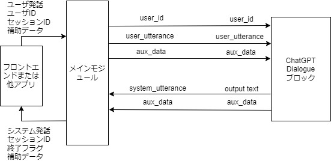
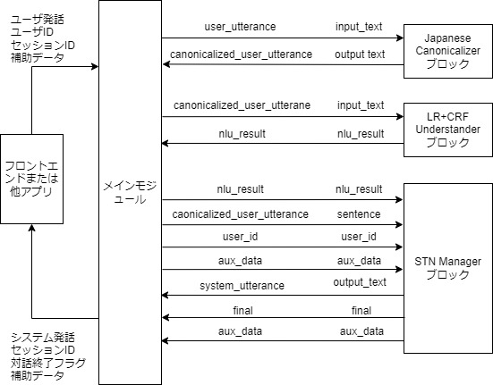

# チュートリアル

## はじめに

DialBBにはいくつかのサンプルアプリケーションが付属しています．本章ではこれらのうち，日本語アプリケーションを用いて，DialBBのアプリケーションの構成と，DialBBを用いてアプリケーションを構築する方法を説明します．

これらのアプリケーションの動作のさせ方は[README](https://github.com/c4a-ri/dialbb)を見てください．

## オウム返しサンプルアプリケーション

### 説明

ただオウム返しを行うアプリケーションです．組み込みブロッククラスは使っていません．

`sample_apps/parrot`にあります．

`sample_apps/parrot/config.yml`が，このアプリケーションを規定するコンフィギュレーションファイルで，その内容は以下のようになっています．

```yaml
blocks:
  - name: parrot
    block_class: parrot.Parrot
    input:
      input_text: user_utterance  
      input_aux_data: aux_data
    output:
      output_text: system_utterance
      output_aux_data: aux_data
      final: final
```

`blocks`は，本アプリケーションで用いるブロックのコンフィギュレーションのリストです．本アプリケーションでは，一つのブロックのみを用います．

`name`はブロックの名前を指定します．ログで用いられます．

`block_class`は，このブロックのクラス名を指定します．このクラスのインスタンスが作られて，メインモジュールと情報をやり取りします．クラス名は，コンフィギュレーションファイルからの相対パスまたは`dialbb`ディレクトリからの相対パスで記述します．

ブロッククラスは，`diabb.abstract_block.AbstractBlock`の子孫クラスでないといけません．

`input`はメインモジュールからの情報の受信を規定します．例えば，

```yaml
input_text: user_utteranee
```

は，メインモジュールの`blackboard['user_utterane']`をブロッククラスの中の`process`メソッドの入力（辞書型）の`input_text'`として参照できることを意味します．

`output`はメインモジュールへの情報の送信を規定します．例えば，

```yaml
output_text: system_utterance
```

は，メインモジュールの`blackboard['output_text']`をブロッククラスの`process`メソッドの出力（辞書型）`output_text`要素で上書きまたは追加することを意味しています．

これを図示すると以下のようになります。


メインモジュールとブロックを結ぶ矢印の上の記号は，左側がメインモジュールのblackboardにおけるキーで，右側がブロックの入出力におけるキーです．

さらに、`sample_apps/parrot/parrot.py`を見ることでDialBBにおけるブロッククラスの概念が理解できると思います．

### デバッグモード

以下のように、環境変数`DIALBB_DEBUG`に`yes`を設定することにより、ログレベルがデバッグモードになります。

```sh
export DIALBB_DEBUG=yes;python run_server.py sample_apps/parrot/config.yml
```

これにより、コンソールに詳しいログが出力されます。

## ChatGPT対話アプリケーション

### 説明

{ref}`chatgpt_dialogue`を用い，OpenAIのChatGPTを用いて対話を行います．

`sample_apps/chatgpt/`にあります．

`sample_apps/chatgpt/config_ja.yml`の内容は以下のようになっています．

```yaml
blocks:
  - name: chatgpt
    block_class: dialbb.builtin_blocks.chatgpt.chatgpt.ChatGPT
    input:
      user_id: user_id
      user_utterance: user_utterance
      aux_data: aux_data
    output:
      system_utterance: system_utterance
      aux_data: aux_data
      final: final
    user_name: ユーザ
    system_name: システム
    first_system_utterance: "こんにちは．私の名前は由衣です．少しお話させてください．スイーツって好きですか？"
    prompt_template: prompt_template_ja.txt
    gpt_model: gpt-3.5-turbo
```

メインモジュールとの情報の授受を図示すると以下のようになります。




ブロックコンフィギュレーションのパラメータとして，`input`，`output`以外にいくつか設定されています．

`prompt_template`は，システム発話のプロンプトのテンプレートを指定します．

プロンプトテンプレート`sample_apps/chatgpt/prompt_template_ja.txt`の中身は以下のようになっています．

```txt
# タスク説明

- あなたは対話システムで，ユーザと食べ物に関して雑談をしています．あなたの次の発話を50文字以内で生成してください．

# あなたのペルソナ

- 名前は由衣
- 28歳
- 女性
- スイーツ全般が好き
- お酒は飲まない
- IT会社のwebデザイナー
- 独身
- 非常にフレンドリーに話す
- 外交的で陽気

#  状況

- ユーザとは初対面
- ユーザは同年代
- ユーザとは親しい感じで話す

# 対話の流れ

- 自己紹介する
- 自分がスイーツが好きと伝える
- スイーツが好きかどうか聞く
- ユーザがスイーツが好きな場合，どんなスイーツが好きか聞く
- ユーザがスイーツが好きでない場合，なんで好きじゃないのか聞く

# 現在までの対話

@dialogue_history
```

最後の`@dialogue_history`のところに，それまでの対話の履歴が以下のような形式で挿入されます。

```
システム：こんにちは．私の名前は由衣です．少しお話させてください．スイーツって好きですか？
ユーザ：まあまあ好きです
システム：そうなんですね！私も大好きです．どんなスイーツが好きですか？
ユーザ：どっちかというと和菓子が好きなんですよね
```

ここで，「システム」「ユーザ」はコンフィギュレーションの`user_name`, `system_name`で指定したものが使われます。

(app_development_with_chatgpt_app)=

### ChatGPTアプリケーションを利用したアプリケーション作成

このアプリケーションを流用して新しいアプリケーションを作るには以下のようにします．

- `sample_apps/chatgpt`をディレクトリ毎コピーします．DialBBのディレクトリとは全く関係ないディレクトリで構いません．

- `config.yml`や`prompt_template_ja.txt`をを編集します．これらのファイルの名前を変更しても構いません．

- 以下のコマンドで起動します．

  ```sh
  export PYTHONPATH=<DialBBディレクトリ>;python run_server.py <コンフィギュレーションファイル>
  ```

## シンプルアプリケーション

以下の組み込みブロックを用いたサンプルアプリケーションです．
(v0.9からSnips言語理解を使わないアプリケーションに置き換わりました）

- 日本語アプリケーション

  - {ref}`japanese_canonicalizer`
  - {ref}`lr_crf_understander`
  - {ref}`stn_manager`

- 英語アプリケーション

  - {ref}`simple_canonicalizer`
  - {ref}`lr_crf_understander`
  - {ref}`stn_manager`

`sample_apps/simple_ja/`に日本語版があります．

### システム構成

本アプリケーションは以下のようなシステム構成をしています．




本アプリケーションでは，以下の3つの組み込みブロックを利用しています．これらの組み込みブロックの詳細は，「{ref}`builtin-blocks`」で説明します．

- Japanese Canonicalizer: ユーザ入力文の正規化（大文字→小文字，全角→半角の変換，Unicode正規化など）を行います．
- LR-CRF Understander: 言語理解を行います．ロジスティック回帰 (Logistic Regression) と条件付き確率場(Conditional Random Fields) を利用して，ユーザ発話タイプ（インテントとも呼びます）の決定とスロットの抽出を行います．
- STN Manager: 対話管理と言語生成を行います．状態遷移ネットワーク(State Transition Network)を用いて対話管理を行い，システム発話を出力します．


### アプリケーションを構成するファイル

本アプリケーションを構成するファイルは`sample_apps/simple_ja`ディレクトリ（フォルダ）にあります．

`sample_apps/simple_ja`には以下のファイルが含まれています．

- `config.yml`

  アプリケーションを規定するコンフィギュレーションファイルです．どのようなブロックを使うかや，各ブロックが読み込むファイルなどが指定されています．このファイルのフォーマットは「{ref}`configuration`」で詳細に説明します

- `config_gs_template.yml`　

  LR-CRF UnderstanderブロックとSTN Manageブロックで用いる知識をExcelではなく，Google Spreadsheetを用いる場合のコンフィギュレーションファイルのテンプレートです．これをコピーし，Google Spreadsheetにアクセスするための情報を加えることで使用できます．

- `sample-knowledge-ja.xlsx`

  LR-CRF UnderstanderブロックとSTN Managerブロックで用いる知識を記述したものです．

- `scenario_functions.py`

  STN Managerブロックで用いるプログラムです

- `test_inputs.txt`

  システムテストで使うテストシナリオです．

### LR-CRF Understanderブロック

#### 言語理解結果

LR-CRF Understanderブロックは，入力発話を解析し，言語理解結果を出力します．
言語理解結果はタイプとスロットの集合からなります．

例えば，「好きなのは醤油」の言語理解結果は次のようになります．

```json
{
  "type": "特定のラーメンが好き", 
  "slots": {
     "好きなラーメン": "醤油ラーメン"
  }
}
```

`"特定のラーメンが好き"`がタイプで，`"favarite_ramen"`スロットの値が`"醤油ラーメン"`です．複数のスロットを持つような発話もあり得ます．

#### 言語理解知識

LR-CRF Understanderブロックが用いる言語理解用の知識は，`simple-nlu-knowledge-ja.xlsx`に書かれています．言語理解知識の記述法の詳細は「{ref}`nlu_knowledge`」を参照してください．以下に簡単に説明します。

言語理解知識は，以下の2つのシートからなります．

| シート名   | 内容                                                     |
| ---------- | -------------------------------------------------------- |
| utterances | タイプ毎の発話例と、その発話例から抽出されるべきスロット |
| slots      | スロットとエンティティの関係                             |

utterancesシートの一部を以下に示します。

| flag | type                           | utterance                    | slots                                  |
| ---- | ------------------------------ | ---------------------------- | -------------------------------------- |
| Y    | 肯定                           | はい                         |                                        |
| Y    | 否定                           | そうでもない                 |                                        |
| Y    | 特定のラーメンが好き           | 豚骨ラーメンが好きです       | 好きなラーメン=豚骨ラーメン            |
| Y    | 地方を言う                     | 荻窪                         | 地方=荻窪                              |
| Y    | ある地方の特定のラーメンが好き | 札幌の味噌ラーメンが好きです | 地方=札幌, 好きなラーメン=味噌ラーメン |

一行目は「はい」のタイプが「肯定」で、スロットはないことを示しています。「はい」の言語理解結果は以下のようになります。

```JSON
{  
   "type": "はい"   
}
```

「札幌の味噌ラーメンが好きです」の言語理解結果は以下のようになります。

```JSON
{
  "type": "ある地方の特定のラーメンが好き", 
  "slots": {
     "好きなラーメン": "味噌ラーメン",
     "地方": "札幌"
  }
}
```

`flag`列は、その行を使用するかどうかをコンフィギュレーションで規定するためのものです。

次に、`slots`シートの内容の一部を以下に示します。

| flag | slot name      | entity       | synonyms                                     |
| ---- | -------------- | ------------ | -------------------------------------------- |
| Y    | 好きなラーメン | 豚骨ラーメン | とんこつラーメン、豚骨スープのラーメン、豚骨 |
| Y    | 好きなラーメン | 味噌ラーメン | みそらーめん、みそ味のラーメン、味噌         |

`slot name`列はスロット名、`entity`はスロット値、`synonyms`は同義語のリストです。 
例えば、一行目は、`好きなラーメン`のスロット値として、`とんこつラーメン`や`豚骨`などが得られた場合、言語理解結果においては、`豚骨ラーメン`に置き換えられる、ということを表しています。


#### 言語理解モデルの構築と利用

アプリを立ち上げると、上記の知識から、ロジスティック回帰と条件付き確率場のモデルが作られ、実行時に用いられます。

### STN Managerブロック

#### 概要

STN Managerブロックは、状態遷移ネットワーク（State-Transition Network）を用いて対話管理と言語生成を行います。状態遷移ネットワークのことをシナリオとも呼びます。シナリオは，`simple-scenario-ja.xlsx`ファイルの`scenario`シートに書かれています。このシートの書き方の詳細は「{ref}`scenario`」を参照してください．

#### シナリオ記述

シナリオ記述の一部を以下に示します。

| flag | state | system  utterance                                            | user utterance  example                | user utterance  type | conditions                            | actions                                                      | next state             |
| ---- | ----- | ------------------------------------------------------------ | -------------------------------------- | -------------------- | ------------------------------------- | ------------------------------------------------------------ | ---------------------- |
| Y    | 好き  | 豚骨ラーメンとか塩ラーメンなどいろんな種類のラーメンがありますが、どんなラーメンが好きですか？ | 豚骨ラーメンが好きです。               | 特定のラーメンが好き | _eq(#好きなラーメン,  "豚骨ラーメン") | _set(&topic_ramen,  #好きなラーメン)                         | 豚骨ラーメンが好き     |
| Y    | 好き  |                                                              | 豚骨ラーメンが好きです。               | 特定のラーメンが好き | is_known_ramen(#好きなラーメン)       | _set(&topic_ramen,  #好きなラーメン); get_ramen_location(*topic_ramen, &location) | 特定のラーメンが好き   |
| Y    | 好き  |                                                              |                                        | 特定のラーメンが好き | is_novel_ramen(#好きなラーメン)       | _set(&topic_ramen,  #好きなラーメン)                         | 知らないラーメンが好き |
| Y    | 好き  |                                                              | 近所の街中華のラーメンが好きなんだよね |                      |                                       |                                                              | #final                 |

各行が一つの遷移を示します。

`flag`列はは言語理解知識と同じく、その行を使用するかどうかをコンフィギュレーションで規定するためのものです。

`state`列は遷移元の状態の名前、`next state`列は遷移先の状態の名前です。

`system utterance`列はその状態で出力されるシステム発話です。システム発話はその行の遷移とは関係なく、左側の`state`列の値と結びついています。

`user utterance example`列は、その遷移で想定する発話の例です。実際には使いません。

`user utterance type`列と`conditions`列はその遷移の条件を表します。以下の場合に遷移が満たされます。

- `user utterance type`列が空か、または、`user utterance type`列の値が言語理解結果のユーザ発話タイプがその値と同じで、かつ、
- `conditions`列が空か、または、`conditions`列のすべての条件が満たされるとき

これらの条件は、上に書いてある遷移から順に、満たされるかどうかを調べて行きます。

`user utterance type`列も`conditions`列も空のものをデフォルト遷移と呼びます。
基本的に、一つのstateにデフォルト遷移が一つ必要で、そのstateが遷移元になっている行のうち一番下にないといけません。

（デフォルト遷移がなくても良い場合がありますが、それについては「{ref}`scenario`」を参照してください。

#### 条件

`conditions`列の条件は、関数呼び出しのリストです。関数呼び出しが複数ある場合は、`;`でつなぎます。

`conditions`列で使われる関数は、条件関数と呼ばれ、`True`か`False`を返す関数です。すべての関数呼び出しが`True`を返した場合、条件が満たされます。

`_`で始まる関数は、組み込み関数です。それ以外の関数は、開発者が作成する関数で、このアプリケーションの場合、`scenario_functions.py`で定義されています。

`_eq`は二つの引数の値が同じ文字列なら、`True`を返す組み込み関数です。

`#好きなラーメン`のように、`#`で始まる引数は特殊な引数です。例えば言語理解結果のスロット名に`#`をつけたものはスロット値を表す引数です。`#好きなラーメン`は`好きなラーメン`スロットの値です。

`"豚骨ラーメン"`のように、`""`で囲まれた引数はその中の文字列がその値になります。

`_eq(#好きなラーメン,  "豚骨ラーメン")`は、`好きなラーメン`スロットの値が`豚骨ラーメン`の時に`True`になります。

`is_known_ramen(#好きなラーメン)`はシステムが`好きなラーメン`スロットの値を知っていれば`True`を返し、そうでなければ`False`を返すように`scenario_functions.py`の中で定義されています。

条件関数の定義の中では、文脈情報と呼ばれるデータにアクセスすることができます。文脈情報は辞書型のデータで、条件関数や後述のアクション関数の中で、キーを追加することができます。また、あらかじめ値が入っている特殊なキーもあります。詳細は「{ref}`context_information`」を参照してください。

#### アクション

`actionss`列には、その行の遷移が行われたときに、実行される処理を書きます。これは、関数呼び出しの列です。関数呼び出しが複数ある場合は、`;`でつなぎます。

`actions`列で使われる関数は、アクション関数と呼ばれ、何も返しません。

条件関数と同様、`_`で始まる関数は、組み込み関数です。それ以外の関数は、開発者が作成する関数で、このアプリケーションの場合、`scenario_functions.py`で定義されています。

`_set`は第2引数の値を第1引数に代入する処理を行います。`_set(&topic_ramen,  #好きなラーメン)`の第１引数&topic_ramenは、部文脈情報の`topic_ramen`キーの意味で、この関数呼び出しは文脈情報の`topic_ramen`に`#好きなラーメン`スロットの値をセットします。文脈情報の値は、`*<キー名>`で、条件やアクションの中で取り出せます。

`get_ramen_location(*topic_ramen, &location)`は、開発者の作成した関数の呼び出しです。`get_ramen_location`は`scenario_functions.py`で定義されています。この関数は第1引数の値であるラーメンの種類が名物である場所を検索し、文脈情報の第2引数で指定されたキーの値にセットします。例えば`topic_ramen`キーの値が`味噌ラーメン`の場合、味噌ラーメンが名物である場所を検索し、その値が`札幌`であれば、文脈情報の`location`の値を札幌に設定する、という処理を行います。

#### 遷移の記述のまとめ

まとめると、1行目は、状態が`好き`の時、「豚骨ラーメンとか塩ラーメンなどいろんな種類のラーメンがありますが、どんなラーメンが好きですか？」を発話し、次のユーザの発話の言語理解結果のタイプが`特定のラーメンが好き`で、`好きなラーメン`スロットの値が`豚骨ラーメン`であれば、条件が満たされて遷移が行われ、`好きなラーメン`スロットの値、すなわち、`豚骨ラーメン`が、文脈情報の`topic_ramen`の値にセットされ、`豚骨ラーメンが好き`状態に移行します。条件が満たされない場合、2行目の条件が調べられます。

これを図示すると以下のようになります。


#### 特殊な状態名

状態名には特殊なものがあります。

`#prep`は、対話が始まる前の状態で、セッション開始後、条件判定とアクションが実行されます。

`#initial`は、最初のユーザ発話を生成する状態です。

`#final`で始まる名前の状態は、最終状態です。ブロックの出力の`final`に`True`を入れて返すので、対話が終了します。

`#error`は、内部エラーが起きた場合に遷移する状態です。これもブロックの出力の`final`に`True`を入れて返します。

#### シナリオグラフ

Graphvizがインストールされていれば，アプリケーションを起動したとき，`system utterance`列のシステム発話と`user utterance  example`列のユーザ発話例を利用したグラフ(シナリオグラフ`_scenario_graph.jpg`)を出力します．以下が本アプリケーションのシナリオグラフです．


### N-Best言語理解結果の利用

本アプリケーションでは、LR-CRF言語理解ブロックが5-Bestの理解結果を出力するようになっています。これは、コンフィギュレーションファイルの以下の`num_candidates`要素で指定されています。

```yml
blocks:  # bclock list
  - ....
  - name: understander
    ....
    num_candidates: 5
  - ....
```

STN Managerブロックでは、遷移の条件を調べるときに上位の言語理解結果から順に調べ、条件を満たすものがあれば。その結果を用いてアクションを実行して、次の状態に遷移します。

### シンプルアプリケーションを利用したアプリケーション構築

#### 概要

「{ref}`app_development_with_chatgpt_app`」と同様に、シンプルアプリケーションを利用したアプリケーション構築法を説明します。

- `sample_apps/simple_ja`をディレクトリ毎コピーします．DialBBのディレクトリとは全く関係ないディレクトリで構いません．

- 各ファイルを編集します。．これらのファイルの名前を変更しても構いません．

- 以下のコマンドで起動します．

  ```sh
  export PYTHONPATH=<DialBBディレクトリ>;python run_server.py <コンフィギュレーションファイル>
  ```

#### 変更するファイル


## 実験アプリケーション

ChatGPTによる言語理解とネットワークベース対話管理を軸に，組み込みブロックの様々な機能を含んでいるものです．`sample_apps/lab_app_ja/`にあります．以下の組み込みブロックを用いています．

- {ref}`japanese_canonicalizer`
- {ref}`chatgpt_understander`
- {ref}`spacy_ner`
- {ref}`stn_manager`

### 


### ChatGPT言語理解ブロック


### spaCy/GiNZAを用いた固有表現の利用

### STN Managerの機能

#### システム発話中の関数呼び出し・特殊変数参照

#### ChatGPTを用いた発話生成

#### ChatGPTを用いた条件判定

#### リアクション発話生成

#### シンタクスシュガー

#### 音声入力に対処するための機能

#### スキップ遷移

#### サブダイアローグ

## 

### 


