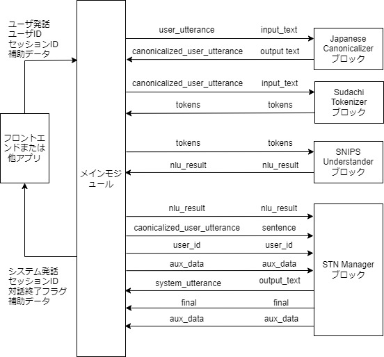

# サンプルアプリケーション

## DialBB付属のサンプルアプリケーション

DialBBには以下のサンプルアプリケーションが付属しています．

### オウム返しサンプルアプリケーション

ただオウム返しを行うアプリケーションです．組み込みブロッククラスは使っていません．

`sample_apps/parrot`にあります．

### Snips+STNアプリケーション

以下の組み込みブロックを用いたサンプルアプリケーションです．

- 日本語アプリケーション

  - {ref}`japanese_canonicalizer`
  - {ref}`sudachi_tokenizer`
  - {ref}`snips_understander`
  - {ref}`stn_manager`

- 英語アプリケーション

  - {ref}`simple_canonicalizer`
  - {ref}`whitespace_tokenizer`
  - {ref}`snips_understander`
  - {ref}`stn_manager`

`sample_apps/network_ja/`に日本語版が，`sample_apps/network_en/`に英語があります．

### 実験アプリケーション

ChatGPTによる言語理解とネットワークベース対話管理を軸に、組み込みブロックの様々な機能を含んでいるものです）．以下の組み込みブロックを用いています．(v0.7からSnips言語理解がChatGPT言語理解ブロックに置き換わりました）


  - 日本語アプリケーション

    - {ref}`japanese_canonicalizer`
    - {ref}`chatgpt_understander`
    - {ref}`spacy_ner`
    - {ref}`stn_manager`


  - 英語アプリケーション

    - {ref}`simple_canonicalizer`
    - {ref}`chatgpt_understander`
    - {ref}`spacy_ner`
    - {ref}`stn_manager`

日本語版は`sample_apps/lab_app_ja/`に、英語版は`sample_apps/lab_app_en/`にあります．

### ChatGPT対話アプリケーション

(ver. 0.6で追加）
以下の組み込みブロックを用い，OpenAIのChatGPTを用いて対話を行います．

- {ref}`chatgpt_dialogue`

  `sample_apps/chatgpt/`にあります．

## Snips＋STNアプリケーションの説明

以下では，Snips+STNアプリケーションを通して，DialBBアプリケーションの構成を説明します．

### システム構成

本アプリケーションは以下のようなシステム構成をしています．





本アプリケーションでは，以下の4つの組み込みブロックを利用しています．これらの組み込みブロックの詳細は，「{ref}`builtin-blocks`」で説明します．

- Japanese Canonicalizer: ユーザ入力文の正規化（大文字→小文字，全角→半角の変換，Unicode正規化など）を行います．

- Sudachi Tokenizer: 正規化されたユーザ入力文を単語に分割します．形態素解析器[Sudachi](https://github.com/WorksApplications/Sudachi)を用います．

- Snips Understander: 言語理解を行います．[Snips_NLU](https://snips-nlu.readthedocs.io/en/latest/)を利用して，ユーザ発話タイプ（インテントとも呼びます）の決定とスロットの抽出を行います．
  
- STN Manager: 対話管理と言語生成を行います．状態遷移ネットワーク(State Transition Network)を用いて対話管理を行い，システム発話を出力します．

メインモジュールとブロックを結ぶ矢印の上の記号は，左側がメインモジュールのblackboardにおけるキーで，右側がブロックの入出力におけるキーです．


### アプリケーションを構成するファイル

本アプリケーションを構成するファイルは`sample_apps/network_ja`ディレクトリ（フォルダ）にあります．ここにあるファイルを変更することで，どのようにすればアプリケーションを変更することができるかを知ることができます．ファイルを大幅に変更すれば全く異なる対話システムも作ることができます．

sample_apps/network_jaには以下のファイルが含まれています．

- `config.yml`

  アプリケーションを規定するコンフィギュレーションファイルです．どのようなブロックを使うかや，各ブロックが読み込むファイルなどが指定されています．このファイルのフォーマットは「{ref}`configuration`」で詳細に説明します

- `config_gs_template.yml`　

  Snips UnderstanderブロックとSTN Manageブロックで用いる知識をExcelではなく，Google Spreadsheetを用いる場合のコンフィギュレーションファイルのテンプレートです．これをコピーし，Google Spreadsheetにアクセスするための情報を加えることで使用できます．

- `sample-knowledge-ja.xlsx`

  Snips UndderstanderブロックとSTN Managerブロックで用いる知識を記述したものです．

- `scenario_functions.py`

  STN Managerブロックで用いるプログラムです．

- `dictionary_functions.py`

  Snips Undderstander用の辞書をExcel記述ではなく，関数によって定義する場合の例が含まれています．

- `test_inputs.txt`

  システムテストで使うテストシナリオです．

### Snips Understanderブロック

#### 言語理解結果

Snips Understanderブロックは，入力発話を解析し，言語理解結果を出力します．
言語理解結果はタイプとスロットの集合からなります．

例えば，「好きなのは醤油」の言語理解結果は次のようになります．

```json
{
  "type": "特定のラーメンが好き", 
  "slots": {
     "favarite_ramen": "醤油ラーメン"
  }
}
```

`"特定のラーメンが好き"`がタイプで，`"favarite_ramen"`スロットの値が`"醤油ラーメン"`です．複数のスロットを持つような発話もあり得ます．

#### 言語理解知識

Snips Understanderブロックが用いる言語理解用の知識は，`sample-knowledge-ja.xlsx`に書かれています．

言語理解知識は，以下の４つのシートからなります．

| シート名   | 内容                                   |
| ---------- | -------------------------------------- |
| utterances | タイプ毎の発話例                       |
| slots      | スロットとエンティティの関係           |
| entities   | エンティティに関する情報               |
| dictionary | エンティティ毎の辞書エントリーと同義語 |

これらの詳細は「{ref}`nlu_knowledge`」を参照してください．

#### Snips用の訓練データ

アプリを立ち上げると上記の知識はSnips用の訓練データに変換され，モデルが作られます．

Snips用の訓練データはアプリのディレクトリの`_training_data.json`です．このファイルを見ることで，うまく変換されているかどうかを確認できます．

### STN Managerブロック

対話管理知識（シナリオ）は，`sample-knowledge-ja.xlsx`ファイルの`scenario`シートです．
このシートの書き方の詳細は「{ref}`scenario`」を参照してください．

Graphvizがインストールされていれば，アプリケーションを起動したとき，シナリオファイルから生成した状態遷移ネットワークの画像ファイル(`_stn_graph.jpg`)を出力します．以下が本アプリケーションの状態遷移ネットワークです．


シナリオファイルで用いている遷移の条件や遷移後に実行する関数のうち，組み込み関数でないものが
`scenario_functions.py`で定義されています．


