# DialBBノーコードツール ドキュメント


## はじめに

本ドキュメントはDialBBのノーコードツールのドキュメントです。

## 動作環境

Windows11、MacOSで動作します。

## インストール

### Pythonのインストール

- Windows 11

  - 以下の手順でPythonをインストールします。

    - ブラウザのアドレスバーに https://www.python.org/downloads/windows/ を打ち込んでEnterキーを押します。
    - 表示されている中から以下の部分を探します。3.10.11である必要があります。

    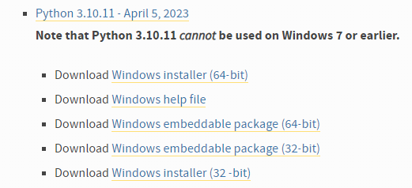

    - 64bit OSの場合は、[Windows installer (64-bit)](https://www.python.org/ftp/python/3.10.11/python-3.10.11-amd64.exe)を、32bit OSの場合は[Windows installer (32 -bit)](https://www.python.org/ftp/python/3.10.11/python-3.10.11.exe)をクリックします。

    - ダウンロードフォルダに `python-3.10.11-amd64.exe`または`python-3.10.11-amd32.exe`というファイルができるので、ダブルクリックします。

    - 以下の画面が現れます。

      

      - Add python.exe to PATHに**チェックを入れてから**Install Nowをクリックします。

        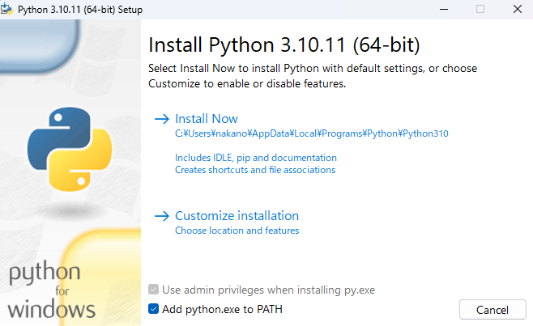

      - Pythonがインストールされます。

### DialBBのインストール

- 以下の要領でwhlファイルをダウンロードします。

  - ブラウザでのアドレスバーに https://github.com/c4a-ri/dialbb/tree/dev-v1.0/dist を打ち込んでEnterキーを押します。

  - dialbb_nc-0.1.5-py3-none-any.whl をクリックします。0.1.5のところは数字が違う可能性があります。

  - 遷移したページの右側の下向き矢印をクリックします。

    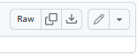

  - ダウンロードフォルダにwhlファイルがダウンロードされます。

- 以下の要領でdialbbをインストールします。

  - 検索窓に"cmd"と入力して、Enterキーを押します。

    

  - コマンドプロンプトが現れます。

    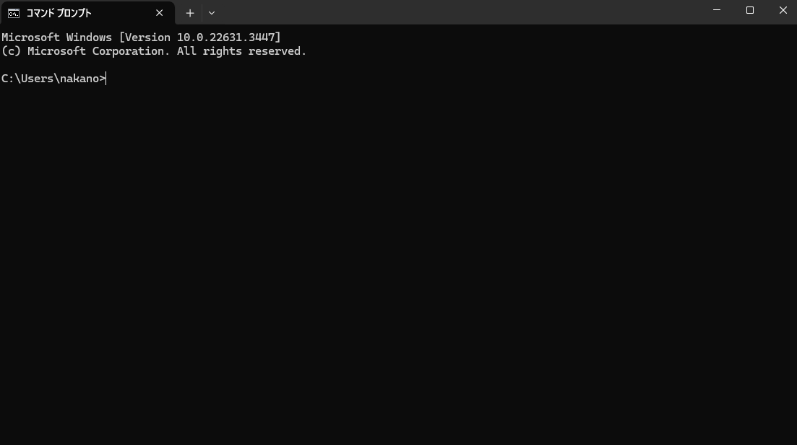

  - 以下のコマンドを打ち込んでEnterキーを押します。

    - pip install Downloads\dialbb_nc-0.1.5-py3-none-any.whl 

      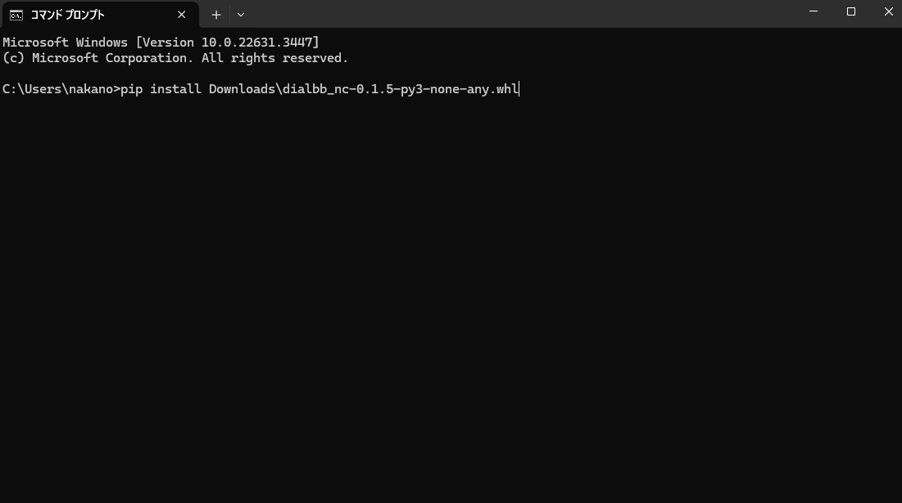

      \は円マーク(￥の半角)の場合があります。

      \の右側はダウンロードしたファイルの名前です。

  

## 起動
コマンドプロンプトで以下のコマンドを入力してEnterキーを押します。
```sh
dialbb-nc
```

###  メイン画面
  正常に起動するとメイン画面が表示されます。  

  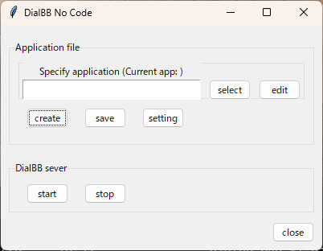

### アプリケーションの読み込み・作成・起動・保存

#### アプリケーションファイル
  アプリケーションファイルは次の3つがあり、zipファイルにまとめて扱います。  
  - config.yml: コンフィギュレーションファイルのテンプレート
  - scenario.xlsx: シナリオファイルのテンプレート
  - nlu-knowledge.xlsx: 言語理解知識ファイルのテンプレート

#### アプリケーションの読み込み/新規作成

  - すでにあるアプリケーションを読み込む場合は、`select`ボタンをクリックし、読み込むアプリケーションファイルのzipファイルを開きます。  
  
    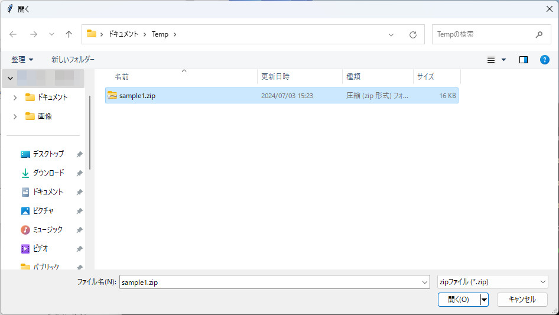
  
  - アプリケーションを新たに作成する場合は、`create`ボタンをクリックし、英語/日本語を選択します。テンプレートファイルが読み込まれます。  

    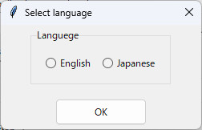

  - アプリケーションを新たに作成した場合、および、読み込んだアプリケーションがChatGPTを使っている場合は、OpenAIのAPIキーの登録が必要です。OpenAIのAPIキーの登録は以下のようにします。  
    - `setting`ボタンを押します。  
      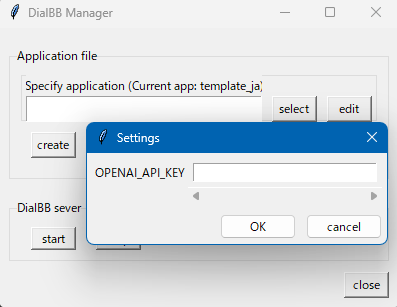
    - `OPENAI_API_KEY`の右側に別途入手したOpenAIのAPIキーを入力し、`OK`ボタンを押します。`Saved`という表示が出るので再度`OK`ボタンを押します。

#### アプリケーションの起動

- `start`ボタンをクリックします。コマンドプロンプトを見て、エラーが出ていないことを確認します。

- ChromeやEdgeなどのブラウザを開き、アドレスバーに`http://localhost:8080/`を打ち込んでEnterを押します。以下のような画面が表示されます。

  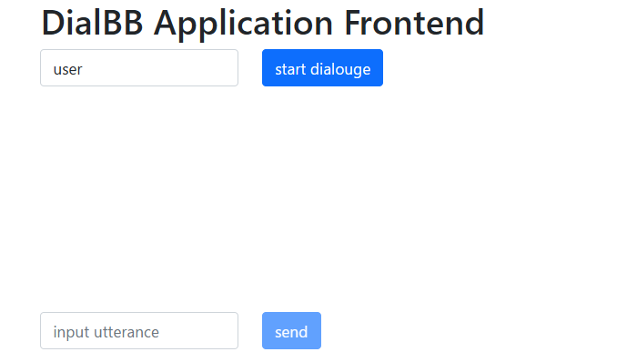

- `start dialogue`ボタンを押すと会話が開始されます。

- 再度最初から会話を始めたい場合はブラウザのリロードボタンを押してください。

#### アプリケーションの編集

- `edit`ボタンをクリックし、編集するアプリケーションファイルを選択します。  
   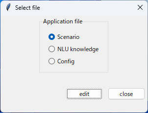

- 編集の仕方は後述します。

####  アプリケーションの保存

- `save`ボタンをクリックし、保存する場所/ファイル名を指定します、zipファイルにまとめて保存されます。  

  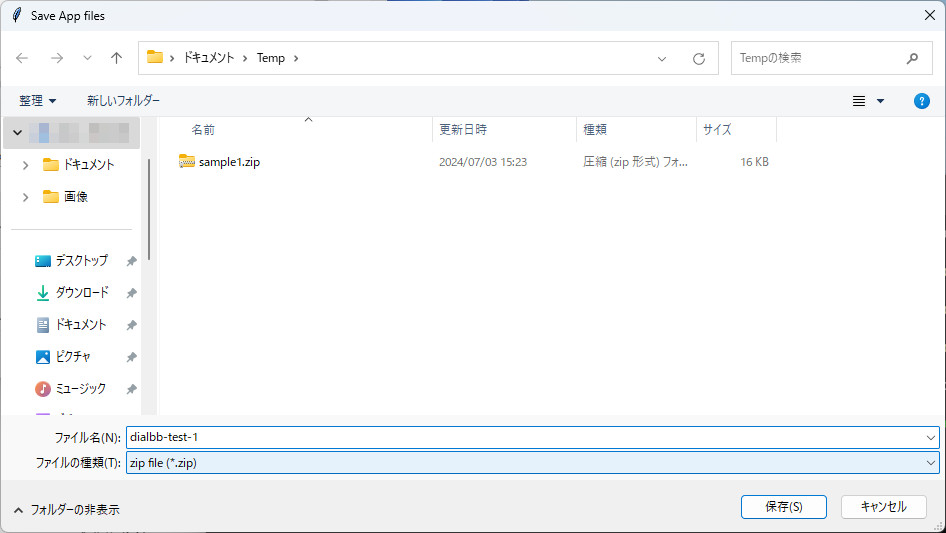


## コンフィギュレーションの変更

  __アプリケーションの編集__ 画面で`Config`を選択した場合に以下の画面が表示されます。

  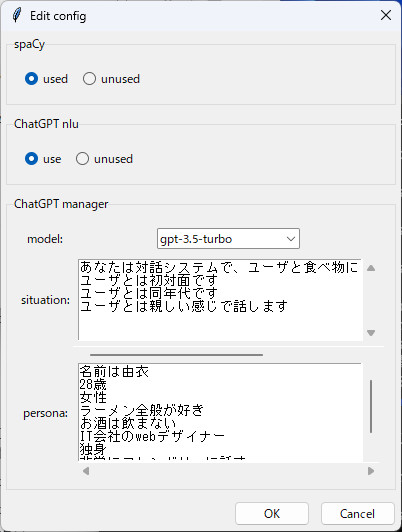

| 内容 | 説明 |
|-----|------|
| spaCy | spaCy（後述）を利用するかどうかを選択します． |
| ChatGPT nlu | ChatGPTを用いた言語理解（後述）をするかどうかを選択します． |
| models | 利用するChatGPTのモデルを選択します． |
| situation | GPTのプロンプトに書く状況を入力します、1行ごとに状況を記述します． |
| persona | GPTのプロンプトに書くシステムのペルソナを入力します、1行ごとにペルソナを記述します． |

-  __GPT モデルの編集__ `edit`ボタンをクリックし、選択するGPT モデルの追加変更が可能です。  
  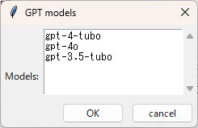

## 言語理解用知識の編集
  __アプリケーションの編集__ 画面で`NLU knowledge`を選択した場合は、xlsxファイルに関連付けされたアプリケーションが起動します（ExcelやOpenOfficeなど）、アプリケーション画面で編集＆保存をおこないます。  

## シナリオファイルの編集
### 編集アプリケーションの選択
  __アプリケーションの編集__ 画面で Excel で編集するか（`Scenario(Excel)`ボタン）、 GUIシナリオエディタ で編集するか（`Scenario(GUI Editor)`ボタン）を選択します、 Excel の場合はxlsxファイルに関連付けされたアプリケーションが（ExcelやOpenOfficeなど）、 GUIシナリオエディタ の場合はブラウザベースのアプリケーションが起動します。  


### シナリオエディタの操作方法

#### 概要

シナリオを[systemノード]と[userノード]として扱います、それぞれのノードを[コネクタ]で接続することでsystem：userを関連付けます。

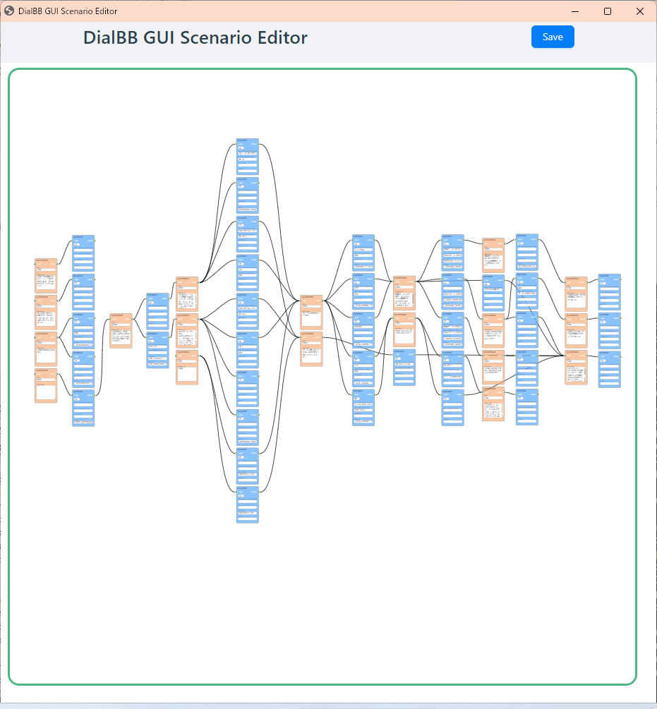

#### ノードの追加
背景で右クリック > [systeｍNode]か[userNode]を選択すると新規追加されます 

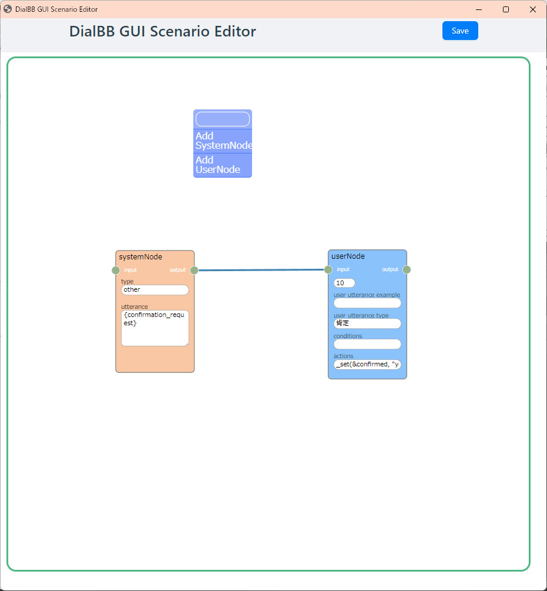

#### ノードの削除
ノードの上で右クリック > [Delete] を選択すると削除されます  

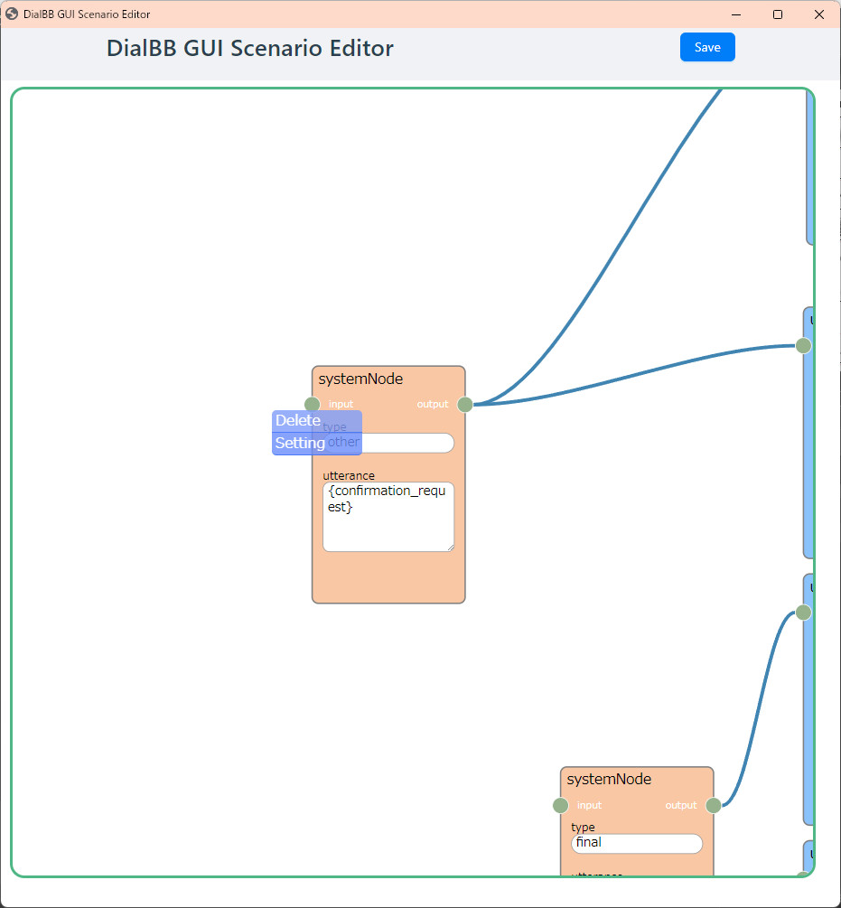

#### ノードの編集
ノードの上で右クリック > [Edit] を選択すると入力ダイアログが表示されます  

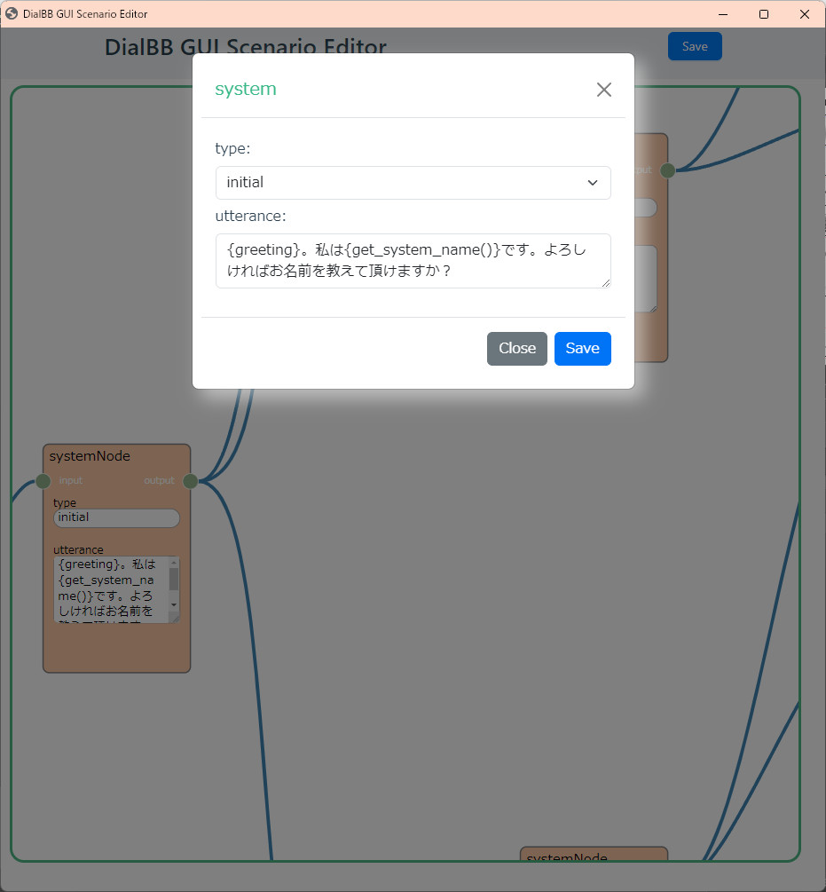　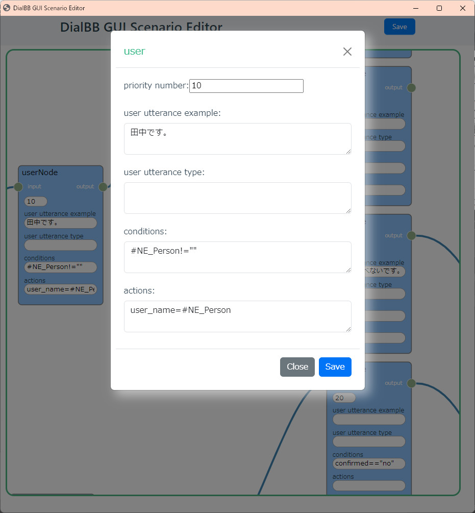

ノードの編集の仕方は後述します。

#### コネクタの接続・削除

ノードのoutputソケットを左クリック > 他ノードのinputソケットへドラッグして接続します  
削除はinputソケットを摘まんで離すか、コネクター上で右クリック > [Delete] を選択します。

　

#### 保存
上部の[Save]ボタンをクリックすると保存します。保存しないでエディタサーバを停止した場合はデータが失われます。

#### システムノードの編集の仕方

システムノードを右クリックすると以下のような入力ダイアログが表示されますので、中身を書き換えて`Save`ボタンを押します。

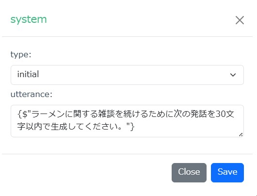　

`type`は以下のどれかです。

| type    | 説明                                                         |
| ------- | ------------------------------------------------------------ |
| initial | 対話の最初のシステム発話を記述します。シナリオの中で、typeがinitialであるシステムノードは一つだけ存在しなくてはなりません。 |
| final   | このノードに来たら、システム発話を生成して対話を終了します。typeがfinalであるシステムノードはいくつあっても構いません。 |
| error   | 内部エラーが起きたときにこのノードに移行し、システム発話を生成して終了します。別のノードとつながっていてはいけません。 |
| other   | その他のシステムノードです。                                 |

`utterance`には、システム発話を書きます。システム発話の中の`{}`で囲んだ部分に以下のようなものを書けます。

- `$"<インストラクション>"` 
  ChatGPTにインストラクションを与えて発話を生成させます。このとき、コンフィギュレーションで指定したsituationとpersonaが用いられます。
  例： `{$"感想を言う発話を20字以内で生成してください。"}ところで、最近の体調はいかがですか？` 

- `#<言語理解のスロット名>`

  直前のユーザ発話の言語理解で得られたスロットの値で置き換えられます。`{#好きなラーメン}`なら、`好きなラーメン`スロットの値で置き換えられます。

  例：`{#好きなラーメン}がお好きなんですね！`

  スロットが空の場合、空文字列になります。スロットが空でないときだけ、このノードに来るように、ユーザノードで設定する必要があります。

- `#<NE_固有表現のクラス>`

  固有表現抽出の結果で置き換えられます。`{#NE_Person}`なら、直前のユーザ発話の固有表現抽出の結果得られたPersonクラスの固有表現が用いられます。

  例：`こんにちは、{#NE_Person}さん`

  固有表現が抽出できなかった場合、空文字列になります。スロットが空でないときだけ、このノードに来るように、ユーザノードで設定する必要があります。

#### ユーザノードの編集の仕方

ユーザノードを右クリックすると以下のような入力ダイアログが表示されます。

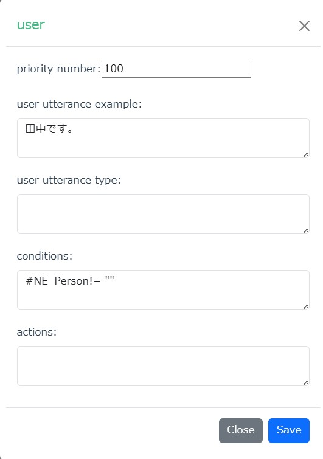　

