# DialBB No-Code Tool (DialBB-NC) Documentation

[日本語版](index-ja.md)

## Introduction

This document describes the DialBB no-code tool, DialBB-NC.

## Major Changes from Ver. 1.x

- Python 3.10 is no longer supported.
- Intent understanding and named entity extraction have been removed. Slot extraction is now available instead.

## Supported Environment

DialBB-NC works on Windows 11 and macOS.

## Installation and Startup on Windows

### Install Python on Windows

- If Python is already installed, check its version first. If you already have Python 3.11-3.14, you do not need to install it again. If you still have Python 3.10 or earlier and you are not using it, uninstall it. If you are using it, contact the DialBB developers at [dialbb@c4a.jp](mailto:dialbb@c4a.jp).

- Windows 11

  - If Python is not installed, install it with the following steps.

    - Open [the Python downloads page for Windows](https://www.python.org/downloads/windows/) in your browser.
    - Find a Python 3.11.x-3.14.x release. Versions up to 3.10.x and versions from 3.15.x onward are not supported.

    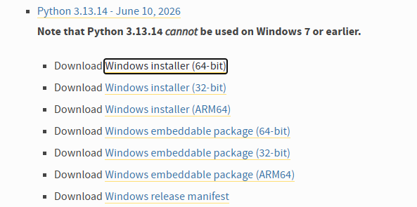

    - Download the installer for your environment.
      - For a 64-bit OS, choose Windows installer (64-bit).
      - For a 32-bit OS, choose Windows installer (32-bit).
    - After the installer is downloaded, double-click it.

    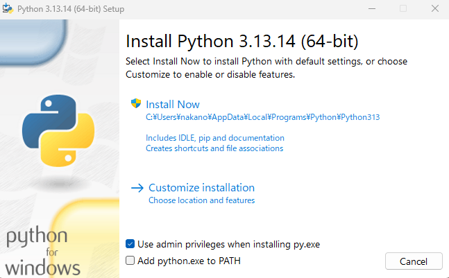

    - Make sure Add python.exe to PATH is checked, then click Install Now.

    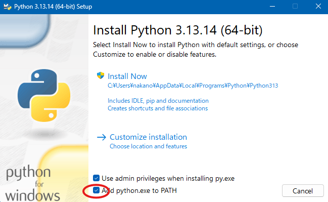

    - Python will be installed.

### Install DialBB on Windows

- Download the required files as follows.

  - Open [the DialBB setup zip file](https://c4a-ri.github.io/dialbb/files/dialbb-setup.zip) in your browser.
  - The file will be downloaded to your Downloads folder. Confirm that the zip file is there.

    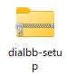

    - Depending on your environment, the file may be displayed as dialbb-setup.zip.
    - If you download it multiple times, the latest one may be named something like dialbb-setup(1). In that case, delete the older extracted folder and download again if needed.

- In File Explorer, right-click the dialbb-setup zip file and choose Extract All. Then click Extract in the dialog.
- Open the extracted dialbb-setup folder.
- Double-click install or install.bat. DialBB will be installed.

  - You may see a warning such as Windows protected your PC. If so, click More info and then Run.
  - When Press any key to continue . . . appears, the installation is complete. Press any key to close the window.

### Launch DialBB-NC on Windows

In the dialbb-setup folder, double-click start-dialbb-nc or start-dialbb-nc.bat.

If startup succeeds, the main window will appear.

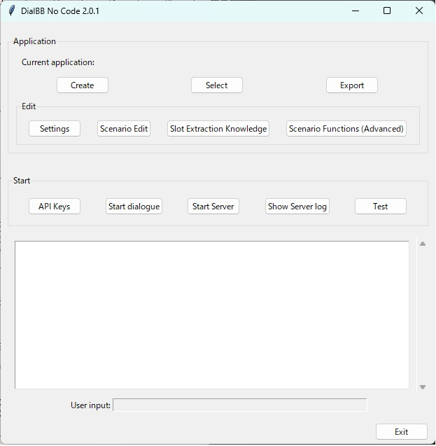

## Installation and Startup on macOS

### Install Python on macOS

As on Windows, if Python 3.11-3.14 is already installed, you do not need to install it again.

If Python is not installed, follow these steps.

- Open [the official Python download page for macOS](https://www.python.org/downloads/mac-osx/).
- Choose an appropriate version such as 3.13.14 and download the macOS 64-bit universal2 installer.
- Open the downloaded .pkg file and follow the on-screen instructions.

### Install DialBB on macOS

Download [dialbb-setup.zip](https://c4a-ri.github.io/dialbb/files/dialbb-setup.zip). It will be saved in your Downloads folder. Open Terminal, create an appropriate directory for DialBB, and move into it.

Then run the following commands.

```sh
unzip ~/Downloads/dialbb-setup.zip
pip install --force-reinstall *.whl
```

DialBB will be installed.

### Launch DialBB-NC on macOS

Run the following command in Terminal.

```sh
dialbb-nc
```

On macOS, the screen layout may be slightly disturbed.

## Loading, Creating, and Exporting Applications

### Load an Existing Application or Create a New One

- To load an existing application, click Select, choose the zip file for the application, and then click Load.

  <!-- 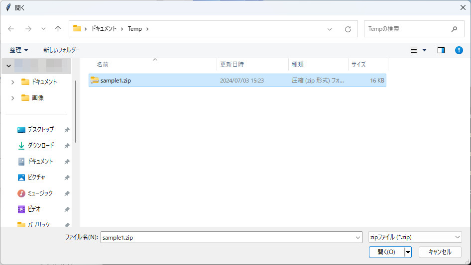 -->

- To create a new application, click Create New and select a language. A template application will be loaded.

  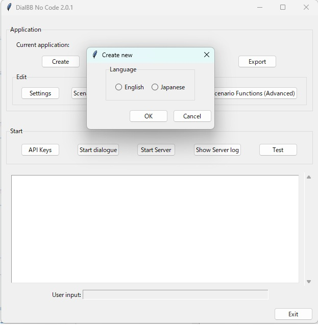

- The name of the currently loaded application, which is the zip file name, is shown next to Current application in the main window.

### Export an Application

- Click Export and specify the save location and file name. The application will be saved as a zip file.

  <!-- 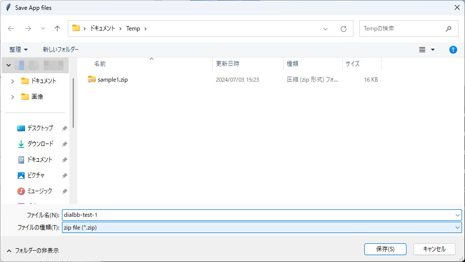 -->

## Starting and Stopping an Application

### Register API Keys

When you use DialBB-NC for the first time, or after reinstalling DialBB, you need to register API keys for the large language model you want to use, such as ChatGPT. For example, if you use ChatGPT, you need an OpenAI API key. Obtain the key separately.

- Click the API Key button to open the settings dialog.

  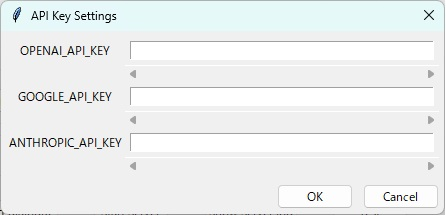

- Enter your OpenAI API key in the field to the right of OPENAI_API_KEY and click OK.
- A Saved message will appear. Click OK again.
- If you later use Gemini or Claude in the settings dialog or during testing, you will also need GOOGLE_API_KEY or ANTHROPIC_API_KEY.
- Entered API keys are saved in encrypted form, but they can be decrypted by the DialBB program itself. Do not save them on a shared or public computer. To remove them, either overwrite the value with another string or uninstall DialBB.

### Run a Dialogue

- Click Start Dialogue to begin a dialogue. Enter the user utterance in the User Input field.

  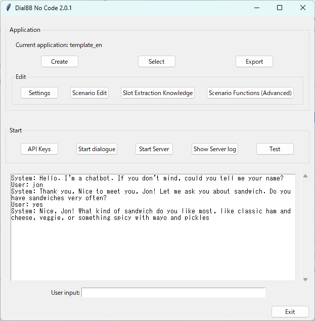

### Test an Application

You can test an application with user simulation. Details are explained later in this document.

### Use the Dialogue Server (Advanced)

You can run your application as a web server and connect it with other programs.

#### Start the Server

- Click Start Server. The application server starts.
- Open a browser such as Chrome or Edge and access [http://localhost:8080/](http://localhost:8080/).

  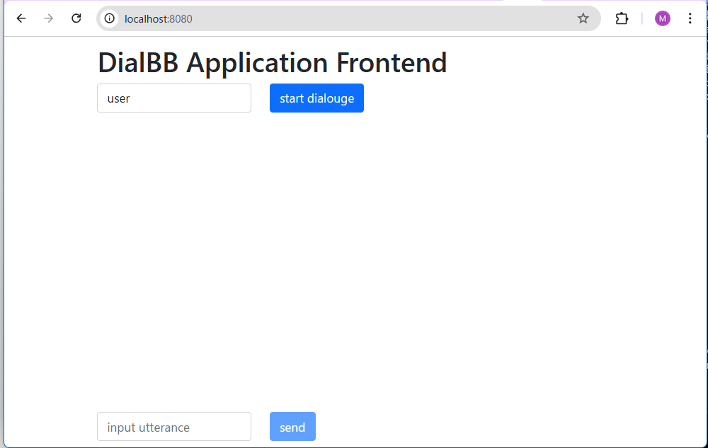

- Click start dialogue to begin the conversation.
- To restart the conversation from the beginning, reload the browser page.
- Accessing [http://localhost:8080/test](http://localhost:8080/test) opens a simpler test screen.

#### Stop the Server

- In the main GUI, click Stop Server to stop the application server.

#### View Logs

- If the browser page does not appear or the dialogue does not work correctly, click Show Server Log and consult a nearby engineer or the DialBB developers at [dialbb@c4a.jp](mailto:dialbb@c4a.jp).
- Logs are written under the .dialbb_nc_logs folder in your home directory.
  - On Windows, the home directory is usually C:\Users\<user name>.
  - Logs are grouped into folders by date.
  - Each log file is named `application-startup-time.txt`.

### Uninstall DialBB

Double-click the uninstall icon in the dialbb-setup folder to uninstall DialBB.

## Editing an Application

### Edit the Configuration

Click the Settings button to open the following screen.

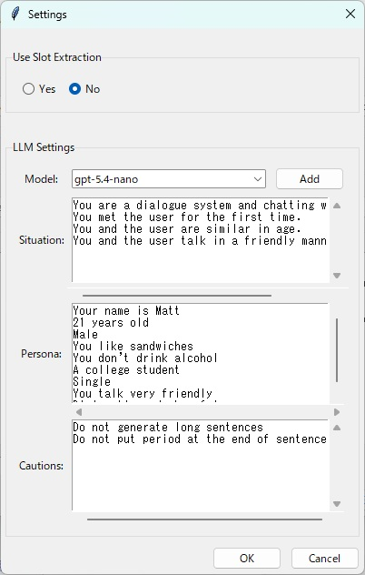

The editable items are described below.

| Item | Description |
| --- | --- |
| Enable slot extraction? | Select whether slot extraction should be used. Advanced option. |
| Model | Select the large language model to use. Click Add to register a model that is not in the pull-down list. |
| Situation | Enter the situation description used in prompts for the LLM. Write one situation per line. |
| Persona | Enter the system persona used in prompts for the LLM. Write one persona per line. |
| Notes | Enter cautionary notes used in prompts for the LLM. This is used only for system nodes. |

---

### Edit the Scenario File

Click the Scenario Edit button to open the scenario editor.

#### Overview of the Scenario Editor

A scenario consists of system nodes and user nodes connected by links. In a system node, you describe system utterances. In a user node, you describe transition conditions. Transition conditions are checked in descending order of priority. When a condition is satisfied, the dialogue moves to the next system node. If none of the transition conditions of the user nodes are satisfied, the dialogue returns to the same system node and a system utterance is generated again.

Each system node can connect to multiple user nodes. Each user node connects to only one next node. The connector on the right side of a node is the output, and the connector on the left side is the input.

Some screenshots below are from an older version. In ver. 2.0 and later, user nodes do not have an utterance type.

Descriptions of system utterances and transition conditions are explained later.

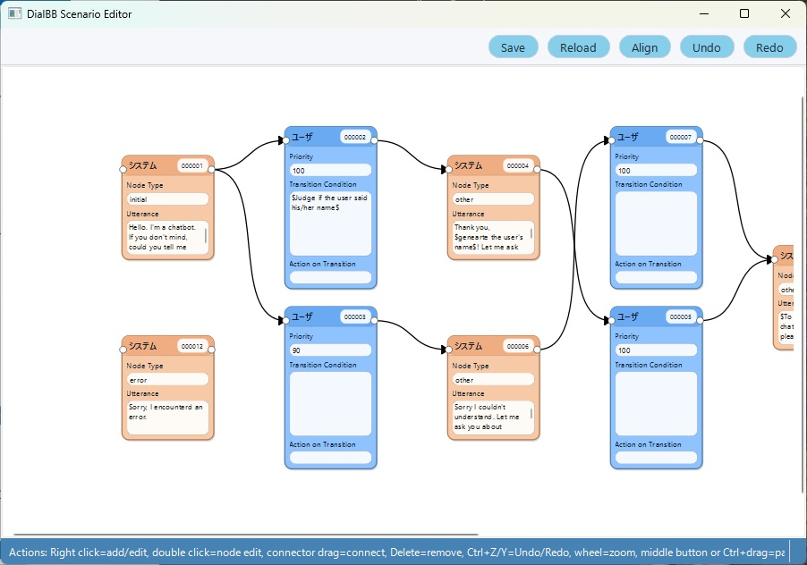

#### Add a Node

Right-click on the background and select either Add System Node or Add User Node.

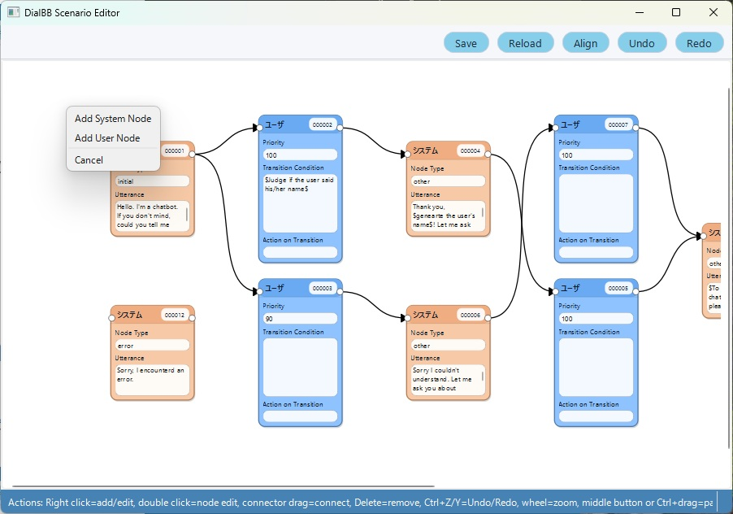

#### Delete a Node

Right-click on a node and select Delete, or select the node and press the Delete key.

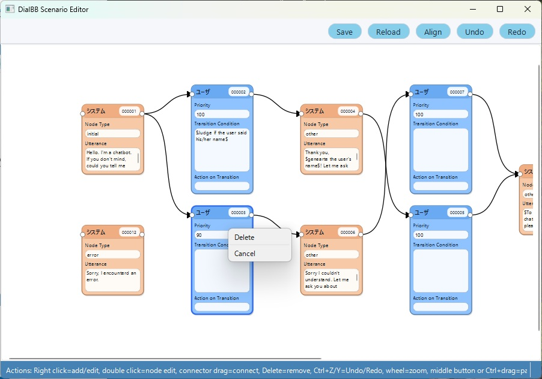

#### Edit a Node

Double-click a node to open the node editing dialog.

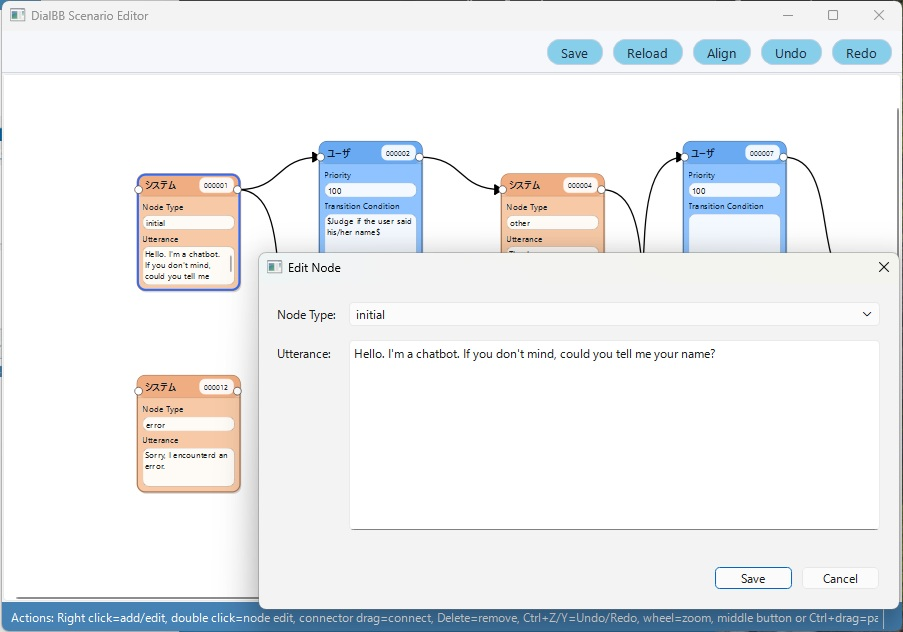
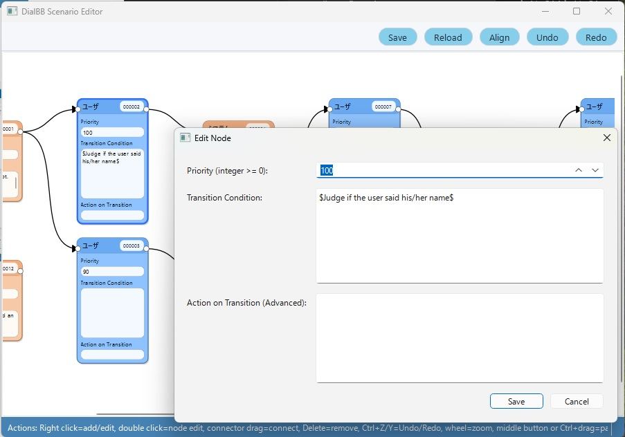

How to edit nodes is described later.

#### Connect or Delete a Connector

Left-click the circle on the right side of a node and drag it to the circle on the left side of another node.

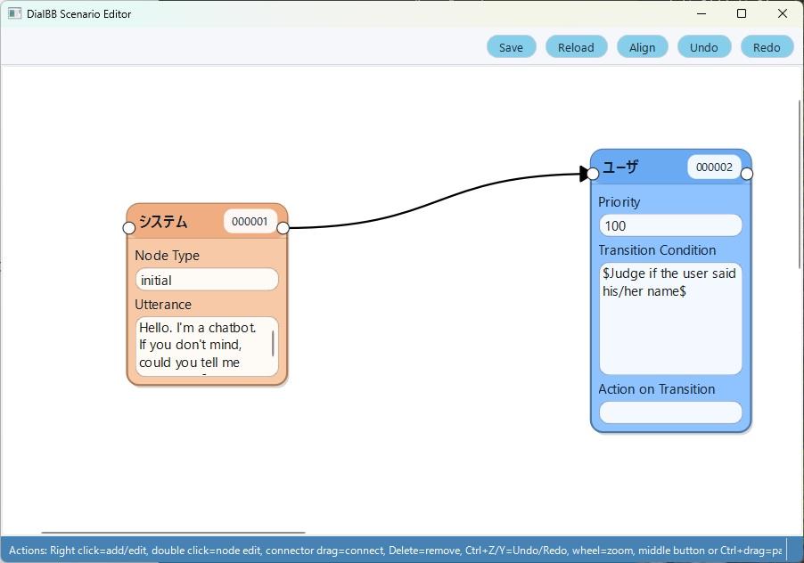

To delete a connector, right-click it and select Delete, or select it and press the Delete key.

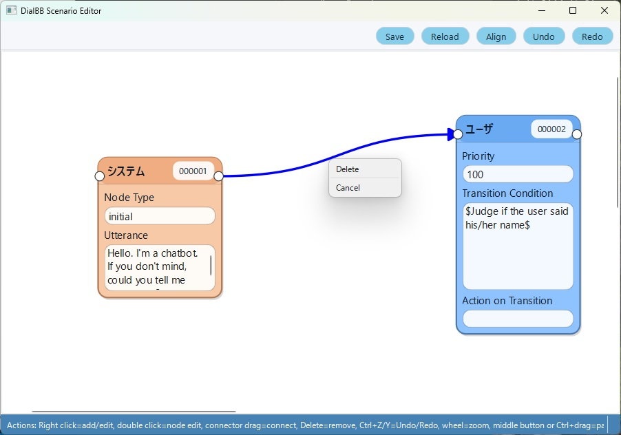

#### Undo and Redo

Use the Undo and Redo buttons at the top of the editor. You can also use Ctrl+Z and Ctrl+Y.

#### Save

Click the Save button at the top of the editor. If you close the editor without saving, your changes are lost.

#### Reload

Click the Reload button at the top of the editor to restore the last saved state. If you save frequently while editing a large state transition diagram, you can return to that point.

#### Zoom In and Out

Use the mouse wheel to zoom in or out.

#### Move the Canvas

Drag the canvas with the middle mouse button, or hold Ctrl while dragging with the left mouse button.

#### Close the Scenario Editor

In the main GUI, click Exit Scenario Edit to close the editor window.

#### Edit a System Node

Double-click a system node to open the following dialog. Edit the contents and click Save. Click Cancel to close the dialog without saving.


Node type must be one of the following.

| Type | Description |
| --- | --- |
| initial | Describes the first system utterance of the dialogue. Exactly one system node in the scenario must have this type. |
| final | When the dialogue reaches this node, it generates a system utterance and ends. You may have multiple nodes of this type. |
| error | Used when an internal error occurs. The dialogue moves to this node, generates a system utterance, and ends. It must not be connected to other nodes. |
| prep | Preparation state. When a dialogue starts, transitions from this state are tried first. Use this when you want to change the initial utterance or starting state depending on the context. |
| other | Any other system node. |

Write the system utterance in Utterance. The following notations are available.

- $<instruction>$
  Generate the utterance by giving an instruction to ChatGPT. In this case, the situation and persona specified in the configuration are used.

  Example: $Generate an utterance that gives a brief impression in 20 characters or fewer.$ By the way, how have you been feeling recently?

- $$$<prompt template>$$$

  Generate the utterance by giving ChatGPT a prompt created from a prompt template. The template may contain line breaks.

  Example:

  ```text
  $$$
  # Situation

  {situation}

  # Your persona

  {persona}

  # Dialogue so far

  {dialogue_history}

  # Notes

  {caution}

  # Task

  Generate an utterance that naturally closes the dialogue in 50 characters or fewer.
  $$$
  ```

  Text enclosed in { and } is a placeholder.

  Available placeholders:

  - {dialogue_history}
    Replaced with the dialogue so far, including the latest user utterance.
  - {situation}
    Replaced with the Situation setting from the configuration.
  - {persona}
    Replaced with the Persona setting from the configuration.
  - {caution}
    Replaced with the Notes setting from the configuration.
  - {current_time}
    Replaced with the current date, weekday, and time.

- `{#slot_name}` (advanced)

  Replaced with the value of the extracted slot. For example, `{#favorite ramen}` is replaced with the value of the favorite ramen slot.

  Example: `You like {#favorite ramen}.`

  If the slot is empty, it is replaced with an empty string. You should configure the user node so that this node is reached only when the slot is not empty.

#### Edit a User Node

Double-click a user node to open the following dialog. Edit the contents and click Save. Click Cancel to close it without saving.


Priority is an integer representing the priority of this user node. Among the user nodes connected from the same system node, conditions are checked in descending order of priority number. This number is reset each time the scenario is saved and is reassigned as 100, 90, 80, and so on from the highest one.

Enter the transition conditions for the user node in Transition Condition. When all listed conditions are satisfied, the dialogue moves to the next system node.

If there are multiple conditions, connect them with ;. The following kinds of conditions are available.

- $instruction$

  Ask ChatGPT to judge the condition from an instruction. In this case, the situation and persona specified in the configuration are used.

  Example: $Determine whether the user has become tired of the conversation.$

- $$$<prompt template>$$$

  Ask ChatGPT to judge the condition from a prompt created from a prompt template. The template may contain line breaks.

  Example:

  ```text
  $$$
  # Situation

  {situation}

  # Your persona

  {persona}

  # Dialogue so far

  {dialogue_history}

  # Task

  Determine whether the user stated a reason, and answer yes or no.
  $$$
  ```

  The same placeholders as system nodes are available.

- `#slot_name == "string"` or `#slot_name != ""` (advanced)

  Checks whether the slot value extracted from the latest user utterance matches a string or is not empty.

  Example: `#favorite ramen=="tonkotsu ramen"`

  If the slot is empty, it becomes an empty string. For example, if the favorite ramen slot is empty, the condition `#favorite ramen==""` is satisfied.

- `TT > number_of_turns`

  The condition is satisfied when the number of user utterances since the dialogue started exceeds the specified number.

  Example: `TT>10`

- `TS > number_of_turns`

  The condition is satisfied when the number of user utterances in the current state exceeds the specified number.

  Example: `TS>5`

Transition Action is used only in advanced cases and is not explained here.

### Edit Slot Extraction Knowledge (Advanced)

Slot extraction means extracting necessary information from the dialogue so far. That necessary information is called a slot. For example, in a dialogue system for weather information, place names and dates can be slots.

The names of those categories are slot names, and the extracted values themselves are slot values. These slot values can be used as transition conditions in user nodes.

To make the dialogue system perform slot extraction, you need slot extraction knowledge. It includes information such as the following.

- What slots exist?
- Examples of slot values
- Examples of dialogues and the slots extracted from them

You can also describe synonyms for each slot.

The same word may belong to different slots. For example, in a ticket vending dialogue system, if the user says a ticket from Tokyo to Shin-Osaka, then Tokyo is the departure station, Shin-Osaka is the arrival station, and ticket is the ticket type. In that case, the departure station slot and the arrival station slot are both station names.

To edit slot extraction knowledge, click Slot Extraction Knowledge on the main screen. Excel opens the knowledge file. Edit it and save it. If another spreadsheet application such as OpenOffice is associated instead of Excel, that application opens. If you do not use spreadsheet software, contact the developers.

The Excel file for slot extraction knowledge consists of two sheets: dialogues and slots.
The following is an example of the dialogues sheet.

| flag | dialogue | slots |
| --- | --- | --- |
| Y | System: What kind of ramen do you like? / User: Tonkotsu ramen. | favorite ramen=tonkotsu ramen |
| Y | System: Tell me your favorite ramen. / User: Tonkotsu ramen. / System: Hakata style? / User: Yes. | region=Hakata, favorite ramen=tonkotsu ramen |

- The flag column is not used.
- The dialogue column contains dialogue examples.
- The slots column contains slots in the form `slot name=slot value, ...`. Commas may be half-width commas or Japanese punctuation commas.

The following is an example of the slots sheet.

| flag | slot name | entity | synonyms |
| --- | --- | --- | --- |
| Y | favorite ramen | tonkotsu ramen | tonkotsu, pork-broth ramen |
| Y | favorite ramen | miso ramen | miso |
| Y | region | Hakata | - |
| Y | user name | Taro | - |

- The flag column is not used.
- In slot name, write the slot name.
- In entity, write an example of a possible slot value.
- In synonyms, list synonyms for the slot value separated by commas. If a synonym is extracted, it is normalized to the value in entity.

## Testing with the User Simulator

You can test your application with the user simulator. Click the Test button on the main menu to open the test menu screen.

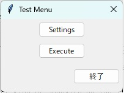

Click Settings to open the simulator settings.

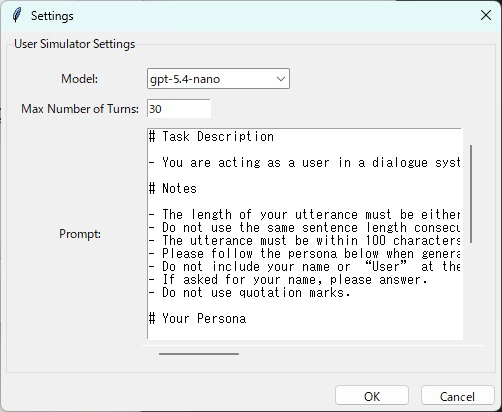

Model is the model used by the simulator. Maximum Turns is the maximum number of user utterances in a simulated dialogue. Prompt is the simulator prompt. Edit them as needed and click OK.

Click Run in the test menu screen to start the test.
