# DialBBノーコードツール（DialBB-NC）ドキュメント


## はじめに

本ドキュメントはDialBBのノーコードツール（DialBB-NC）のドキュメントです．

## 動作環境

Windows11，MacOSで動作します．

## インストール・起動（Windows）

### Pythonのインストール

- もし，すでにPythonがインストールされていれば，バージョンを確かめてください．インストールされているかどうかの確かめ方やバージョンの確かめ方はそのうち記述します．インストールされていても，バージョンが3.10-3.12であれば，新しくインストールする必要はありません．3.9以前のPythonがインストールされている場合，使っていないならアンインストールしてください．使っている場合，DialBBの開発者（dialbb あっと c4a.jp）に相談してください．

- Windows 11

  - Pythonがインストールされていない場合，以下の手順でPythonをインストールします．

    - ブラウザのアドレスバーに https://www.python.org/downloads/windows/ を打ち込んでEnterキーを押します．
    - 表示されている中から以下の部分を探します．以下は3.10.11ですが，3.10.x-3.13.xであれば，別のバージョンでも構いません．

    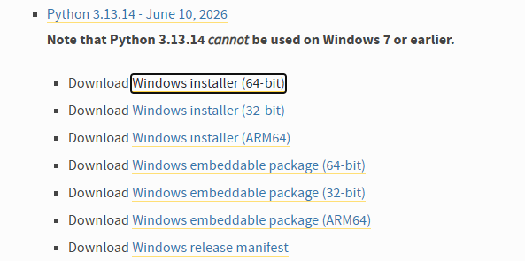

    - 64bit OSの場合は，[Windows installer (64-bit)](https://www.python.org/ftp/python/3.10.11/python-3.10.11-amd64.exe)を，32bit OSの場合は[Windows installer (32 -bit)](https://www.python.org/ftp/python/3.10.11/python-3.10.11.exe)をクリックします．

    - 「ダウンロード」フォルダに `python-3.10.11-amd64.exe`または`python-3.10.11-amd32.exe`というファイルができるので，ダブルクリックします．

    - 以下の画面が現れます．

      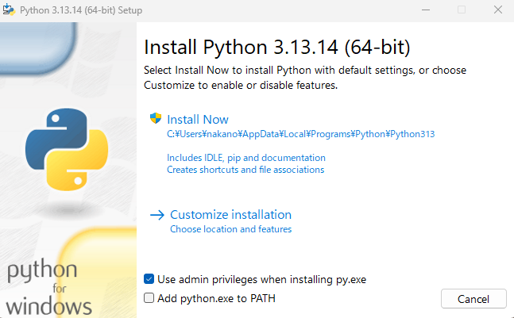

      - Add python.exe to PATHに**チェックを入れてから**Install Nowをクリックします．

        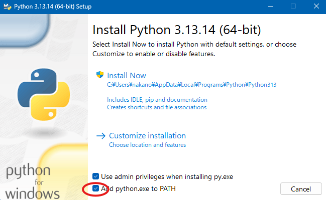

      - Pythonがインストールされます．


### DialBBのインストール

- 必要なファイルを以下の手順でダウンロードします．

  - ブラウザから https://c4a-ri.github.io/dialbb/files/dialbb-setup.zip にアクセスします．

  - `ダウンロード`フォルダに`dialbb`ファイルがダウンロードされます．エクスプローラで`ダウンロード`フォルダを開いて確認してください．以下のようなファイルができているはずです．

    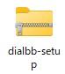

    - このようにチャックの模様があるものをzipファイルと呼びます．環境によっては，`dialbb-setup.zip`という名前で表示されます．
    - 複数回ダウンロードすると，新しくダウンロードしたものは`dialbb-setup(1)`のような名前になるので，その場合，`ダウンロード`フォルダの`dialbb-setup`を削除してからもう一度ダウンロードしてください．
  
- エクスプローラで`dialbb-setup`アイコンの上にカーソルを持っていき右クリックし，「すべて展開」を選びます．出てきた画面で，「展開」を押してください．`dialbb-setup`フォルダができるので，それを開いてください．

- install（環境によってはinstall.bat）をダブルクリックします．DialBBがインストールされます．

  - 「WindowsによってPCが保護されました」と出るかもしれません．その場合，「詳細情報」をクリックすると，「実行」ボタンが出てくるので，それを押してください．
  - `Press any key to continue . . .`と表示されたらインストールは完了なので，何かキーを押して終了してください．

### 起動

`dialbb-setup`フォルダ内で`start-dialbb-nc`（または`start-dialbb-nc.bat`）をダブルクリックします．

正常に起動するとメイン画面が表示されます．

<div align="center">
  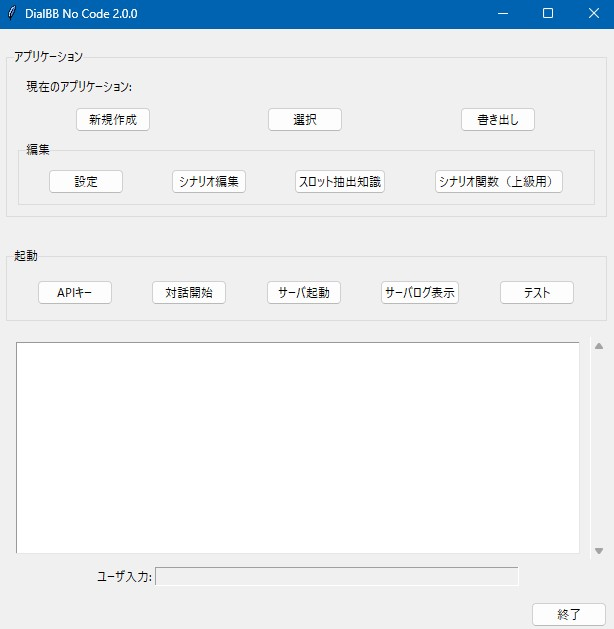
</div>

## インストールと起動（Mac）

### Pythonのインストール

Windowsの場合と同様，Python3.10-3.12がインストールされていれば，新たにインストールする必要はありません．

Pythonがインストールされていない場合，以下の手順でインストールしてください．

- [Pythonの公式ダウンロードサイト](https://www.python.org/downloads/mac-osx/)にアクセスしてください．
- 適当なバージョン（例:3.10.11）の下の，`macOS 64-bit universal2 installer`をクリックし，ファイルをダウンロードします．
- ダウンロードした `.pkg` ファイルを開いて，画面に表示される指示に従いインストールを進めてください．

### DialBBのインストール

https://c4a-ri.github.io/dialbb/files/dialbb-setup.zip から`dialbb-setup.zip`ファイルをダウンロードします．Downloadフォルダにダウンロードされます．ターミナルを開きます．適当なディレクトリ（DialBBディレクトリと呼びます）を作って移動してください．

そこで，

```sh
unzip ~/Downloads/dialbb-setup.zip
pip install --force-reinstall *.whl
```

としてください．DialBBがインストールされます．

### 起動

ターミナルで以下を実行します．（ディレクトリはどこでも構いません）

```sh
dialbb-nc
```

Macの場合少し画面が乱れます．（修正予定）

## アプリケーションの読み込み・作成・書き出し

### アプリケーションの読み込み/新規作成

- すでにあるアプリケーションを読み込む場合は，`選択`ボタンをクリックし，読み込むアプリケーションのzipファイルを選択し，`読み込み`を押します．

    <div align="center">
      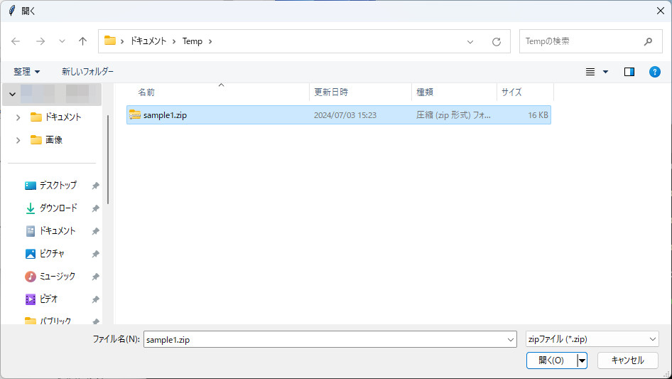
    </div>

- アプリケーションを新たに作成する場合は，`新規作成`ボタンをクリックし，言語を選択します．テンプレートアプリケーションファイルが読み込まれます．  

    <div align="center">
      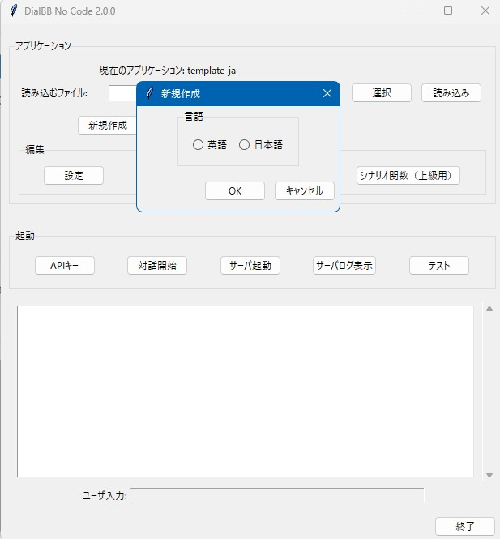
    </div>

- その時点で読み込まれているアプリケーションの名前（zipファイルの名前）がメイン画面の`Current application`のところに表示されます．

###  アプリケーションの書き出し

- `書き出し`ボタンをクリックし，保存する場所/ファイル名を指定します，zipファイルにまとめて保存されます．  

  <div align="center">
    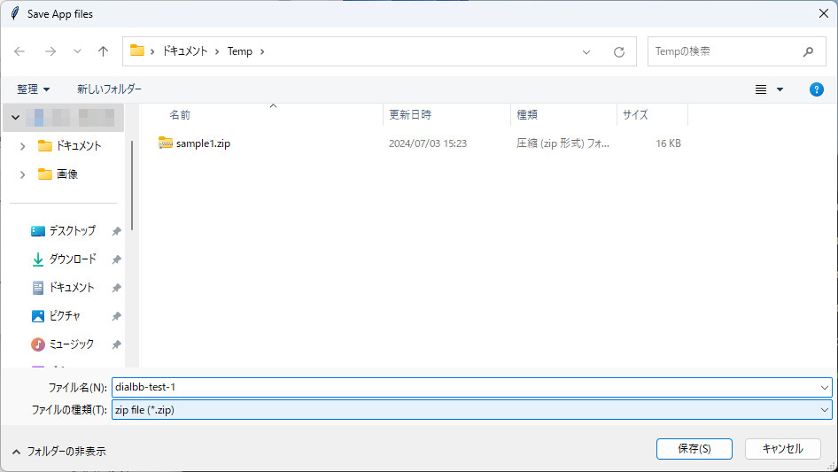
  </div>

## アプリケーションの起動・停止

### OpenAI API キーの登録

最初にDialBB-NCを使うときや，DialBBのインストールをし直した後には，OpenAIのAPIキーの登録が必要です．OpenAIのAPIキーの登録は以下のようにします．  

- `設定`ボタンを押しますと設定画面が出ます． 

  <div align="center">
    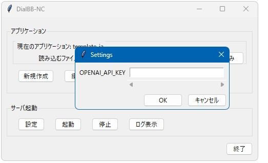
  </div>

- `OPENAI_API_KEY`の右側に別途入手したOpenAIのAPIキーを入力し，`OK`ボタンを押します．`保存しました`という表示が出るので再度`OK`ボタンを押します．OpenAIのAPIキーの入手方法は別途「OpenAI API キー」などで検索して調べてください（少額ですが有料です）．

- 入力したAPIキーは暗号化して保存されますが，DialBBのプログラムがあれば復号できるので，個人用PC以外では保存しないようにしてください．消去する場合には，`OPENAI_API_KEY`に他の文字列をセットするか，DialBBをアンインストールしてください．

### 対話の実行

- `対話開始`ボタンを押すと対話ができます．`ユーザ入力`フィールドに発話を入力して対話をしてください．

  <div align="center">
    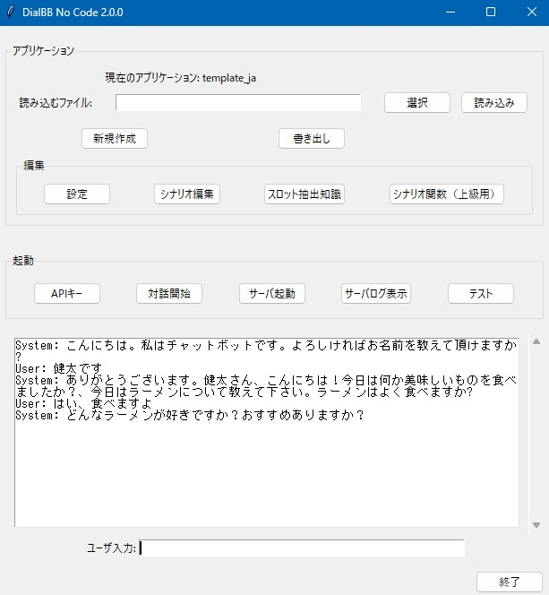
  </div>

### テスト

ユーザシミュレーションを利用したテストができます。後で詳細に説明します。

### 対話サーバの使い方(上級用)

Webサーバとしてアプリケーションを動かし，他のプログラムと連携させたりできます．

#### 起動

- `サーバ起動`ボタンをクリックします．アプリケーションサーバが起動します．

- ChromeやEdgeなどのブラウザを開き，アドレスバーに`http://localhost:8080/`を打ち込んでEnterを押します．以下のようなチャット画面が表示されます．

  <div align="center">
    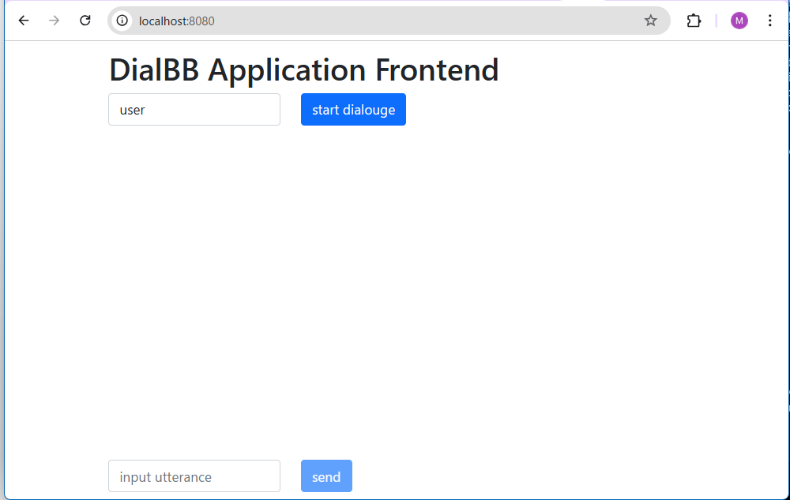
  </div>

- `start dialogue`ボタンを押すと会話が開始されます．

- 再度最初から会話を始めたい場合はブラウザのリロードボタンを押してください．

- `http://localhost:8080/test` にアクセスするとシンプルな画面が出ます．（対話のログのコピペがしやすいです）

#### 停止

- メインGUIで`サーバ停止`ボタンを押すとアプリケーションサーバが停止します．

#### ログ

- ブラウザからアクセスしても画面が出ない場合や対話がうまくいかない場合は，`ログ表示`ボタンを押し，ログを見て近くのエンジニアか[DialBB開発者](mailto:dialbb@c4a.jp)に相談してください．
- ログはホームフォルダ（ホームディレクトリ）の中の`.dialbb_nc_logs`フォルダの中に書きだされます．
  - ホームフォルダは，Windowsの場合，`C:\Users\<ユーザ名>`です．
  - ログは日付毎にフォルダにまとまっています．
  - ログファイルは`<アプリケーションが起動した時間>.txt`です．

### アンインストール

`dialbb-setup`フォルダの中にある，uninstallというアイコンをダブルクリックするとDialBBがアンインストールできます．


## アプリケーションの編集

### コンフィギュレーションの変更

  `コンフィギュレーション`ボタンを押すと，以下の画面が表示されます．

  <div align="center">
    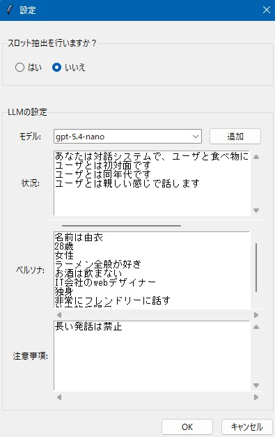
  </div>

以下が各編集項目の説明です．

| 編集項目 | 説明 |
|-----|------|
| 固有表現抽出を行いますか？ | 固有表現抽出（後述）を行うかどうかを選択します．(上級用) |
| 言語理解を行いますか？ | 言語理解（後述）を行うかどうかを選択します．(上級用) |
| モデル | 利用する大規模言語モデル（LLM）を選択します．`その他`を押すと，プルダウンにないモデルを追加できます．（今はOpenAIのgptしか使うことができません） |
| 状況 | LLMのプロンプトに書く状況を入力します．1行ごとに状況を記述します． |
| ペルソナ | LLMのプロンプトに書くシステムのペルソナを入力します．1行ごとにペルソナを記述します． |
| 注意事項 | LLMのプロンプトに書く注意事項を記述します．（システムノードでのみ用いられます．） |

---

### シナリオファイルの編集

`シナリオ編集`ボタンを押すと，シナリオエディタが表示されます．

#### シナリオエディタの概要

シナリオは，システムノードとユーザノードがリンクで接続されたものです．システムノードではシステム発話を記述し，ユーザノードでは，遷移の条件を記述します．priorityの値が高い順に遷移の条件を調べていき，条件が満たされれば，その次のシステムノードに遷移します．**どのユーザノードの遷移の条件も満たされない場合，同じシステムノードに戻って，システム発話が生成されます．**

システムノードは複数のユーザにリンクが出て行き，ユーザノードからは一つだけのノードにリンクが出て行きます．（ノード右側コネクタが出口，ノード左側が入口です）

システム発話や遷移の条件の記述については，後で説明します．

<div align="center">
  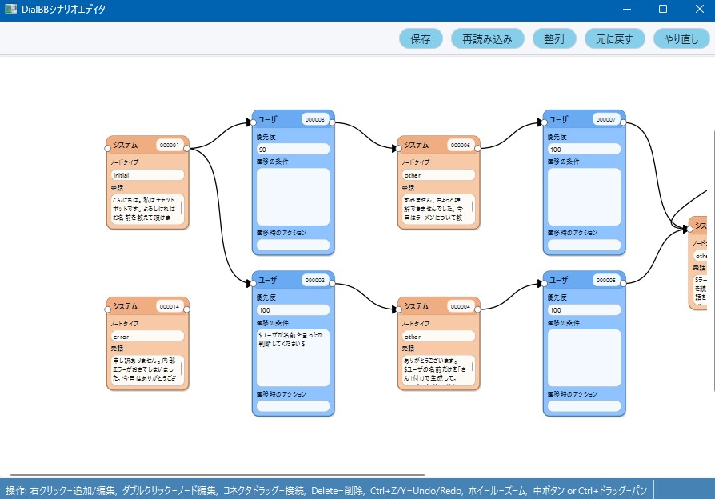
</div>

#### ノードの追加
背景で右クリック し，`システムノード追加`か`ユーザノード追加`を選択するとシステムノードかユーザノードが新規追加されます． 

<div align="center">
  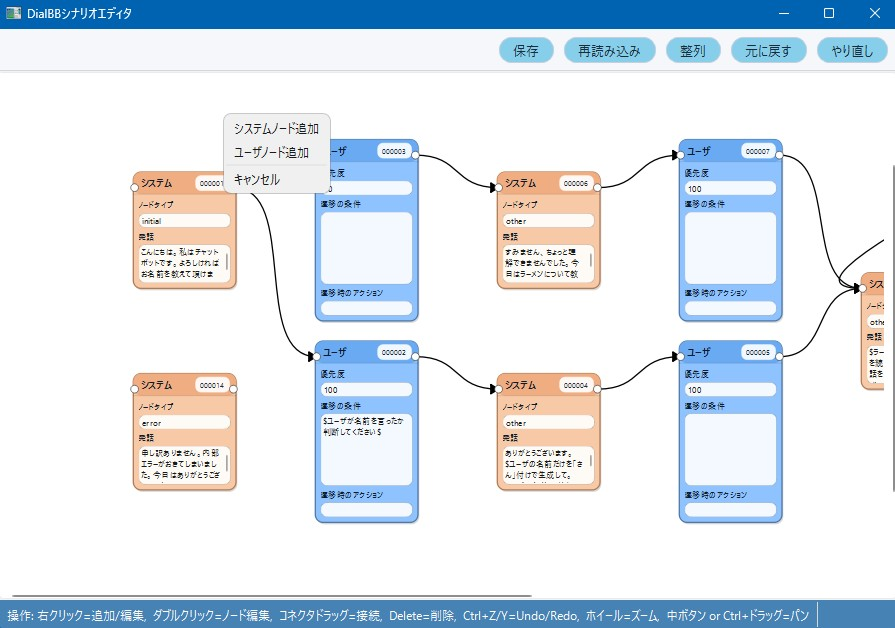
</div>

#### ノードの削除
ノードの上で右クリック し`削除`を選択するかノードを選択してDelキーを押すとそのノードが削除されます．

<div align="center">
  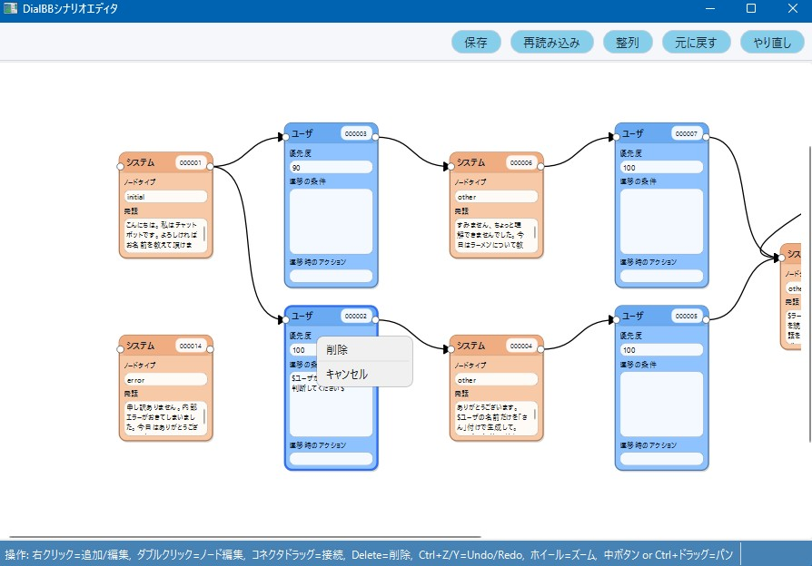
</div>

#### ノードの編集
ノードの上でダブルクリック すると，ノードの編集画面が表示されます．

<div align="center">
  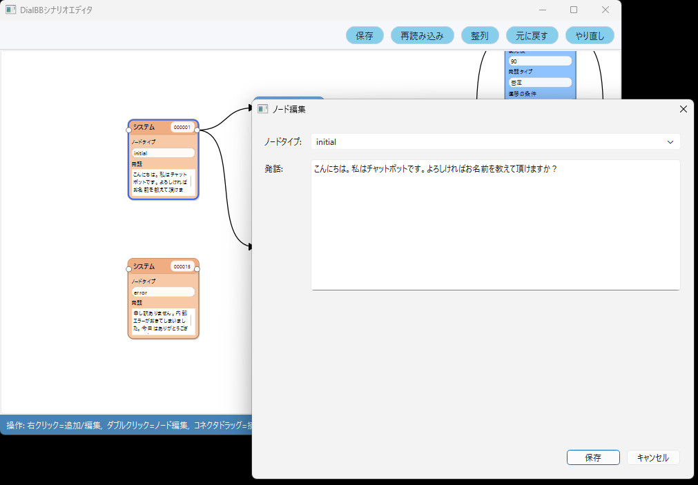 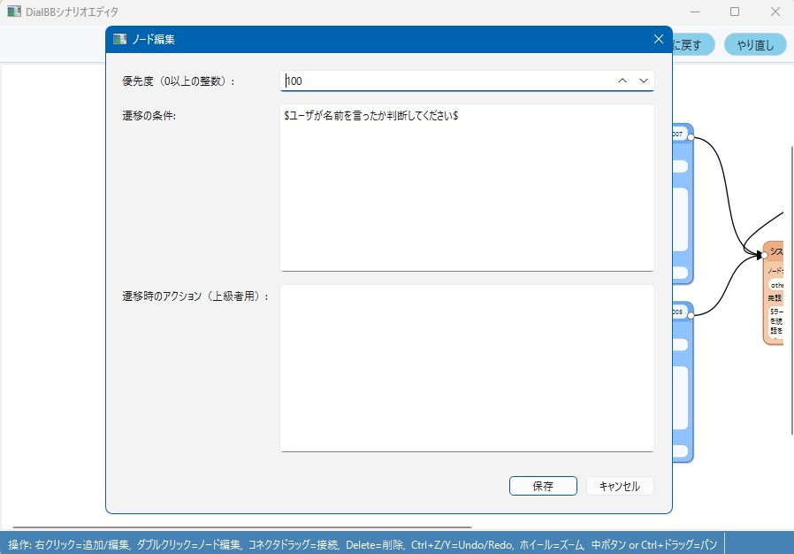
</div>

ノードの編集の仕方は後述します．

#### コネクタの接続・削除

ノード右側〇を左クリックし，他ノードの左側〇へドラッグして接続します．

<div align="center">
  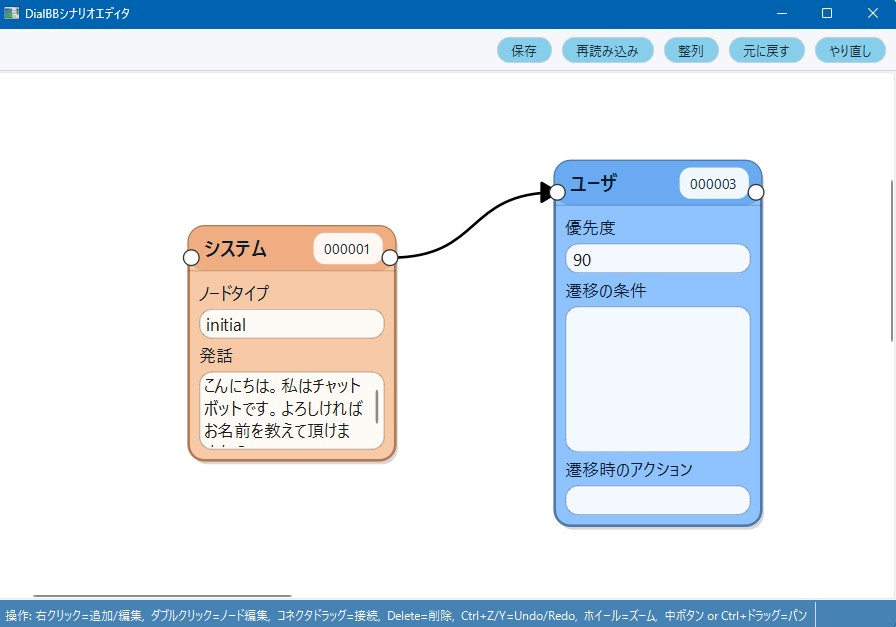
</div>

削除はコネクター上で右クリック し`削除`を選択するか、選択した状態でDelキーを押すと削除されます．

<div align="center">
  
</div>

#### アンドゥ／リドゥ

変更を戻すときには上部の`元に戻す`ボタン、やり直しをする時は`やり直し`ボタンを押してください．コントロールキーを押しながら`z`／`y`でも操作が可能です.  

#### 保存

上部の`保存`ボタンをクリックすると保存します．保存しないでエディタを終了した場合は変更データが失われます．

#### 再読み込み

上部の`再読み込み`ボタンをクリックすると最後に保存されたデータを読み込みます．大規模な状態遷移図の編集ではこまめに保存をしておけばその状態まで復元することが可能です．

#### 拡大／縮小

マウスの`ホイール`を使いズームイン／ズームアウトが可能です．  

#### キャンバスの移動

マウスの`中ボタン`またはコントロールキーを押しながら`左クリック`で全体をドラッグできます．

#### シナリオエディタの終了

メインGUIで`シナリオ編集終了`ボタンを押すとエディタウィンドウが閉じます．

#### システムノードの編集の仕方

システムノードをダブルクリックすると以下のような入力ダイアログが表示されますので，中身を書き換えて`保存`ボタンを押します．`キャンセル`ボタンを押すと保存せずに閉じます．

<div align="center">
  
</div>

`ノードタイプ`は以下のどれかです．

| type    | 説明                                                         |
| ------- | ------------------------------------------------------------ |
| initial | 対話の最初のシステム発話を記述します．シナリオの中で，typeがinitialであるシステムノードは一つだけ存在しなくてはなりません． |
| final   | このノードに来たら，システム発話を生成して対話を終了します．typeがfinalであるシステムノードはいくつあっても構いません． |
| error   | 内部エラーが起きたときにこのノードに移行し，システム発話を生成して終了します．別のノードとつながっていてはいけません． |
| prep   | 準備状態．対話が始まった時に，この状態からの遷移が試みられます．最初のシステム発話や状態を状況に応じて変更するときに使います．                                 |
| other   | その他のシステムノードです．                                 |

`発話`には，システム発話を書きます．システム発話の中に以下のようなものを書けます．

- `$<インストラクション>$`
  ChatGPTにインストラクションを与えて発話を生成させます．このとき，コンフィギュレーションで指定したsituationとpersonaが用いられます．
  例： `$感想を言う発話を20字以内で生成してください．$ところで，最近の体調はいかがですか？` 

- `$$$<プロンプトテンプレート>$$$`
  
  ChatGPTにプロンプトを与えて発話を生成させます．プロンプトはプロンプトテンプレートから作られます．プロンプトテンプレートは改行を含んでも構いません．以下が例です．

    ```
  $$$
  # 状況
  
  {situation}
  
  # あなたのペルソナ
  
  {persona}
  
  # 現在までの対話
  
  {dialogue_history}
  
  # 注意事項
  
  {caution}
  
  # タスク
  
  それまでの会話につづけて，対話を終わらせる発話を50文字以内で生成してください．
  $$$
    ```
  
    `{`と`}`で囲まれている部分はプレースホルダです．
  
  - 利用できるプレースホルダ
  
    - `{dialogue_history}`
  
      その時点までの対話（最新のユーザ発話を含む）で置き換えられます．
  
    - `{situation}`
  
      コンフィギュレーションで指定した「状況」で置き換えられます．
    
    - `{persona}`
  
      コンフィギュレーションで指定した「あなたのペルソナ」で置き換えられます．
  
    - `{caution}`
  
      コンフィギュレーションで指定した「注意事項」で置き換えられます．
    
    - `{current_time}`
    
      対話の行われている時点の年月日，曜日，時分秒を表す文字列で置き換えられます．
  
- `#<言語理解のスロット名>` (上級用)

  直前のユーザ発話の言語理解で得られたスロットの値で置き換えられます．`{#好きなラーメン}`なら，`好きなラーメン`スロットの値で置き換えられます．

  例：`{#好きなラーメン}がお好きなんですね！`

  スロットが空の場合，空文字列になります．スロットが空でないときだけ，このノードに来るように，ユーザノードで設定する必要があります．

  言語理解については後で説明します．

- `#<NE_固有表現のクラス>`(上級用)

  固有表現抽出の結果で置き換えられます．`{#NE_人名}`なら，直前のユーザ発話の固有表現抽出の結果得られた`人名`クラスの固有表現が用いられます．

  例：`こんにちは，{#NE_人名}さん`

  固有表現が抽出できなかった場合，空文字列になります．スロットが空でないときだけ，このノードに来るように，ユーザノードで設定する必要があります．
  
  固有表現抽出については後で説明します．

#### ユーザノードの編集の仕方

ユーザノードをダブルクリックすると以下のような入力ダイアログが表示されますので，中身を書き換えて`保存`ボタンを押します．`キャンセル`ボタンを押すと保存せずに閉じます．

<div align="center">
  
</div>

`優先度`はこのユーザノードの優先度を表す整数です．一つのシステムノードからつながっているユーザノードのうち，priority numberの高い順に条件がチェックされます．この数字は，シナリオを保存する度にリセットされ，大きいものから順に100, 90, 80, ...に変更されます．

`ユーザ発話タイプ`と`遷移の条件`にはこのユーザノードの条件を書きます．両方が満たされたとき，このユーザノードの次のシステムノードに移行します．

`ユーザ発話タイプ`は言語理解で得られるユーザ発話のタイプを書きます．コンフィギュレーションで，言語理解を行うことを選択している場合，および，言語理解で得られたユーザ発話のタイプが，ここに書いてあるものにマッチした場合，条件が満たされます．ここが空の場合は，必ず条件が満たされたとみなします．

`遷移の条件`には，ユーザ発話以外のタイプに関する条件を書きます．条件が複数ある場合は，";"でつなぎます．条件には以下のようなものが書けます．

- `$インストラクション$` 
  ChatGPTにインストラクションを与えて条件判定をさせます．このとき，コンフィギュレーションで指定したsituationとpersonaが用いられます．
  例： `$ユーザが会話に飽きたかどうかを判断してください．$` 

- `$$$<プロンプトテンプレート>$$$`
  
  ChatGPTにプロンプトを与えて条件判定をさせます．プロンプトはプロンプトテンプレートから作られます．プロンプトテンプレートは改行を含んでも構いません．以下が例です．

    ```
  $$$
  # 状況
  
  {situation}
  
  # あなたのペルソナ
  
  {persona}
  
  # 現在までの対話
  
  {dialogue_history}
  
  # タスク
  
  ユーザが理由を言ったかどうか判断し，yesかnoで答えてください．
  $$$
    ```
  
    `{`と`}`で囲まれている部分はプレースホルダです．システムノードと同じものを使うことができます．
  
- `#<言語理解のスロット名> == "<文字列>"`/ `#<言語理解のスロット名> != ""` (上級用)

  直前のユーザ発話の言語理解で得られたスロットの値が文字列に一致するかどうか（`==`）または一致しないかどうか（`!=`）を判定します．

  例：`#好きなラーメン=="豚骨ラーメン"`(上級用)

  スロットが空の場合，空文字列になります．例えば`好きなラーメン`スロットの値が空であれば，条件，`#好きなラーメン==""`は満たされます．

- `#<NE_固有表現のクラス> == "<文字列>"`/ `#<NE_固有表現のクラス> != ""` (上級用)

  直前のユーザ発話の固有表現抽出で得られた固有表現の値が文字列に一致するかどうか（`==`）または一致しないかどうか（`!=`）を判定します．

  例：`#NE_人名!=""`

  固有表現が抽出できなかった場合，空文字列になります．例えば`Person`クラスの固有表現が抽出できなかった場合，条件，`#NE_Person!=""`は満たされません．

- `TT > <ターン数>`

  対話開始からのユーザ発話の回数が`<ターン数>`を超えた場合に条件が満たされます．
  例：`TT>10`

- `TS > <ターン数>`

  その状態（システムノード）でのユーザ発話の回数が`<ターン数>`を超えた場合に条件が満たされます．
  例：`TS>5`

`遷移時のアクション`は進んだ使い方の時のみ利用するのでここでは説明しません．


### 言語理解用知識の編集（上級用）

言語理解とは，発話タイプに分類し，必要な情報を取り出すことです．必要な情報のことをスロットと言います．例えば，気象情報を検索する対話システムならば，タイプは「天気を聞く」「気温を聞く」などで，スロットは，「地名」や「日付」などになります．
この「地名」や「日付」をスロット名，実際に抽出される地名や日付の値をスロット値と呼びます．このタイプやスロット値をシナリオのユーザノードで遷移の条件として使うことができます．

対話システムに言語理解を行わせるには，言語理解知識が必要です．言語理解知識には以下のような情報を記述します．

- どのような発話がどのタイプなのか？
- どのようなスロットがあるのか？
- スロット値の例
- 発話とそれから得られるスロットの例

さらに，各スロットの同義語も記述することができます．

同じ単語が別のスロットになることもあります．例えば，券売機の対話システムで「東京から新大阪までの乗車券」と言えば，乗車駅＝東京，降車駅＝新大阪，券種別＝乗車券となりますが，乗車駅スロットと降車駅スロットは両方とも駅名です．

言語理解知識を編集するには，メイン画面で`言語理解知識`を選択します．Excelが起動して言語理解知識を読み込むので，編集して保存してください． 

言語理解用知識のExcelファイルは，`utterances`シートと，`slots`シートからなります．
以下が`utterances`シートの例です．

| flag | type                           | utterance                              | slots                                  |
| ---- | ------------------------------ | -------------------------------------- | -------------------------------------- |
| Y    | 肯定                           | はい                                   |                                        |
| Y    | 特定のラーメンが好き           | 好きなのは味噌ラーメン                 | 好きなラーメン=味噌ラーメン            |
| Y    | ある地方の特定のラーメンが好き | 博多の豚骨ラーメンって美味しいですよね | 地方=博多，好きなラーメン=豚骨ラーメン |

- `flag`列は使いません．
- `type`列には発話のタイプを書きます．
- `utterance`列は発話例です．
- `slots`には，`<スロット名>=<スロット値>, ... ,<スロット名>=<スロット値>`の形で発話に含まれるスロットを書きます．カンマは全角でも読点でも構いません．

以下は`slots`シートの例です．

| flag | slot name      | entity             | synonyms                                     |
| ---- | -------------- | ------------------ | -------------------------------------------- |
| Y    | 好きなラーメン | 豚骨ラーメン       | とんこつラーメン，豚骨スープのラーメン，豚骨 |
| Y    | 好きなラーメン | 味噌バターラーメン |                                              |
| Y    | 地方           | 富山               |                                              |

- `flag`列は使いません．
- `slot name`列にはスロット名を書きます．
- `entity`列にはスロット値になり得るものの例を書きます．
- `synonyms`列には，スロット値の同義語をカンマまたは読点で並べて書きます．同義語がスロット値になった場合，entity列のものに置き換えられます．

### 固有表現抽出知識の編集（上級用）

固有表現とは，固有名詞＋αと思って構いません．発話テキストから固有表現を抽出することを固有表現抽出と言います．固有表現はクラスに分かれています．例えば，人名，地名，組織名，商品名，時間，数量などが，クラスとして使われます．言語理解のスロットと似ていますが，言語理解のスロットは，タイプと結びついているのに対して，

対話システムに固有表現抽出を行わせるには，固有表現抽出知識が必要です．固有表現抽出知識には以下のような情報を記述します．

- どのようなクラスの固有表現があるのか？
- 各クラスの固有表現の例
- 発話とそれから得られる固有表現の例

一つの発話から同じクラスの固有表現が複数得られることもあります．例えば，「太郎と次郎はラーメンが好き」ならば，「太郎」も「次郎」も人名クラスの固有表現です．

固有表現抽出知識を編集するには，メイン画面で`固有表現抽出知識`を選択します．Excelが起動するので，編集して保存してください． 

固有表現抽出知識のExcelファイルは，`utterances`シートと，`classes`シートからなります．

以下がutterancesシートの例です．

| flag | utterance                    | entities             |
| ---- | ---------------------------- | -------------------- |
| Y    | 札幌の味噌ラーメンが好きです | 地名=札幌            |
| Y    | 田中です                     | 人名=田中            |
| Y    | 太郎は東京に住んでます       | 人名=太郎，地名=東京 |

- `flag`列は使いません．
- `utterance`列は発話例です．
- `entities`には，`<固有表現クラス名>=<固有表現>, ... ,<固有表現クラス名>=<固有表現>`の形で発話に含まれるスロットを書きます．カンマは全角でも読点でも構いません．

以下は`classes`シートの例です．固有表現のクラス毎に1行記述します．

| flag | class | explanation | examples                                 |
| ---- | ----- | ----------- | ---------------------------------------- |
| Y    | 人名  | 人の名前    | 田中，山田，太郎，花子，ジョン           |
| Y    | 地名  | 場所の名前  | 札幌，東京，大阪，日本，アメリカ，北海道 |

- `flag`列は使いません．
- `class`列には固有表現のクラスを書きます．
- `explanation`列には固有表現の説明を書きます．
- `examples`列には，そのクラスの固有表現の例をカンマまたは読点で並べて書きます．

## ユーザシミュレータを用いたテスト

ユーザシミュレータを用いたテストができます。メインメニューで`テスト`ボタンを押すと以下のテストメニュー画面が現れます。

<div align="center">
  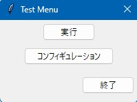
</div>

コンフィギュレーションを押すと、シミュレータの設定が表示されます。

<div align="center">
  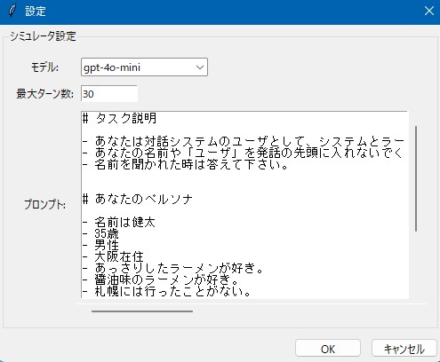
</div>

`モデル`はシミュレータが使うモデルで、`プロンプト`はシミュレータのプロンプトです。適宜編集して`OK`ボタンを押して終了してください。

テストメニュー画面で`実行`ボタンを押すとテストが行えます。

## ノーコードGUIの日本語／英語表示切替について

起動コマンドの引数[ja/en]で指定します．

- `dialbb-nc [ja]`  …日本語，省略時は日本語がデフォルトです．
- `dialbb-nc en`  …英語

