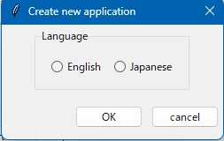

# DialBBノーコードツール ドキュメント


## はじめに

本ドキュメントはDialBBのノーコードツールのドキュメントです．

## 動作環境

Windows11，MacOSで動作します．

## インストール

### Pythonのインストール

- もし，すでにPythonがインストールされていれば，バージョンを確かめてください．インストールされているかどうかの確かめ方やバージョンの確かめ方はそのうち記述します．インストールされていても，バージョンが3.10-3.12であれば，新しくインストールする必要はありません．3.9以前のPythonがインストールされている場合，使っていないならアンインストールしてください．使っている場合，DialBBの開発者に相談してください．

- Windows 11

  - Pythonがインストールされていない場合，以下の手順でPythonをインストールします．

    - ブラウザのアドレスバーに https://www.python.org/downloads/windows/ を打ち込んでEnterキーを押します．
    - 表示されている中から以下の部分を探します．以下は3.10.11ですが，3.10.x-3.12.xであれば，別のバージョンでも構いません．

    

    - 64bit OSの場合は，[Windows installer (64-bit)](https://www.python.org/ftp/python/3.10.11/python-3.10.11-amd64.exe)を，32bit OSの場合は[Windows installer (32 -bit)](https://www.python.org/ftp/python/3.10.11/python-3.10.11.exe)をクリックします．

    - 「ダウンロード」フォルダに `python-3.10.11-amd64.exe`または`python-3.10.11-amd32.exe`というファイルができるので，ダブルクリックします．

    - 以下の画面が現れます．

      

      - Add python.exe to PATHに**チェックを入れてから**Install Nowをクリックします．

        

      - Pythonがインストールされます．

- Mac

  - [この記事](https://qiita.com/omo_taku/items/bc97f69391b2f4627f36)の方法２がおすすめです．方法1だと，pythonではなくpython3と打たないとPythonが起動できない可能性があります．


### DialBBのインストール

- 必要なファイルを以下の要領でダウンロードします．

  - ブラウザでのアドレスバーに https://github.com/c4a-ri/dialbb/tree/dev-v1.0/dist を打ち込んでEnterキーを押します．

  - dialbb_nc-x.x.x-py3-none-any.whl をクリックします．x.x.xのところは数字が違う可能性があります．

  - 遷移したページの右側の下向き矢印をクリックします．

    

  - ダウンロードフォルダにwhlファイルがダウンロードされます．

- 以下の要領でDialBBをインストールします．

  - 検索窓に"cmd"と入力して，Enterキーを押します．

    

  - コマンドプロンプトが現れます．

    

  - 以下のコマンドを打ち込んでEnterキーを押します．

    ```
    pip install Downloads\dialbb_nc-0.1.5-py3-none-any.whl
    ```

    

    \は円マーク(￥の半角)の場合があります．
    
    \の右側はダウンロードしたファイルの名前です．
  
  

## 起動
コマンドプロンプトで以下のコマンドを入力してEnterキーを押します．

```sh
dialbb-nc
```
正常に起動するとメイン画面が表示されます．  


## アプリケーションの読み込み・作成・書き出し

### アプリケーションの読み込み/新規作成

- すでにあるアプリケーションを読み込む場合は，`select`ボタンをクリックし，読み込むアプリケーションのzipファイルを選択し，importを押します．

    

- アプリケーションを新たに作成する場合は，`create`ボタンをクリックし，言語を選択します．テンプレートアプリケーションファイルが読み込まれます．  

    

- その時点で読み込まれているアプリケーションの名前（zipファイルの名前）がメイン画面の`Current application`のところに表示されます．

###  アプリケーションの書き出し

- `export`ボタンをクリックし，保存する場所/ファイル名を指定します，zipファイルにまとめて保存されます．  

  

## アプリケーションの起動・停止

### OpenAI API キーの登録

最初にDialBB-NCを使うときや，DialBBのインストールをし直した後には，OpenAIのAPIキーの登録が必要です．OpenAIのAPIキーの登録は以下のようにします．  

- `settings`ボタンを押します．  
  
- `OPENAI_API_KEY`の右側に別途入手したOpenAIのAPIキーを入力し，`OK`ボタンを押します．`Saved`という表示が出るので再度`OK`ボタンを押します．

### 起動

- `start`ボタンをクリックします．アプリケーションサーバが起動します．

- ChromeやEdgeなどのブラウザを開き，アドレスバーに`http://localhost:8080/`を打ち込んでEnterを押します．以下のような画面が表示されます．

  

- `start dialogue`ボタンを押すと会話が開始されます．

- 再度最初から会話を始めたい場合はブラウザのリロードボタンを押してください．

### 停止

- メインGUIで`stop`ボタンを押すとアプリケーションサーバが停止します．

### ログ

- ログはホームフォルダ（ホームディレクトリ）の中の`.dialbb_nc_logs`の中に書きだされます．
  - ホームフォルダは，Windowsの場合，`C:\Users\<ユーザ名>`です．
  - ログは日付毎にフォルダにまとまっています．
  - ログファイルは`<アプリケーションが起動した時間>.txt`です．


## アプリケーションの編集

- アプリケーションを読み込んだ状態で`edit`ボタンをクリックし，編集するアプリケーションファイルを選択します．  
   

### コンフィギュレーションの変更

  Edit Application画面で`Configuration`ボタンを押すと，以下の画面が表示されます．

  

以下が各編集項目の説明です．

| 編集項目 | 説明 |
|-----|------|
| Use named entity recognizer? | 固有表現抽出（後述）を行うかどうかを選択します． |
| User natural language understander？ | 言語理解を行うかどうかを選択します． |
| model | 利用するChatGPTのモデルを選択します．otherを押すと，プルダウンにないモデルを追加できます． |
| situation | GPTのプロンプトに書く状況を入力します，1行ごとに状況を記述します． |
| persona | GPTのプロンプトに書くシステムのペルソナを入力します，1行ごとにペルソナを記述します． |

### シナリオファイルの編集

Edit Application画面で`scenario`ボタンを押すと，シナリオエディタが表示されます．もし表示されなければ，Webブラウザを立ち上げて，現れたWindowに書いてあるURLをブラウザのアドレスバーに貼り付けてエンターキーを押してください．

#### シナリオエディタの概要

シナリオは，システムノードとユーザノードがリンクで接続されたものです．システムノードではシステム発話を記述し，ユーザノードでは，遷移の条件を記述します．priorityの値が高い順に遷移の条件を調べていき，条件が満たされれば，その次のシステムノードに遷移します．

システムノードは複数のユーザにリンクが出て行き，ユーザノードからは一つだけのノードにリンクが出て行きます．（`to`が出口，`from`が入口です）

システム発話や遷移の条件の記述については，後で説明します．


#### ノードの追加
背景で右クリック し，`AddSystemNode`か`AddUserNode`を選択するとシステムノードかユーザノードが新規追加されます． 


#### ノードの削除
ノードの上で右クリック し，`Delete`を選択するとそのノードが削除されます．


#### ノードの編集
ノードの上で右クリック し，`Edit`を選択すると，ノードの編集画面が表示されます．

　

ノードの編集の仕方は後述します．

#### コネクタの接続・削除

ノードの`to`を左クリック し，他ノードの`from`へドラッグして接続します．

　

削除は`from`をつまんで離すか，リンク上で右クリック して`Delete`を選択します．


#### 保存
上部の`Save`ボタンをクリックすると保存します．保存しないでエディタサーバを停止した場合はデータが失われます．

#### システムノードの編集の仕方

システムノードを右クリックすると以下のような入力ダイアログが表示されますので，中身を書き換えて`Save`ボタンを押します．`Close`ボタンを押すと保存せずに閉じます．

　

`type`は以下のどれかです．

| type    | 説明                                                         |
| ------- | ------------------------------------------------------------ |
| initial | 対話の最初のシステム発話を記述します．シナリオの中で，typeがinitialであるシステムノードは一つだけ存在しなくてはなりません． |
| final   | このノードに来たら，システム発話を生成して対話を終了します．typeがfinalであるシステムノードはいくつあっても構いません． |
| error   | 内部エラーが起きたときにこのノードに移行し，システム発話を生成して終了します．別のノードとつながっていてはいけません． |
| other   | その他のシステムノードです．                                 |

`utterance`には，システム発話を書きます．システム発話の中の`{}`で囲んだ部分に以下のようなものを書けます．

- `$"<インストラクション>"` 
  ChatGPTにインストラクションを与えて発話を生成させます．このとき，コンフィギュレーションで指定したsituationとpersonaが用いられます．
  例： `{$"感想を言う発話を20字以内で生成してください．"}ところで，最近の体調はいかがですか？` 

- `#<言語理解のスロット名>`

  直前のユーザ発話の言語理解で得られたスロットの値で置き換えられます．`{#好きなラーメン}`なら，`好きなラーメン`スロットの値で置き換えられます．

  例：`{#好きなラーメン}がお好きなんですね！`

  スロットが空の場合，空文字列になります．スロットが空でないときだけ，このノードに来るように，ユーザノードで設定する必要があります．

  言語理解については後で説明します．

- `#<NE_固有表現のクラス>`

  固有表現抽出の結果で置き換えられます．`{#NE_Person}`なら，直前のユーザ発話の固有表現抽出の結果得られた`Person`クラスの固有表現が用いられます．

  例：`こんにちは，{#NE_Person}さん`

  固有表現が抽出できなかった場合，空文字列になります．スロットが空でないときだけ，このノードに来るように，ユーザノードで設定する必要があります．
  
  固有表現抽出については後で説明します．

#### ユーザノードの編集の仕方

ユーザノードを右クリックすると以下のような入力ダイアログが表示されますので，中身を書き換えて`Save`ボタンを押します．`Close`ボタンを押すと保存せずに閉じます．

　

`priority number`はこのユーザノードの優先度を表す整数です．一つのシステムノードからつながっているユーザノードのうち，priority numberの高い順に条件がチェックされます．この数字は，シナリオを保存する度にリセットされ，大きいものから順に100, 90, 80, ...に変更されます．

`user utterance example`にはユーザ発話例を書きます．システムの動作には影響しません．書かなくても構いません．

`user utterance type`と`conditions`にはこのユーザノードの条件を書きます．両方が満たされたとき，このユーザノードの次のシステムノードに移行します．

`user utterance type`は言語理解で得られるユーザ発話のタイプを書きます．コンフィギュレーションで，言語理解を行うことを選択している場合，および，言語理解で得られたユーザ発話のタイプが，ここに書いてあるものにマッチした場合，条件が満たされます．ここが空の場合は，必ず条件が満たされたとみなします．

`conditions`には，ユーザ発話以外のタイプに関する条件を書きます．条件が複数ある場合は，";"でつなぎます．条件には以下のようなものが書けます．

- `$"<インストラクション>"` 
  ChatGPTにインストラクションを与えて条件判定をさせます．このとき，コンフィギュレーションで指定したsituationとpersonaが用いられます．
  例： `$"ユーザが会話に飽きたかどうかを判断してください．"` 

- `#<言語理解のスロット名> == "<文字列>"`/ `#<言語理解のスロット名> != ""` 

  直前のユーザ発話の言語理解で得られたスロットの値が文字列に一致するかどうか（`==`）または一致しないかどうか（`!=`）を判定します．

  例：`#好きなラーメン=="豚骨ラーメン"`

  スロットが空の場合，空文字列になります．例えば`好きなラーメン`スロットの値が空であれば，条件，`#好きなラーメン==""`は満たされます．

- `#<NE_固有表現のクラス> == "<文字列>"`/ `#<NE_固有表現のクラス> != ""` 

  直前のユーザ発話の固有表現抽出で得られた固有表現の値が文字列に一致するかどうか（`==`）または一致しないかどうか（`!=`）を判定します．

  例：`#NE_Person!=""`

  固有表現が抽出できなかった場合，空文字列になります．例えば`Person`クラスの固有表現が抽出できなかった場合，条件，`#NE_Person!=""`は満たされません．

- `_num_turns_exceeds("<ターン数>")`

  対話開始からのユーザ発話の回数が`<ターン数>`を超えた場合に条件が満たされます．
  例：`_num_turns_exceeds("10")`

`actions`は進んだ使い方の時のみ利用するのでここでは説明しません．

### 言語理解用知識の編集

言語理解とは，発話タイプに分類し，必要な情報を取り出すことです．必要な情報のことをスロットと言います．例えば，気象情報を検索する対話システムならば，タイプは「天気を聞く」「気温を聞く」などで，スロットは，「地名」や「日付」などになります．
この「地名」や「日付」をスロット名，実際に抽出される地名や日付の値をスロット値と呼びます．このタイプやスロット値をシナリオのユーザノードで遷移の条件として使うことができます．

対話システムに言語理解を行わせるには，言語理解知識が必要です．言語理解知識には以下のような情報を記述します．

- どのような発話がどのタイプなのか？
- どのようなスロットがあるのか？
- スロット値の例
- 発話とそれから得られるスロットの例

さらに，各スロットの同義語も記述することができます．

同じ単語が別のスロットになることもあります．例えば，券売機の対話システムで「東京から新大阪までの乗車券」と言えば，乗車駅＝東京，降車駅＝新大阪，券種別＝乗車券となりますが，乗車駅スロットと降車駅スロットは両方とも駅名です．

言語理解知識を編集するには，Edit Application画面で`NLU knowledge`を選択します．Excelが起動して言語理解知識を読み込むので，編集して保存してください． 

言語理解用知識のExcelファイルは，`utterances`シートと，`slots`シートからなります．
以下が`utterances`シートの例です．

| flag | type                           | utterance                              | slots                                  |
| ---- | ------------------------------ | -------------------------------------- | -------------------------------------- |
| Y    | 肯定                           | はい                                   |                                        |
| Y    | 特定のラーメンが好き           | 好きなのは味噌ラーメン                 | 好きなラーメン=味噌ラーメン            |
| Y    | ある地方の特定のラーメンが好き | 博多の豚骨ラーメンって美味しいですよね | 地方=博多，好きなラーメン=豚骨ラーメン |

- `flag`列は使いません．
- `type`列には発話のタイプを書きます．
- `utterance`列は発話例です．
- `slots`には，`<スロット名>=<スロット値>, ... ,<スロット名>=<スロット値>`の形で発話に含まれるスロットを書きます．カンマは全角でも読点でも構いません．

以下は`slots`シートの例です．

| flag | slot name      | entity             | synonyms                                     |
| ---- | -------------- | ------------------ | -------------------------------------------- |
| Y    | 好きなラーメン | 豚骨ラーメン       | とんこつラーメン，豚骨スープのラーメン，豚骨 |
| Y    | 好きなラーメン | 味噌バターラーメン |                                              |
| Y    | 地方           | 富山               |                                              |

- `flag`列は使いません．
- `slot name`列にはスロット名を書きます．
- `entity`列にはスロット値になり得るものの例を書きます．
- `synonyms`列には，スロット値の同義語をカンマまたは読点で並べて書きます．同義語がスロット値になった場合，entity列のものに置き換えられます．

### 固有表現抽出知識の編集

固有表現とは，固有名詞＋αと思って構いません．発話テキストから固有表現を抽出することを固有表現抽出と言います．固有表現はクラスに分かれています．例えば，人名，地名，組織名，商品名，時間，数量などが，クラスとして使われます．言語理解のスロットと似ていますが，言語理解のスロットは，タイプと結びついているのに対して，

対話システムに固有表現抽出を行わせるには，固有表現抽出知識が必要です．固有表現抽出知識には以下のような情報を記述します．

- どのようなクラスの固有表現があるのか？
- 各クラスの固有表現の例
- 発話とそれから得られる固有表現の例

一つの発話から同じクラスの固有表現が複数得られることもあります．例えば，「太郎と次郎はラーメンが好き」ならば，「太郎」も「次郎」も人名クラスの固有表現です．

固有表現抽出知識を編集するには，Edit Application画面で`NER knowledge`を選択します．Excelが起動するので，編集して保存してください． 

言語理解用知識のExcelファイルは，`utterances`シートと，`classes`シートからなります．

以下がutterancesシートの例です．

| flag | utterance                    | entities             |
| ---- | ---------------------------- | -------------------- |
| Y    | 札幌の味噌ラーメンが好きです | 地名=札幌            |
| Y    | 田中です                     | 人名=田中            |
| Y    | 太郎は東京に住んでます       | 人名=太郎，地名=東京 |

- `flag`列は使いません．
- `utterance`列は発話例です．
- `entities`には，`<固有表現クラス名>=<固有表現>, ... ,<固有表現クラス名>=<固有表現>`の形で発話に含まれるスロットを書きます．カンマは全角でも読点でも構いません．

以下は`classes`シートの例です．固有表現のクラス毎に１行記述します．

| flag | class | explanation | examples                                 |
| ---- | ----- | ----------- | ---------------------------------------- |
| Y    | 人名  | 人の名前    | 田中，山田，太郎，花子，ジョン           |
| Y    | 地名  | 場所の名前  | 札幌，東京，大阪，日本，アメリカ，北海道 |

- `flag`列は使いません．
- `class`列には固有表現のクラスを書きます．
- `explanation`列には固有表現の説明を書きます．
- `examples`列には，そのクラスの固有表現の例をカンマまたは読点で並べて書きます．