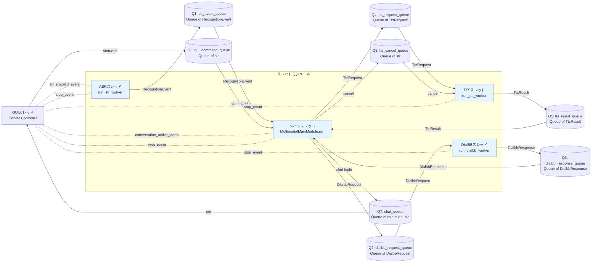
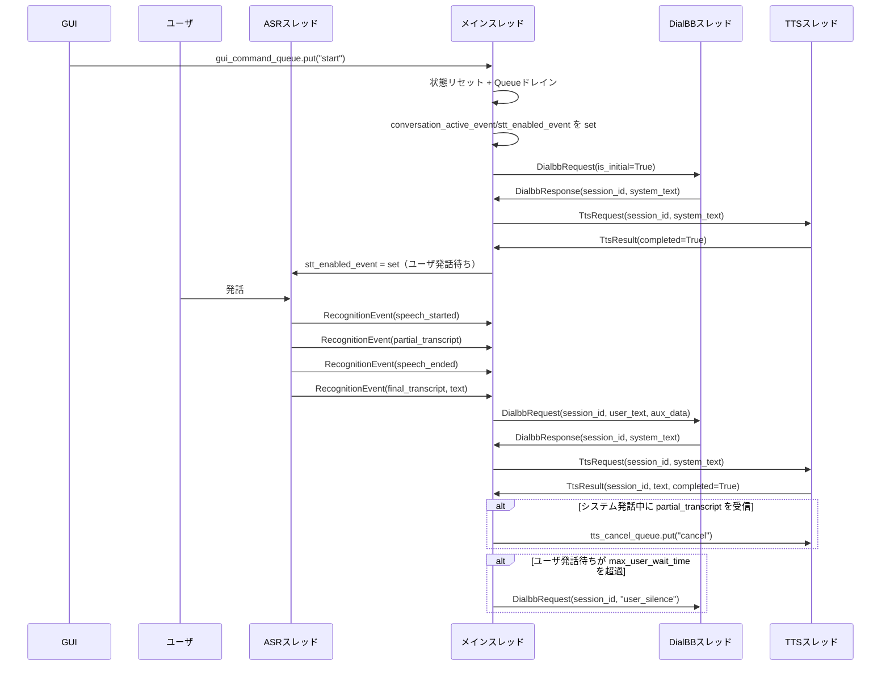
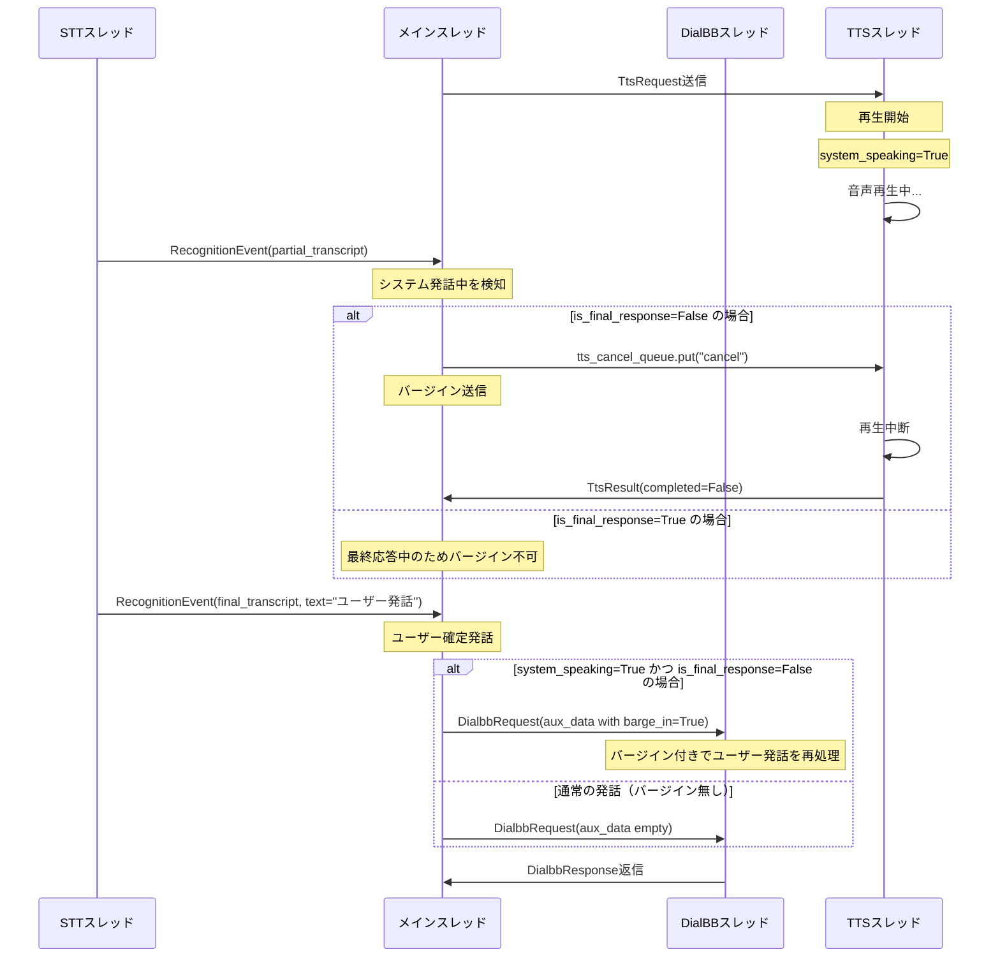

# モジュール・スレッド間メッセージ仕様

## 1. 目的と適用範囲

本書は、マルチモーダルクライアントにおけるモジュール／スレッド間のメッセージ契約と、queue.Queue を用いた通信方式を定義する。

## 1.1 基本の仕組み

本モジュールは「GUI + 4つのワーカースレッド」と「8つの Queue」で構成される。

- GUIスレッド（Tkinter）: 対話開始/対話終了/終了ボタンで実行状態を制御する。
- MAINスレッド: 全体の司令塔。認識結果を受けて対話要求を作り、応答をTTSへ渡す。
- STTスレッド: 音声認識結果を生成する（RecognitionEvent）。
- DialBBスレッド: DialogueProcessor を呼び出してシステム応答を生成する。
- TTSスレッド: 音声合成（Google TTS）と再生（pygame）を実行する。

Queue はスレッド間のメッセージ受け渡し口であり、非同期に安全な連携を実現する。

- データ Queue
  - stt_event_queue: STT -> MAIN に RecognitionEvent を渡す。
  - dialbb_request_queue: MAIN -> DialBB に DialbbRequest を渡す。
  - dialbb_response_queue: DialBB -> MAIN に DialbbResponse を渡す。
  - tts_request_queue: MAIN -> TTS に TtsRequest を渡す。
  - tts_result_queue: TTS -> MAIN に TtsResult を渡す。
- 制御 Queue
  - gui_command_queue: GUI -> MAIN に start/end コマンドを渡す。
  - chat_queue: MAIN -> GUI に表示用メッセージを渡す。
  - tts_cancel_queue: MAIN -> TTS に再生キャンセルを渡す。

特に stt_event_queue は、認識中イベント（partial）、確定イベント（final）、開始/終了イベント、エラーイベントを MAIN に順序付きで届けるための中核 Queue である。

制御用 Event は以下の3つを使用する。

- stop_event: アプリケーション終了シグナル。GUIの「終了」でセットし、全ワーカースレッドを終了させる。
- conversation_active_event: 対話アクティブ状態。GUIの「対話開始」でセット、「対話終了」でクリア。
- stt_enabled_event: 音声入力受付状態。MAIN が対話状態に応じて set/clear し、STT スレッドの入力受付を制御する。

## 2. スレッド・Queue 構成

注: STT -> MAIN の RecognitionEvent には `speech_started` / `partial_transcript` / `speech_ended` / `final_transcript` / `error` が含まれる。

## 3. メッセージ型定義

### 3.1 RecognitionEventType（列挙体）

- `speech_started`: 音声区間の開始を検知したイベント（発話開始通知）。
- `speech_ended`: 音声区間の終了を検知したイベント（発話終了通知）。
- `partial_transcript`: 認識途中の中間テキストを通知するイベント。
- `final_transcript`: 認識が確定した最終テキストを通知するイベント。
- `error`: 音声認識処理中の例外・失敗を通知するイベント。

### 3.2 RecognitionEvent

使用Queue：stt_event_queue（STT -> MAIN）

| 項目 | 型 | 説明 |
|---|---|---|
| event_type | RecognitionEventType | イベント種別 |
| text | str | 認識テキスト（中間／確定／エラー文） |
| confidence | float or None | 確定認識時の信頼度 |
| raw | Any | 音声認識基盤からの生レスポンス |
| occurred_at | datetime | イベント発生時刻 |

### 3.3 DialbbRequest

使用Queue：dialbb_request_queue（MAIN -> DIALBB）

| 項目 | 型 | 説明 |
|---|---|---|
| session_id | str | セッション識別子 |
| user_text | str | ユーザ確定発話テキスト |
| is_initial | bool | True の場合は対話開始要求（DialBB初回要求） |
| aux_data | dict | 追加情報。例: `{"barge_in": true}` |

### 3.4 DialbbResponse

使用Queue：dialbb_response_queue（DIALBB -> MAIN）

| 項目 | 型 | 説明 |
|---|---|---|
| session_id | str | セッション識別子 |
| system_text | str | DialBB層からの応答テキスト |
| is_final | bool | True の場合、対話の最終応答（以降のユーザー入力を受け付けない） |

### 3.5 TtsRequest

使用Queue：tts_request_queue（MAIN -> TTS）

| 項目 | 型 | 説明 |
|---|---|---|
| session_id | str | セッション識別子 |
| text | str | 合成対象テキスト |

### 3.6 TtsResult

使用Queue：tts_result_queue（TTS -> MAIN）

| 項目 | 型 | 説明 |
|---|---|---|
| session_id | str | セッション識別子 |
| text | str | 合成テキスト |
| completed | bool | 合成完了フラグ |

## 4. シーケンス（実装準拠）

## 5. バージイン（割り込み）の仕組み

バージイン（Barge-in）とは、ユーザーがシステムの発話中に割り込んで新しい発話を開始する場合、システムの再生をキャンセルしてユーザー発話を優先する機構である。

### 5.1 バージイン処理の流れ

### 5.2 バージイン発火の条件

バージインが発火するのは、以下の条件をすべて満たす場合である：

| 条件 | 詳細 |
|---|---|
| **システム発話中** | `system_speaking == True` |
| **ユーザー音声入力** | `partial_transcript` または `final_transcript` イベント受信 |
| **最終応答フラグ未設定** | `is_final_response == False` |
| **最終応答再生禁止** | 最終応答再生中は `stt_enabled_event` が clear されているため、そもそもSTTが新しい入力を受け付けない |

### 5.3 バージイン処理の詳細

#### 段階1: partial_transcript 時の中間バージイン

1. MAIN が `partial_transcript` を受信する。
2. `system_speaking && !is_final_response && !_barge_in_sent` を判定する。
3. 条件が真なら、`tts_cancel_queue.put("cancel")` を送信する。
4. 重複送信防止のため `_barge_in_sent = True` にする。
5. TTS は再生を中断し、`TtsResult(completed=False)` を MAIN に返す。
6. MAIN は `completed=False` を受け、`system_speaking=False` に戻す。

#### 段階2: final_transcript 時の確定バージイン

1. MAIN が `final_transcript(text)` を受信する。
2. MAIN は `user_speaking=False`、`user_waiting=False` に更新する。
3. `system_speaking && !is_final_response` の場合、`aux_data={"barge_in": True}` を付けて DialBB に送る。
4. それ以外は `aux_data={}` で通常発話として DialBB に送る。
5. DialBB は応答を返し、MAIN は新しい応答で TTS 再生に進む。

#### 段階3: バージイン不可（最終応答中）

1. MAIN が `DialbbResponse(is_final=True)` を受信する。
2. MAIN は `is_final_response=True` に設定し、`stt_enabled_event.clear()` で入力受付を止める。
3. 最終応答を TTS で再生する。
4. 再生中は新しい STT 入力を受け付けないため、バージインは発生しない。
5. `TtsResult(completed=True)` を受信したら、`conversation_active_event.clear()` で対話終了に遷移する。
6. `is_final_response`、`system_speaking` を含む状態フラグをリセットする。

### 5.4 バージイン実装のポイント

| 項目 | 説明 |
|---|---|
| **重複送信防止** | `_barge_in_sent` フラグで、`partial_transcript` が複数到達しても TTS キャンセルは1回のみ送信 |
| **冪等性** | `final_transcript` 受信時は `partial_transcript` でキャンセル済みでも再度キャンセル送信（冪等） |
| **最終応答対応** | `is_final_response=True` 時はバージイン処理をスキップ、STT入力そのものを受け付けない |
| **aux_data マーク** | DialBB に「バージイン発生」を明示することで、応答生成ロジック側で適切な判断を可能にする |
| **イベント駆動** | キャンセルは queue を用いた非同期通知で、TTS スレッドの即座な対応を実現 |

## 6. 停止・エラールール

- stop_event は全ワーカスレッドで共有する。
- stop_event は GUI の「終了」または Ctrl+C でセットされる。
- GUI の「対話終了」はアプリ終了ではなく対話停止として扱う。
  - conversation_active_event を clear
  - stt_enabled_event を clear
- RecognitionEventType.error は MAIN がログ出力し、対話継続可否は上位運用方針で決める（現実装では stop_event は自動セットしない）。
- 各ワーカループは stop_event がセットされたら終了する。

## 7. 編集メモ（Word / Google ドキュメント）

- Mermaid原本は docs/message_spec_diagram.mmd に保存している。
- Word / Google ドキュメントへ反映する場合:
  1. 本Markdown本文をベース仕様として貼り付ける。
  2. Mermaidブロックは Mermaid対応ツールで画像化して貼り付ける。
  3. 図の編集元は docs/message_spec_diagram.mmd を正本として管理する。
