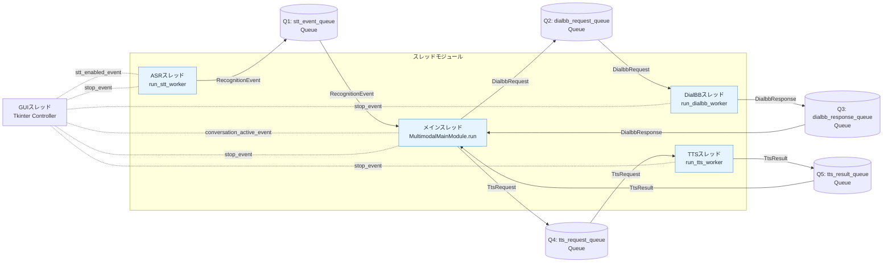
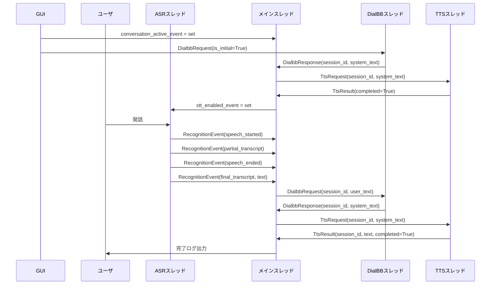

# モジュール・スレッド間メッセージ仕様

## 1. 目的と適用範囲

本書は、マルチモーダルクライアントにおけるモジュール／スレッド間のメッセージ契約と、queue.Queue を用いた通信方式を定義する。

## 1.1 基本の仕組み

本モジュールは「GUI + 4つのスレッド」と「5つの Queue」で構成される。

- GUIスレッド（Tkinter）: 対話開始/対話終了/終了ボタンで実行状態を制御する。

- STTスレッド: 音声認識結果を生成する（RecognitionEvent）。
- MAINスレッド: 全体の司令塔。認識結果を受けて対話要求を作り、応答をTTSへ渡す。
- DialBBスレッド: DialogueProcessor を呼び出して対話応答を生成する。
- TTSスレッド: 音声合成を実行する（現状はスタブ）。

Queue はスレッド間のメッセージ受け渡し口であり、非同期に安全な連携を実現する。

- stt_event_queue: STT -> MAIN に RecognitionEvent を渡す。
- dialbb_request_queue: MAIN -> DialBB に DialbbRequest を渡す。
- dialbb_response_queue: DialBB -> MAIN に DialbbResponse を渡す。
- tts_request_queue: MAIN -> TTS に TtsRequest を渡す。
- tts_result_queue: TTS -> MAIN に TtsResult を渡す。

特に stt_event_queue は、認識中イベント（partial）、確定イベント（final）、開始/終了イベント、エラーイベントを MAIN に順序付きで届けるための中核 Queue である。

制御用 Event は以下の3つを使用する。

- stop_event: アプリケーション終了シグナル。GUIの「終了」でセットし、全ワーカースレッドを終了させる。
- conversation_active_event: 対話アクティブ状態。GUIの「対話開始」でセット、「対話終了」でクリア。
- stt_enabled_event: 音声入力受付状態。対話中かつ TTS 非再生時のみセットされる。

## 2. スレッド・Queue 構成

注: STT -> MAIN の RecognitionEvent には speech_started / partial_transcript / speech_ended / final_transcript / error が含まれる。

## 3. メッセージ型定義

### 3.1 RecognitionEventType（列挙体）

- speech_started: 音声区間の開始を検知したイベント（発話開始通知）。
- speech_ended: 音声区間の終了を検知したイベント（発話終了通知）。
- partial_transcript: 認識途中の中間テキストを通知するイベント。
- final_transcript: 認識が確定した最終テキストを通知するイベント。
- error: 音声認識処理中の例外・失敗を通知するイベント。

### 3.2 RecognitionEvent

使用Queue：stt_event_queue（STT -> MAIN）

| 項目 | 型 | 説明 |
|---|---|---|
| event_type | RecognitionEventType | イベント種別 |
| text | str | 認識テキスト（中間／確定／エラー文） |
| confidence | float or None | 確定認識時の信頼度 |
| raw | Any | 音声認識基盤からの生レスポンス |
| occurred_at | datetime | イベント発生時刻 |

### 3.3 DialbbRequest

使用Queue：dialbb_request_queue（MAIN -> DIALBB）

| 項目 | 型 | 説明 |
|---|---|---|
| session_id | str | セッション識別子 |
| user_text | str | ユーザ確定発話テキスト |
| is_initial | bool | True の場合は対話開始要求（DialBB初回要求） |

### 3.4 DialbbResponse

使用Queue：dialbb_response_queue（DIALBB -> MAIN）

| 項目 | 型 | 説明 |
|---|---|---|
| session_id | str | セッション識別子 |
| system_text | str | DialBB層からの応答テキスト |

### 3.5 TtsRequest

使用Queue：tts_request_queue（MAIN -> TTS）

| 項目 | 型 | 説明 |
|---|---|---|
| session_id | str | セッション識別子 |
| text | str | 合成対象テキスト |

### 3.6 TtsResult

使用Queue：tts_result_queue（TTS -> MAIN）

| 項目 | 型 | 説明 |
|---|---|---|
| session_id | str | セッション識別子 |
| text | str | 合成テキスト |
| completed | bool | 合成完了フラグ |

## 4. シーケンス（正常系）

## 5. 停止・エラールール

- stop_event は全ワーカスレッドで共有する。
- stop_event は GUI の「終了」または Ctrl+C でセットされる。
- GUI の「対話終了」および終了語（終了 / ストップ / おしまい）は、アプリ終了ではなく対話停止として扱う。
  - conversation_active_event を clear
  - stt_enabled_event を clear
- RecognitionEventType.error は安全側で stop_event をセットし、アプリ終了へ移行する。
- 各ワーカループは stop_event がセットされたら終了する。

## 6. 編集メモ（Word / Google ドキュメント）

- Mermaid原本は docs/message_spec_diagram.mmd に保存している。
- Word / Google ドキュメントへ反映する場合:
  1. 本Markdown本文をベース仕様として貼り付ける。
  2. Mermaidブロックは Mermaid対応ツールで画像化して貼り付ける。
  3. 図の編集元は docs/message_spec_diagram.mmd を正本として管理する。
