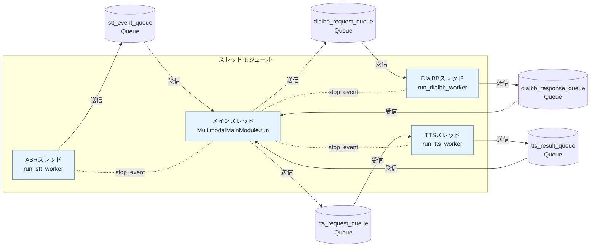
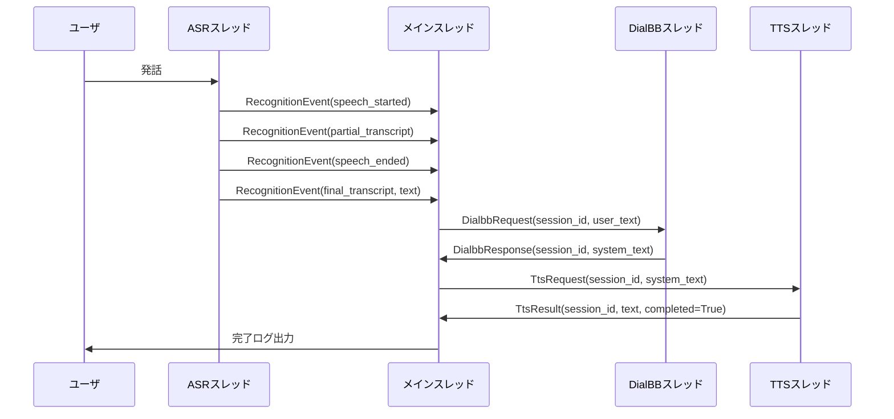

# モジュール・スレッド間メッセージ仕様

## 1. 目的と適用範囲

本書は、マルチモーダルクライアントにおけるモジュール／スレッド間のメッセージ契約と、queue.Queue を用いた通信方式を定義する。

対象実装ファイル:
- start_multimodal_client.py
- asr/google_stt_client.py
- main/main_module.py
- main/dialbb_client.py
- tts/speech_synthesizer.py
- main/messages.py

## 2. スレッド・Queue 構成

## 3. メッセージ型定義

### 3.1 RecognitionEventType（列挙体）
- speech_started
- speech_ended
- partial_transcript
- final_transcript
- error

### 3.2 RecognitionEvent
| 項目 | 型 | 説明 |
|---|---|---|
| event_type | RecognitionEventType | イベント種別 |
| text | str | 認識テキスト（中間／確定／エラー文） |
| confidence | float or None | 確定認識時の信頼度 |
| raw | Any | 音声認識基盤からの生レスポンス |
| occurred_at | datetime | イベント発生時刻 |

### 3.3 DialbbRequest
| 項目 | 型 | 説明 |
|---|---|---|
| session_id | str | セッション識別子 |
| user_text | str | ユーザ確定発話テキスト |

### 3.4 DialbbResponse
| 項目 | 型 | 説明 |
|---|---|---|
| session_id | str | セッション識別子 |
| system_text | str | DialBB層からの応答テキスト |

### 3.5 TtsRequest
| 項目 | 型 | 説明 |
|---|---|---|
| session_id | str | セッション識別子 |
| text | str | 合成対象テキスト |

### 3.6 TtsResult
| 項目 | 型 | 説明 |
|---|---|---|
| session_id | str | セッション識別子 |
| text | str | 合成テキスト |
| completed | bool | 合成完了フラグ |

## 4. シーケンス（正常系）

## 5. 停止・エラールール

- stop_event は全ワーカスレッドで共有する。
- メインスレッドは以下の条件で stop_event をセットする。
  - 確定認識テキストが終了語（終了 / ストップ / おしまい）に一致
  - RecognitionEventType.error を受信
  - エントリポイントで Ctrl+C を受信
- 各ワーカループは stop_event がセットされたら終了する。

## 6. 編集メモ（Word / Google ドキュメント）

- Mermaid原本は docs/message_spec_diagram.mmd に保存している。
- Word / Google ドキュメントへ反映する場合:
  1. 本Markdown本文をベース仕様として貼り付ける。
  2. Mermaidブロックは Mermaid対応ツールで画像化して貼り付ける。
  3. 図の編集元は docs/message_spec_diagram.mmd を正本として管理する。
